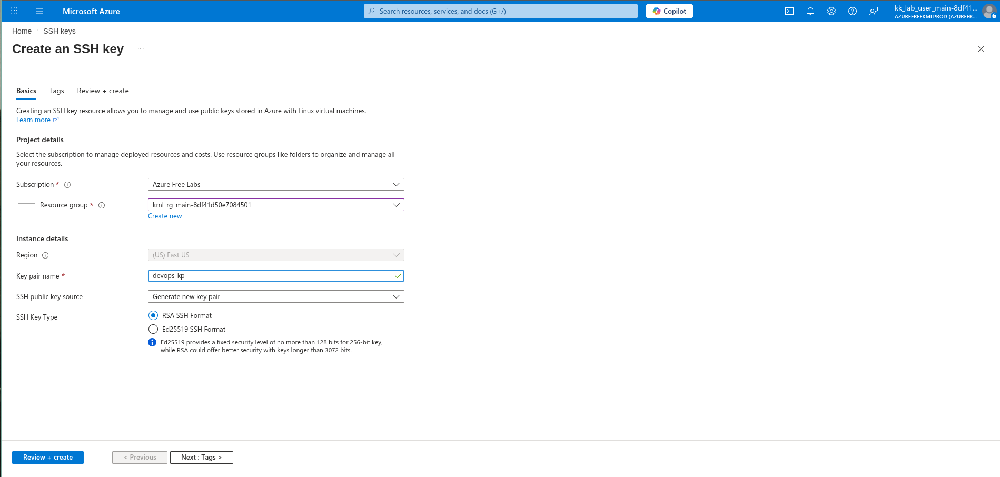
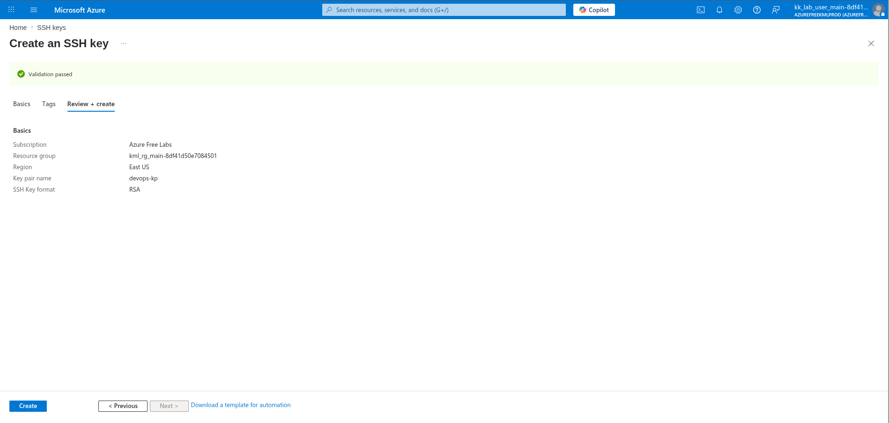
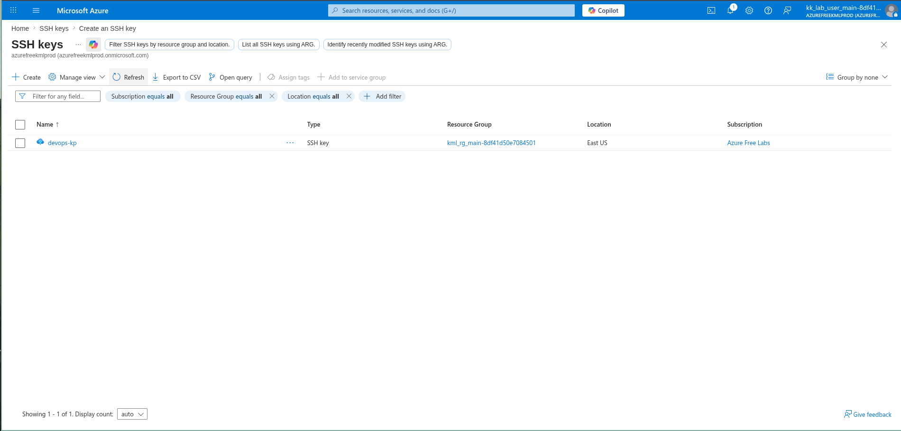

# 100 Days of Azure – Day 1  

## Azure SSH Key Creation

## Overview  

Part of my KodeKloud 100 Days of Azure Challenge.  
Created and managed an SSH key for secure VM access.

---

## What I Did  

- Created SSH key in Azure Portal  
- Key Name: devops-kp  
- Region: East US  
- Type: RSA  
- Generated new key pair  

---

## 📸 Screenshots  

### input the key name and type you want to use

  

### and click the create button

  

### Dashboard

---

## Result  

SSH key successfully created and ready for VM access.

---

## Author  

Hein Lin Zaw
