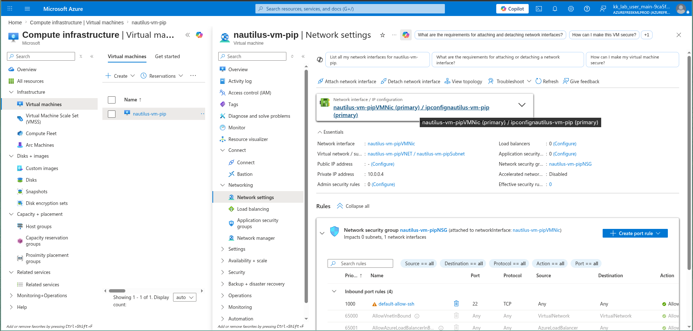
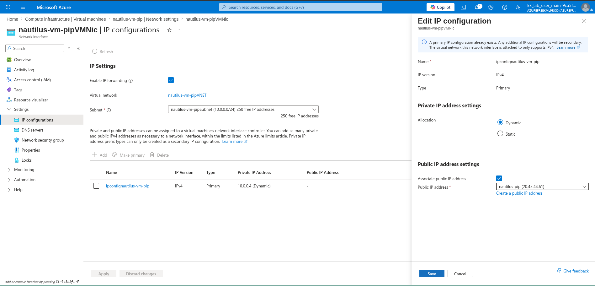
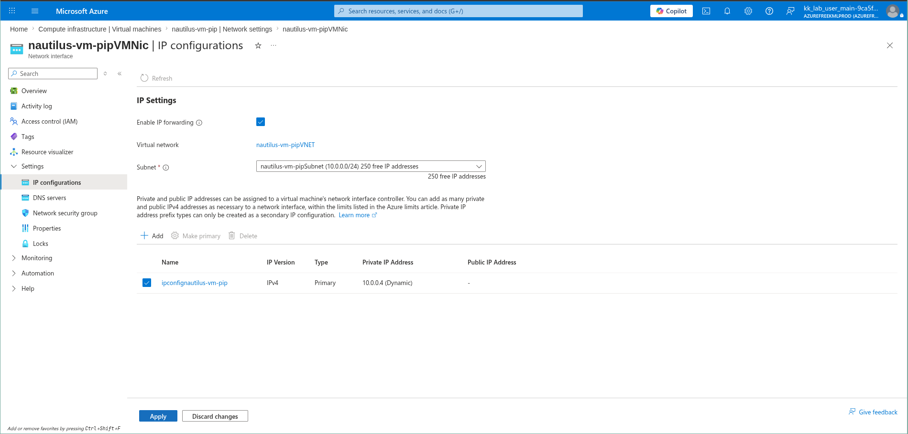
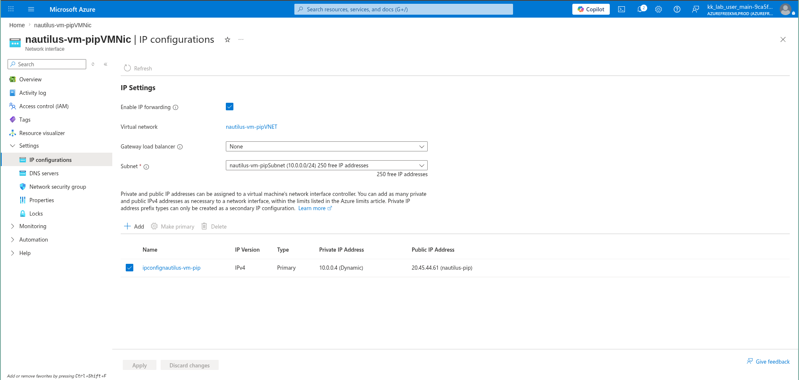

# 100 Days of Azure – Day 10  

## Associate Public IP with Virtual Machine

## Overview  

This task demonstrates associating a Public IP address with a Virtual Machine through its network interface.

---

## What I Did  

- Navigated to Virtual Machine: nautilus-vm-pip  
- Opened Network settings  
- Accessed the attached Network Interface  
- Went to IP configurations  
- Edited the IP configuration  
- Associated an existing Public IP (nautilus-pip)  
- Applied the changes  

---

## Screenshots  

### Go to Network Interface  

### Edit IP configuration and attach the existing public IP

### Select and Apply  

### Public IP Attached  

---

## Result  

Successfully associated a Public IP address with the Virtual Machine.

---

## Author  

Hein Lin Zaw
