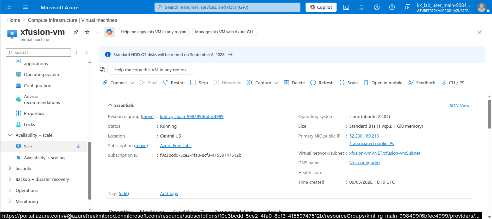
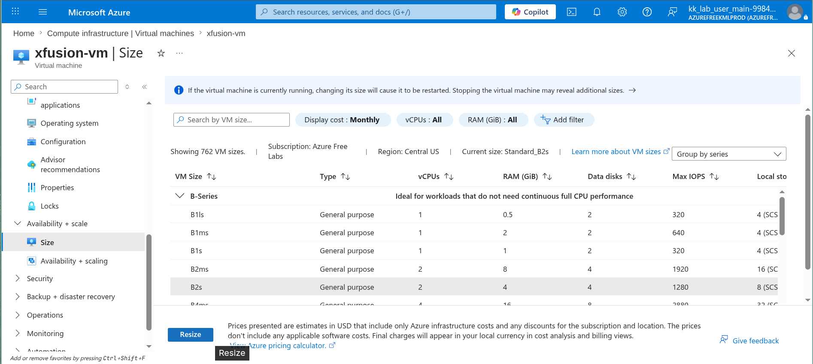
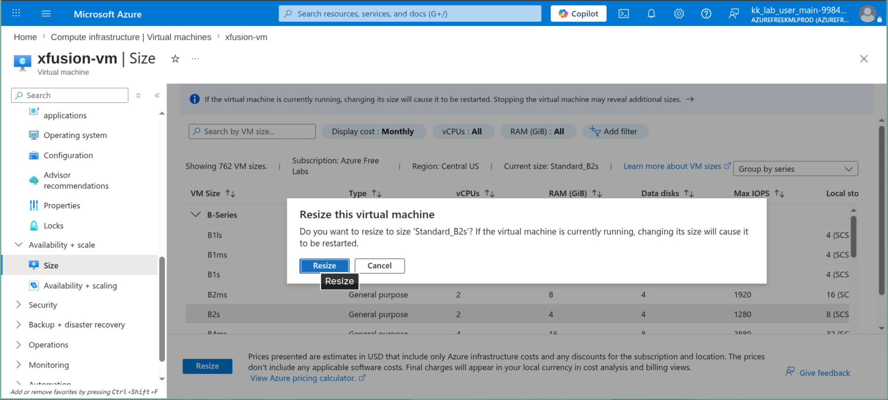
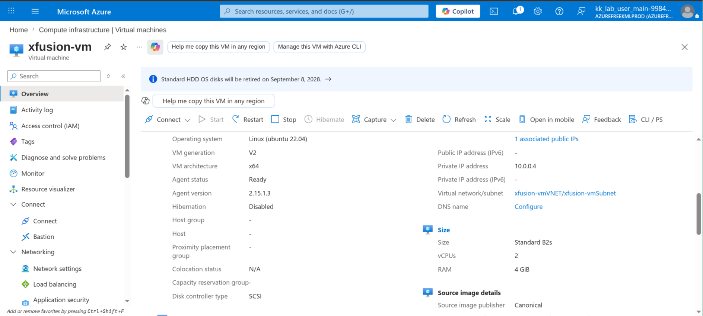

# 100 Days of Azure – Day 11  

## Resize an Azure Virtual Machine

## Overview  

This task demonstrates resizing an Azure Virtual Machine by changing its VM size from Standard B1s to Standard B2s.

---

## What I Did  

- Opened the Virtual Machine dashboard  
- Verified the VM was running  
- Navigated to the **Size** section under *Availability + scale*  
- Selected a new VM size: **Standard_B2s**  
- Clicked **Resize** to apply the changes  
- Verified the VM size was updated successfully  

---

## Screenshots  

### Go to size section of vm

### Select Standard_B2s Size  

### Click Resize

### Make sure vm is in running state

---

## Result  

Successfully resized the Azure Virtual Machine from **Standard B1s** to **Standard B2s**.

---

## Author  

Hein Lin Zaw
