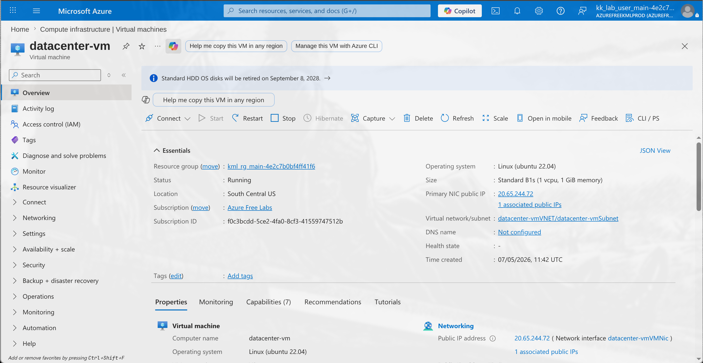
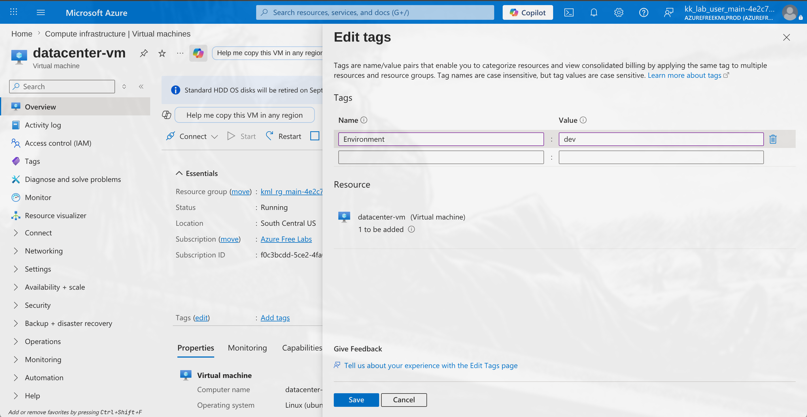
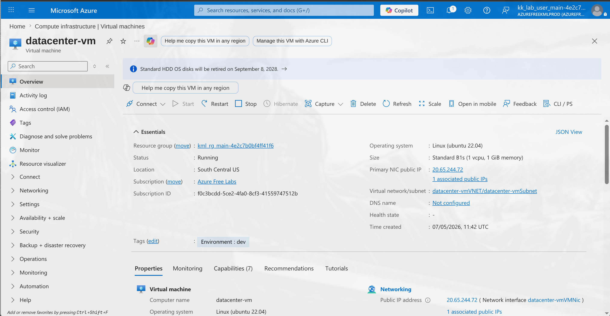

# 100 Days of Azure – Day 12  
## Add Tags to an Azure Virtual Machine

## Overview  
This task demonstrates how to organize Azure resources using tags by adding a key-value pair to a Virtual Machine.

---

## What I Did  
- Opened the Azure Virtual Machine dashboard  
- Navigated to the VM overview page  
- Opened the **Edit Tags** panel  
- Added a tag:
  - **Name:** Environment
  - **Value:** dev
- Saved the configuration  
- Verified the tag was successfully applied to the VM  

---

## Screenshots  

### Open VM Overview  

### Add Tag Key and Value  

### Verify Applied Tag  

---

## Result  
Successfully added the **Environment=dev** tag to the Azure Virtual Machine.

---

## Author  
Hein Lin Zaw
