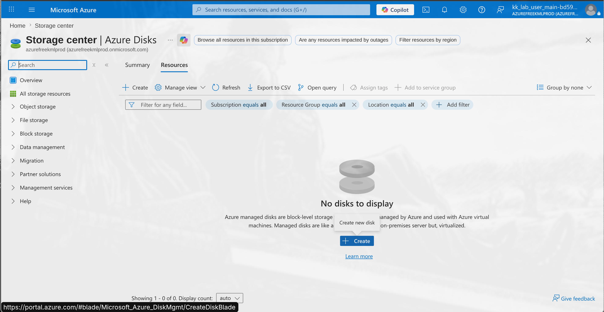
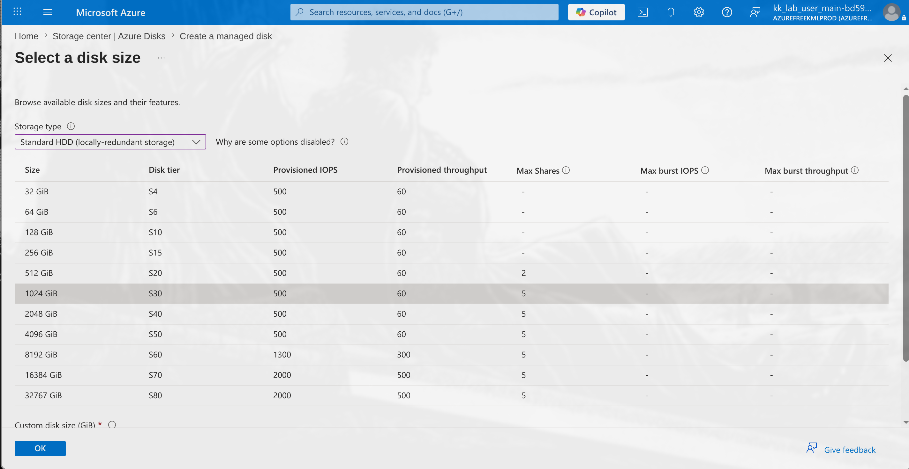
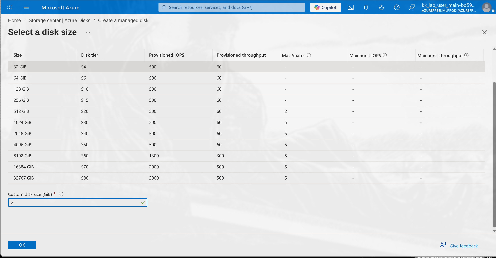
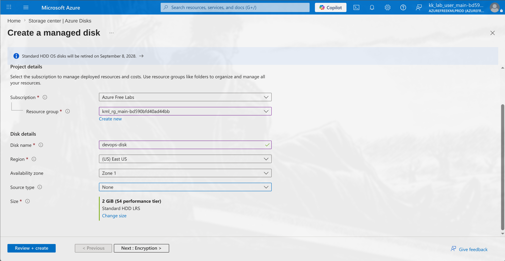
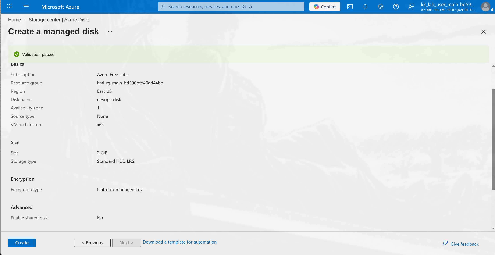

# 100 Days of Azure – Day 14  
## Create and Configure an Azure Managed Disk

## Overview  
This task demonstrates how to create and configure an Azure Managed Disk using the Azure Portal.

---

## What I Did  
- Opened Azure Disks from Storage Center  
- Started the managed disk creation wizard  
- Configured basic disk settings  
- Selected Standard HDD storage type  
- Configured a 2 GiB disk size  
- Left remaining settings as default  
- Reviewed and created the managed disk  

---

## Configuration Used  

| Setting | Value |
|---|---|
| Disk Name | `devops-disk` |
| Region | East US |
| Availability Zone | Zone 1 |
| Storage Type | Standard HDD (LRS) |
| Disk Size | 2 GiB |
| Source Type | None |

---

## Screenshots  

### Open Azure Disks and Click Create  

### Select Storage Type  

### Configure Disk Size  

### Click next  

### Set the rest to defaults and Create  

---

## Result  
Successfully created an Azure Managed Disk named:

## Author
Hein Lin Zaw
