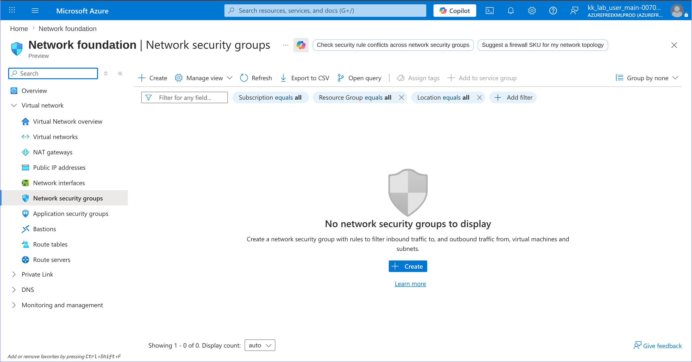
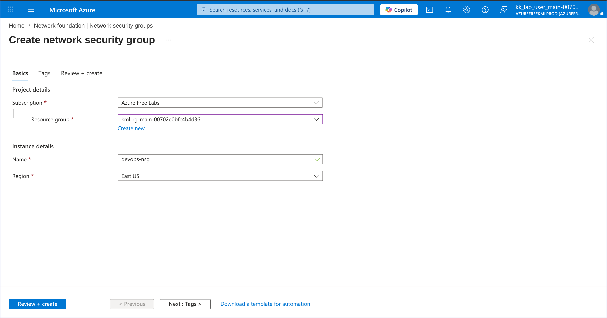
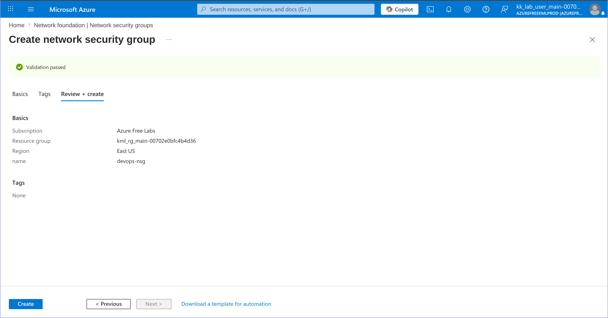
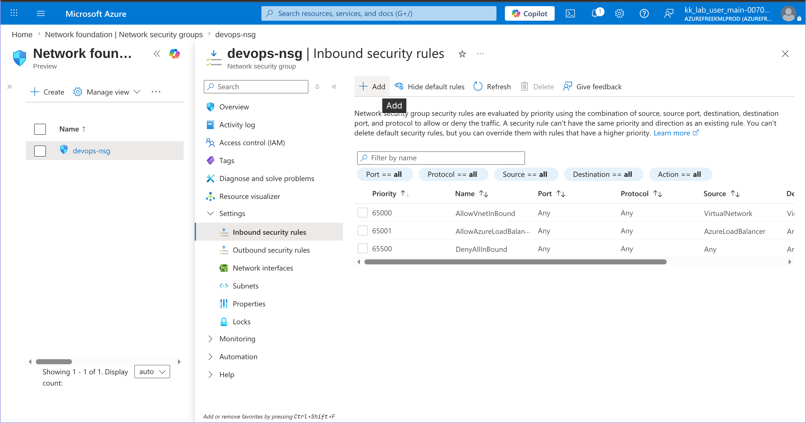
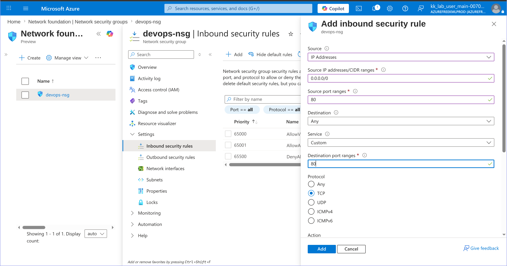
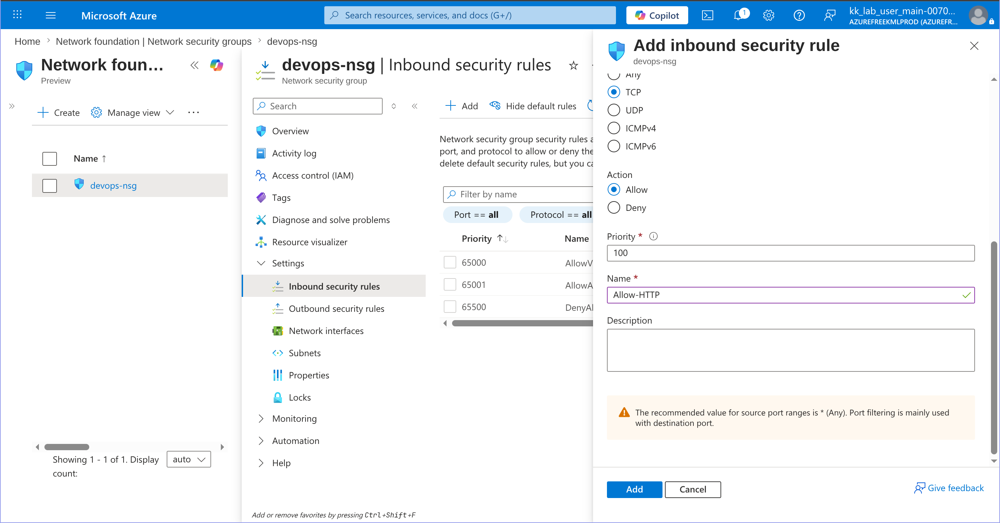
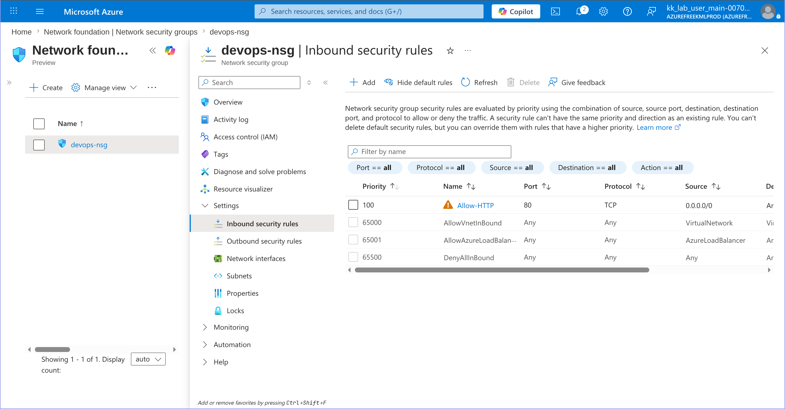
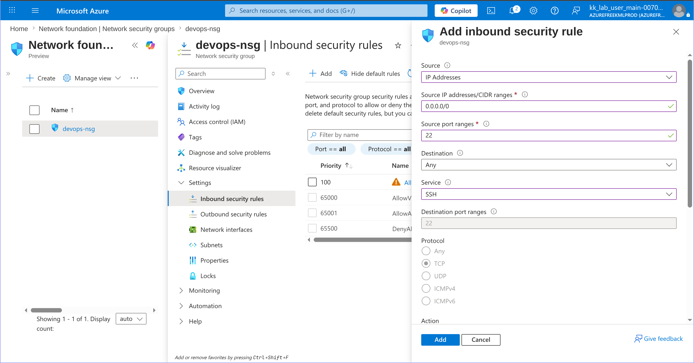
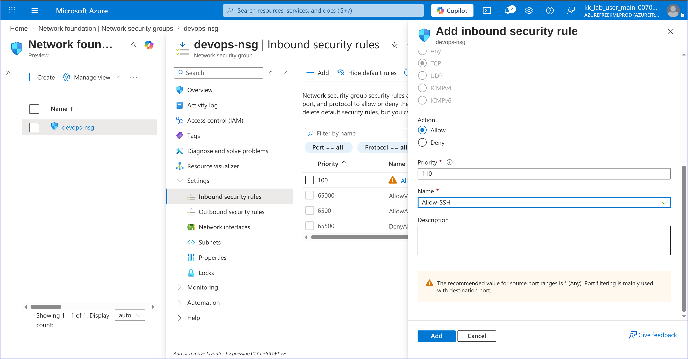
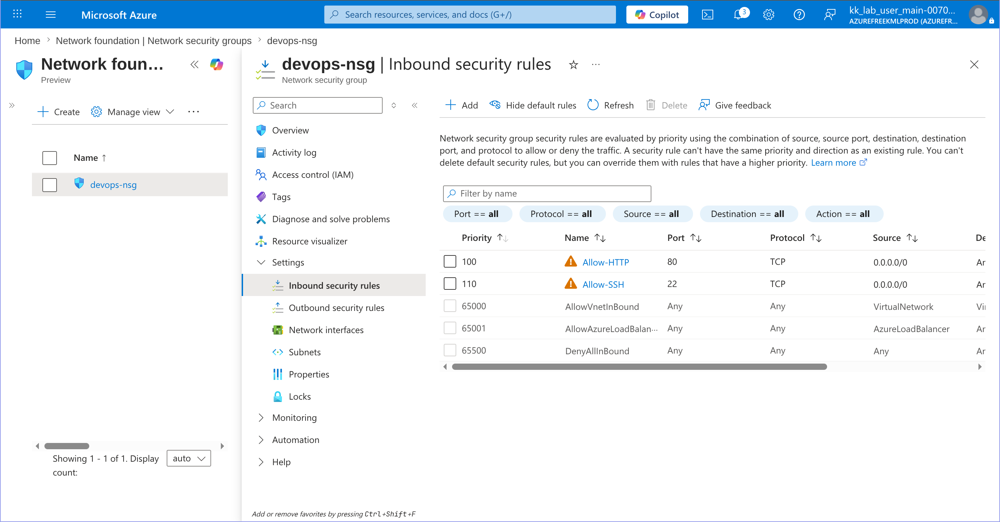

# 100 Days of Azure – Day 15  
## Create and Configure Azure Network Security Group (NSG)

## Overview  
This task demonstrates how to create an Azure Network Security Group (NSG) and configure inbound security rules for HTTP and SSH access.

---

## What I Did  
- Created a new Network Security Group  
- Configured NSG basic settings  
- Added an inbound HTTP rule for port 80  
- Added an inbound SSH rule for port 22  
- Configured priorities for both rules  
- Verified both security rules were successfully added  

---

## Configuration Used  

| Setting | Value |
|---|---|
| NSG Name | `devops-nsg` |
| Region | East US |
| HTTP Port | `80` |
| SSH Port | `22` |
| HTTP Priority | `100` |
| SSH Priority | `110` |
| Protocol | TCP |
| Source | `0.0.0.0/0` |

---

## Steps Performed  

### 1. Open Network Security Groups and Click Create  


---

### 2. Configure NSG Basic Settings  
- Entered NSG name: `devops-nsg`
- Selected region: `East US`
- Selected resource group



---

### 3. Review and Create the NSG  
- Left remaining settings as default
- Clicked **Create**



---

### 4. Open Inbound Security Rules and Click Add  


---

## Configure HTTP Rule

### 5. Configure HTTP Inbound Rule  
- Source: `0.0.0.0/0`
- Destination Port: `80`
- Protocol: `TCP`
- Action: `Allow`



---

### 6. Set Rule Name and Priority  
- Priority: `100`
- Rule Name: `Allow-HTTP`



---

### 7. Verify HTTP Rule Added  


---

## Configure SSH Rule

### 8. Configure SSH Inbound Rule  
- Service: `SSH`
- Port: `22`
- Protocol: `TCP`
- Action: `Allow`



---

### 9. Set SSH Rule Name and Priority  
- Priority: `110`
- Rule Name: `Allow-SSH`



---

### 10. Verify Both Rules Were Added  


---

## Result  
Successfully created an Azure Network Security Group named:

```text
devops-nsg
