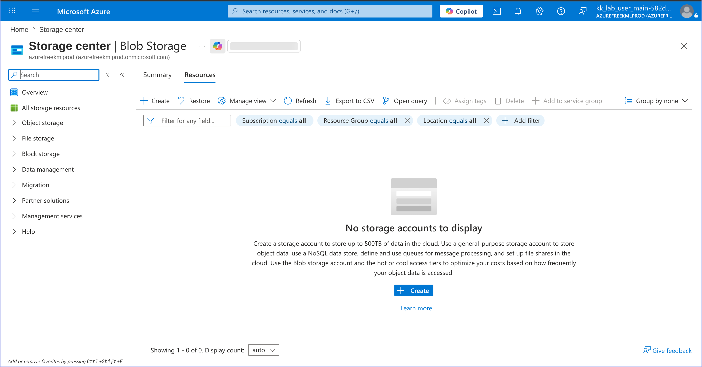
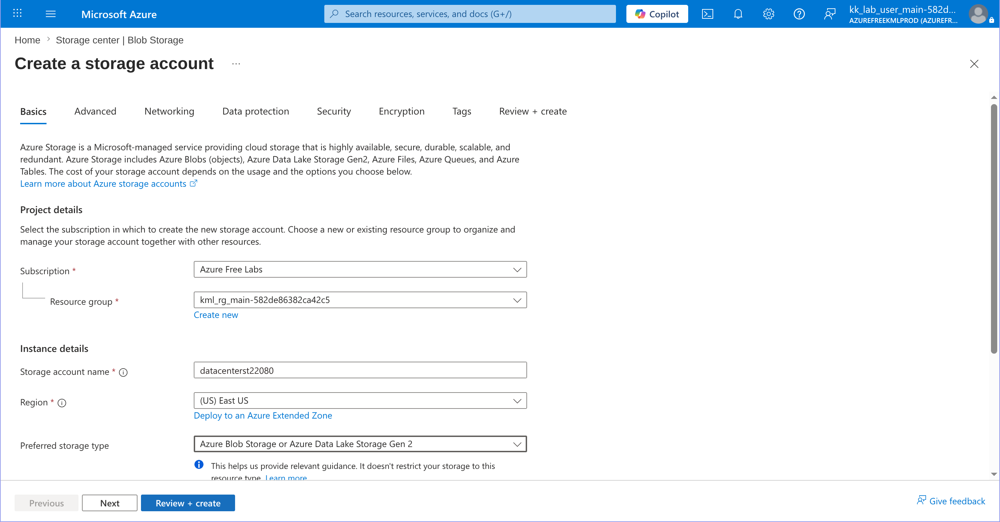
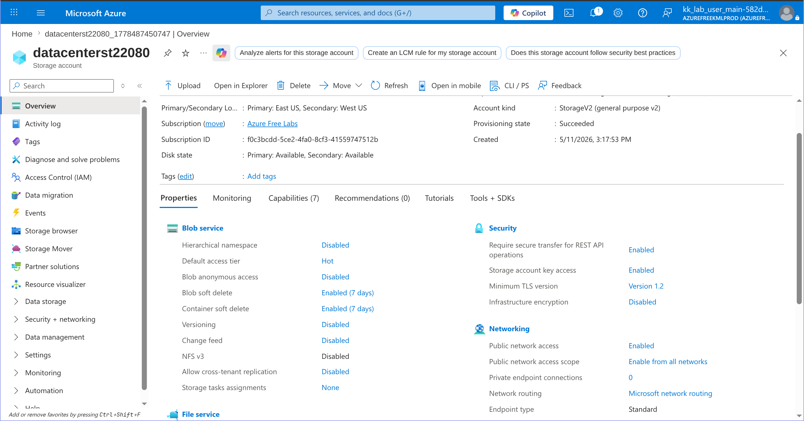
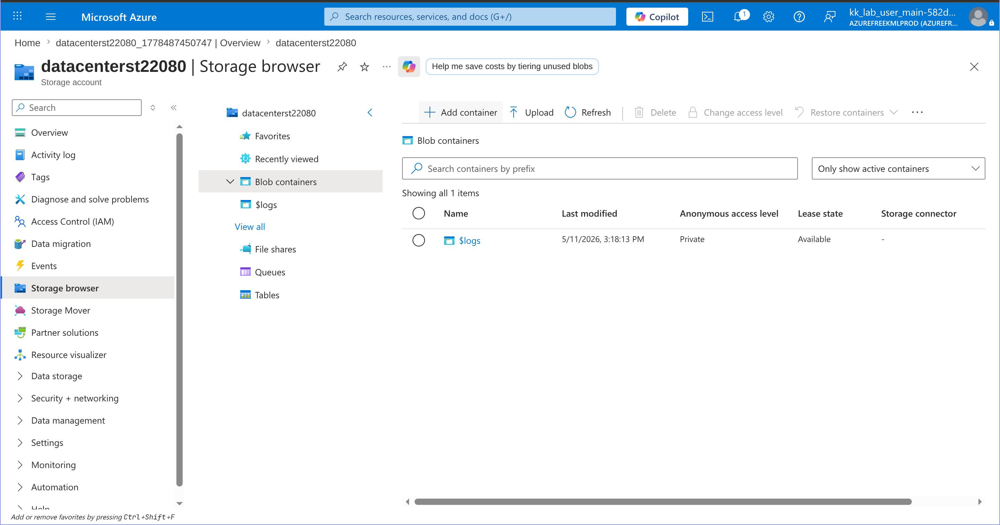
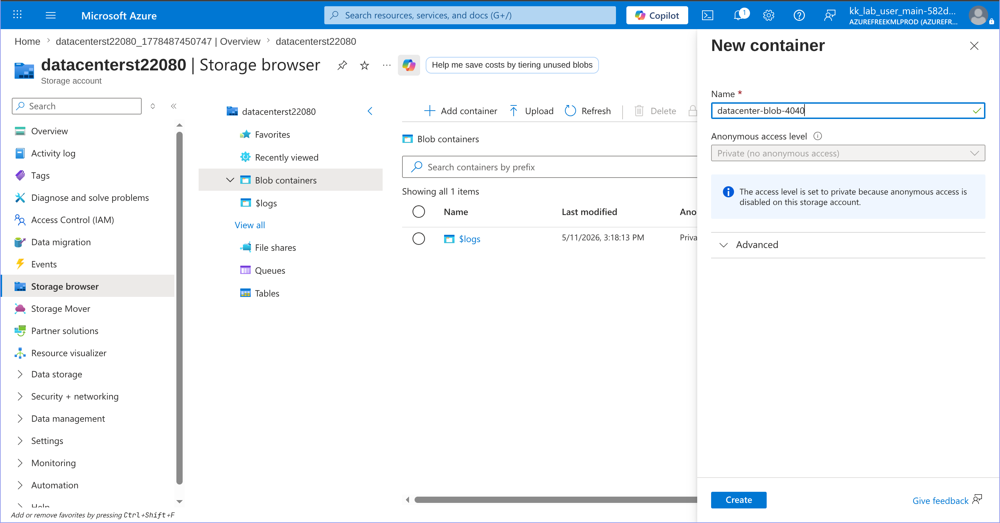
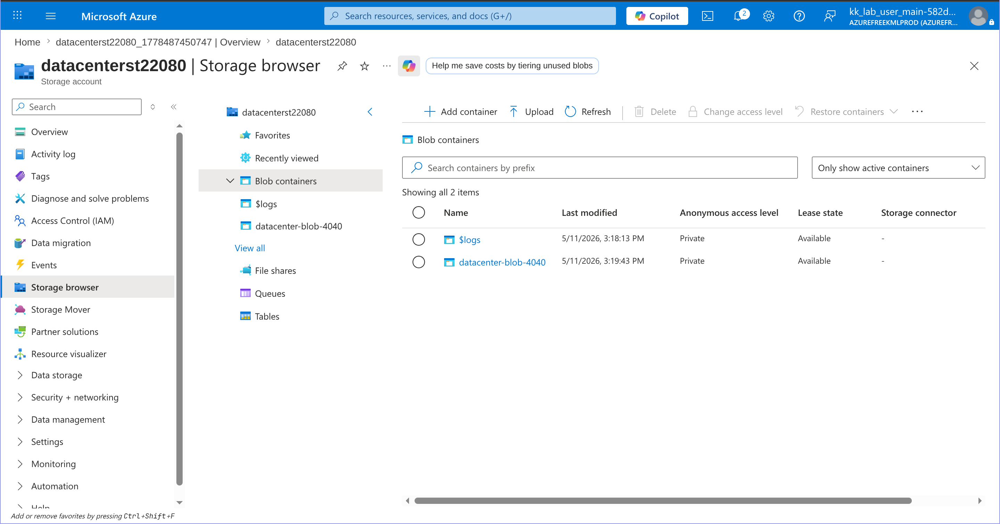

# 100 Days of Azure – Day 16  
## Create Azure Storage Account and Blob Container

## Overview  
This task demonstrates how to create an Azure Storage Account and configure a Blob Storage container inside the storage account.

---

## What I Did  
- Created a new Azure Storage Account  
- Configured storage account settings  
- Opened Storage Browser  
- Navigated to Blob Containers  
- Created a new Blob Container  
- Verified the container was successfully created  

---

## Configuration Used  

| Setting | Value |
|---|---|
| Storage Account Name | `datacentertst22080` |
| Region | `East US` |
| Storage Type | `Azure Blob Storage` |
| Blob Container Name | `datacenter-blob-4040` |
| Access Level | Private |

---

## Steps Performed  

### 1. Open Blob Storage and Click Create  

---

### 2. Configure Storage Account Settings and create 
- Entered storage account name
- Left remaining settings as default

---

### 3. Go to resource and click Storage Browser  

---

### 4. Navigate to Blob Containers and Click Add Container  

---

### 6. Configure Blob Container and create 
- Entered container name: `datacenter-blob-4040`

---

### 7. Verify Blob Container Created Successfully  

---

## Result  
Successfully created:

### Author
Hein Lin Zaw
