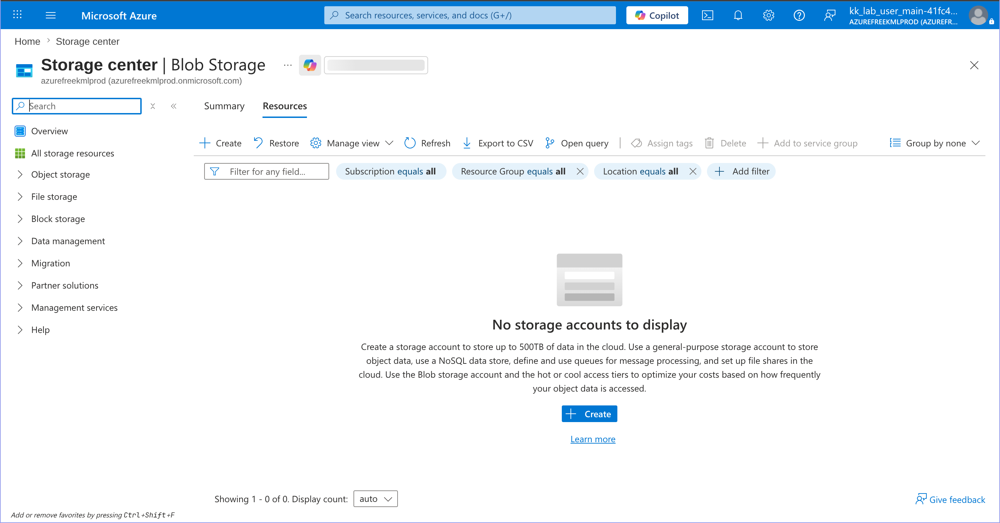
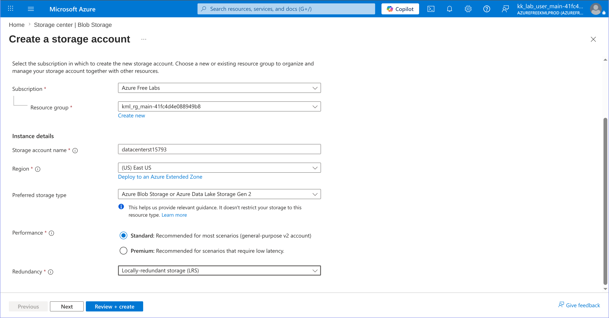
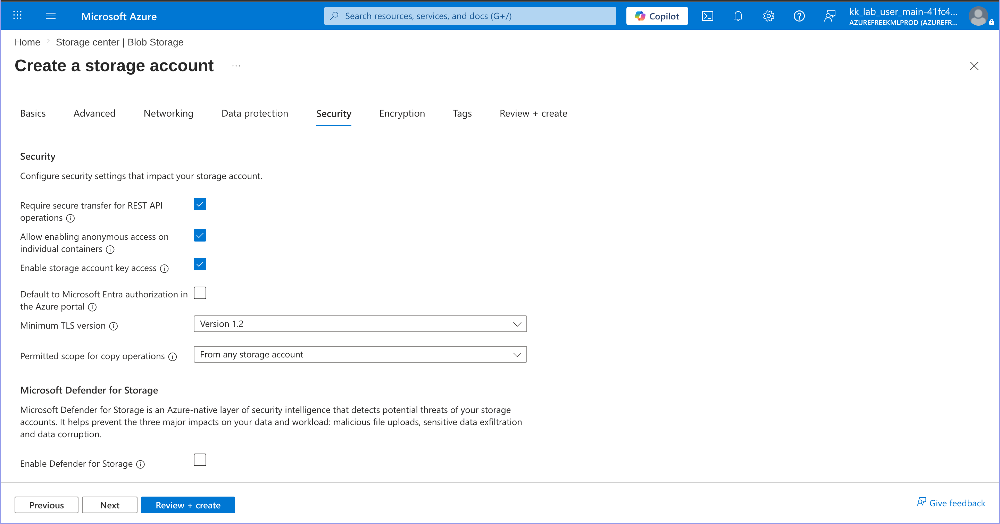
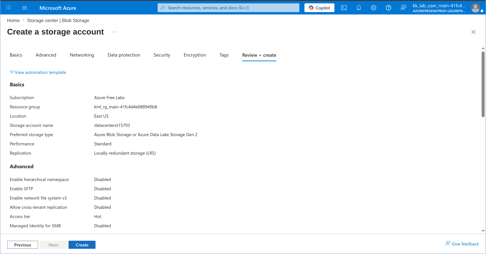
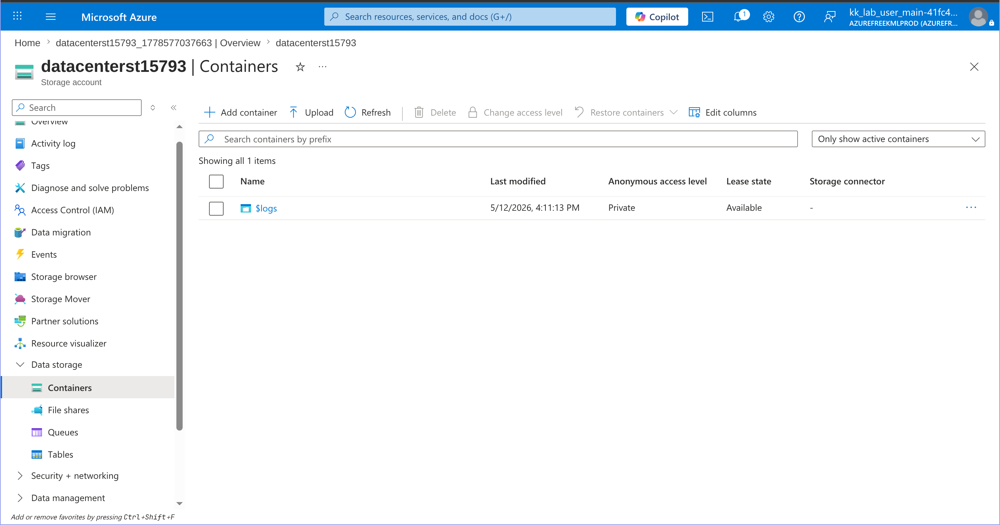
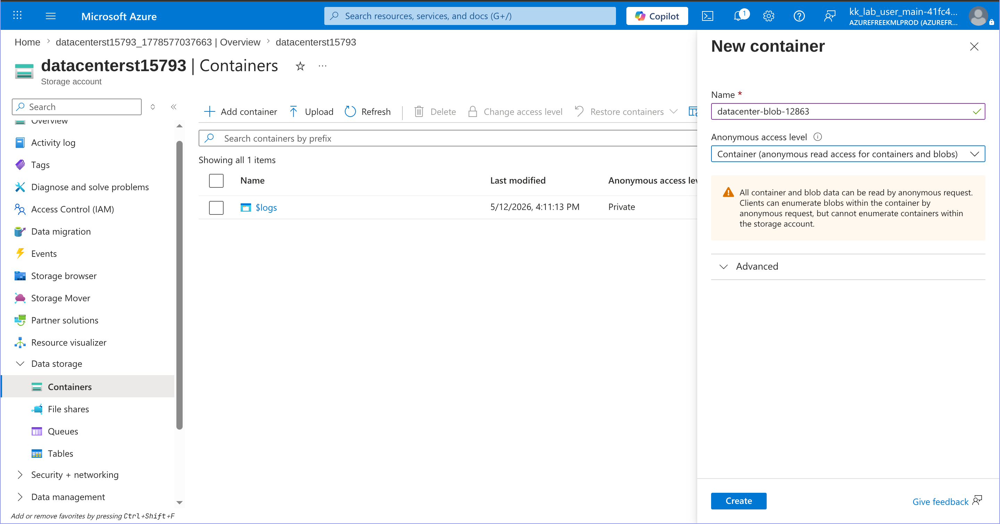
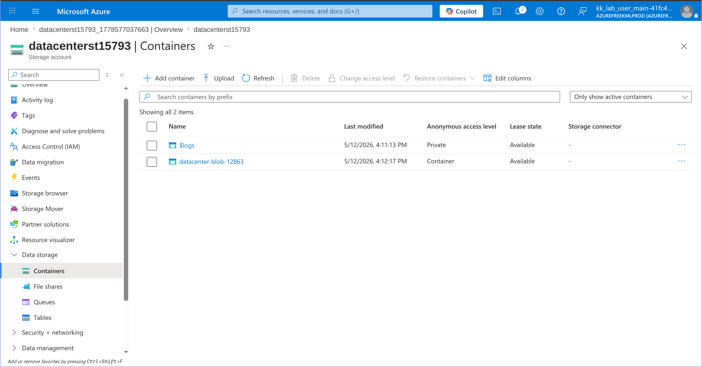

# 100 Days of Azure – Day 17  
## Create Public Azure Blob Container

## Overview  
This lab demonstrates how to create an Azure Storage Account and configure a Blob Container with anonymous public access enabled.

---

## What I Did  
- Created a new Azure Storage Account  
- Enabled anonymous blob access on the storage account  
- Opened the Containers section  
- Created a public Blob Container  
- Configured container-level anonymous read access  
- Verified successful container creation  

---

## Steps Performed  

### 1. Open Blob Storage and Click Create  

---

### 2. Configure Storage Account  
- Selected subscription and resource group  
- Entered storage account name  
- Selected region and redundancy options  

---

### 3. Enable Anonymous Blob Access  
- Navigated to the **Security** tab  
- Enabled:
  - `Allow enabling anonymous access on individual containers`

---

### 4. Review and Create Storage Account  
- Reviewed all configurations  
- Clicked **Create**

---

### 5. Open Containers Section  
- Opened the created storage account  
- Navigated to **Containers**  
- Clicked **Add container**

---

### 6. Configure Blob Container  
- Entered container name:
- Configure access level 

### 7. Make sure Blob Container is created

### Author

Hein Lin Zaw
