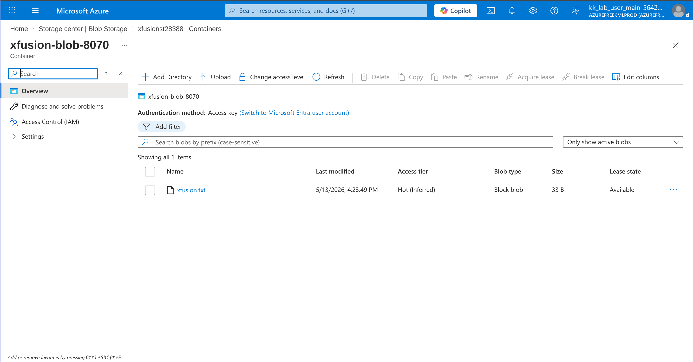

# 100 Days of Azure – Day 18  
## Azure Blob Storage CLI Operations

## Overview  
This lab demonstrates basic Azure Blob Storage operations using the Azure CLI, including listing storage accounts, listing blob containers, and uploading files to a blob container.

---

## What I Did  
- Listed available Azure Storage Accounts  
- Listed Blob Containers inside a storage account  
- Uploaded a file to an Azure Blob Container using Azure CLI  
- Verified successful blob upload in Azure Portal  

---

## Commands Used  

### 1. List Storage Accounts  
```bash
az storage account list | grep name
```

This command displays available Azure Storage Accounts.

---

### 2. List Blob Containers  
```bash
az storage container list --account-name [your_storage_acc_name] | grep name
```

This command lists all blob containers inside a specific storage account.

Replace:

```text
[your_storage_acc_name]
```

with your actual storage account name.

Example:

```bash
az storage container list --account-name xfusionst28388 | grep name
```

---

### 3. Upload File to Blob Container  
```bash
az storage blob upload \
  --account-name [your_storage_acc_name] \
  --container-name [your_container_name] \
  -f /tmp/xfusion.txt
```

This command uploads a file to a blob container.

Replace:

```text
[your_storage_acc_name]
```

with your storage account name.

Replace:

```text
[your_container_name]
```

with your blob container name.

Example:

```bash
az storage blob upload \
  --account-name xfusionst28388 \
  --container-name xfusion-blob-8070 \
  -f /tmp/xfusion.txt
```

---

## Verification  

Verified that the uploaded file appears successfully inside the blob container.

### Uploaded File
```text
xfusion.txt
```



---

## Result  

Successfully:
- Listed Azure Storage Accounts
- Listed Blob Containers
- Uploaded a file to Azure Blob Storage using Azure CLI
- Verified uploaded blob in Azure Portal

---

## Author  
Hein Lin Zaw
