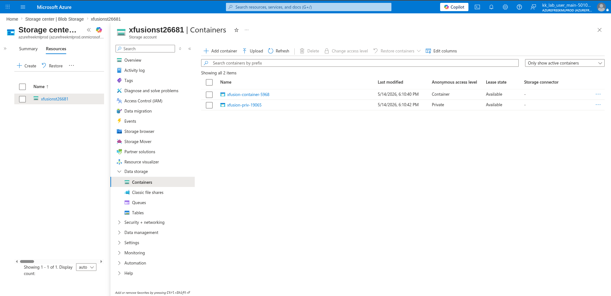
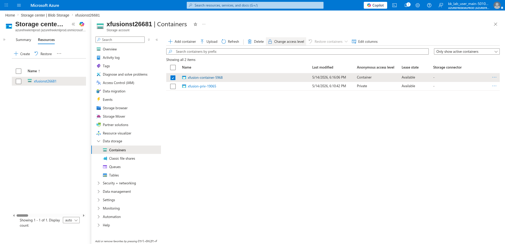
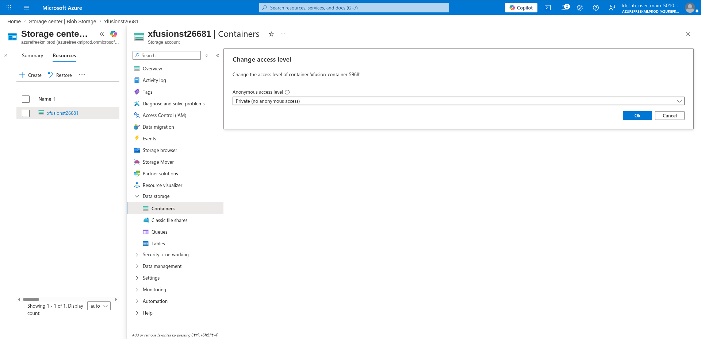

# 100 Days of Azure – Day 19  
## Changing Azure Blob Container Access Level

## Overview  
This lab demonstrates how to manage access levels for Azure Blob Containers.  
The task involved changing a public container back to private access using the Azure Portal.

---

## What I Did  
- Navigated to Azure Storage Account Containers  
- Selected a public blob container  
- Opened the access level settings  
- Changed anonymous access from public to private  
- Verified the container access level was updated successfully  

---

## Steps Performed  

### 1. Open Storage Account Containers  

Navigated to the Azure Storage Account and opened the **Containers** section.



---

### 2. Select Public Container  

Selected the public container and clicked:

```text
Change access level
```



---

### 3. Change Access Level to Private  

Changed the anonymous access level to:

```text
Private (no anonymous access)
```

Then clicked:

```text
Ok
```



---

### 4. Verify Container is Private  

Verified that the container access level changed successfully from:

```text
Container
```

to:

```text
Private
```


---

## Result  

Successfully:
- Accessed Azure Blob Container settings
- Modified anonymous access permissions
- Changed a public container into a private container
- Verified secure private access configuration

---

## Author  
Hein Lin Zaw
