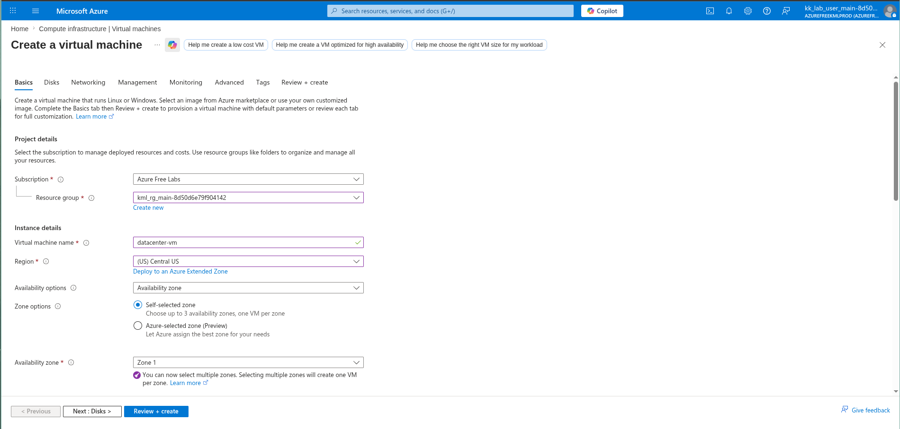
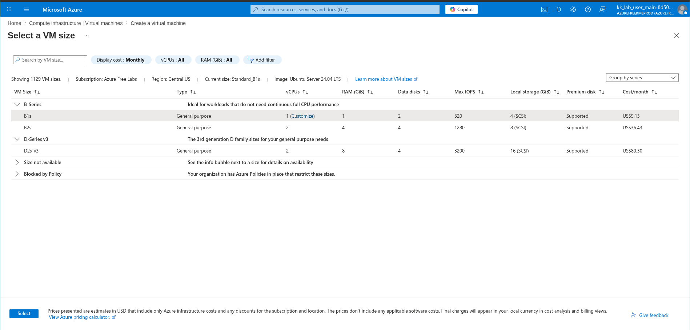
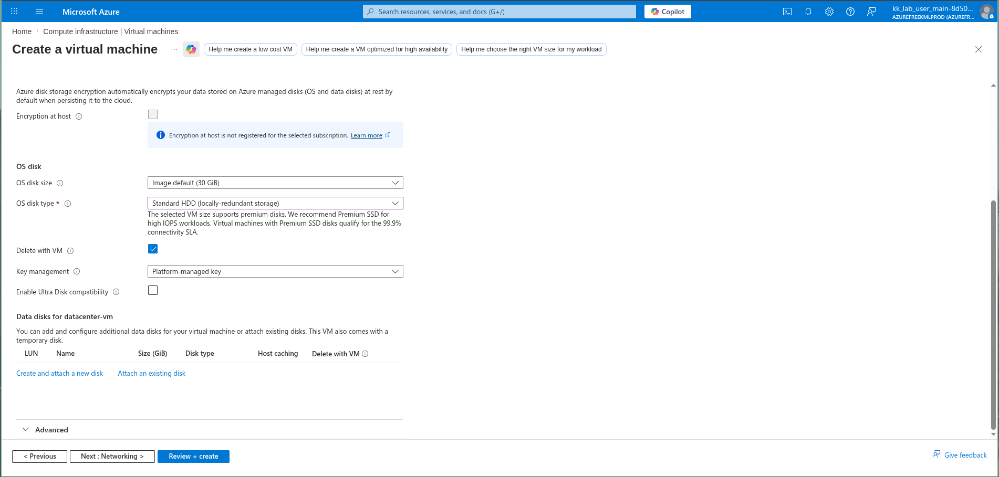
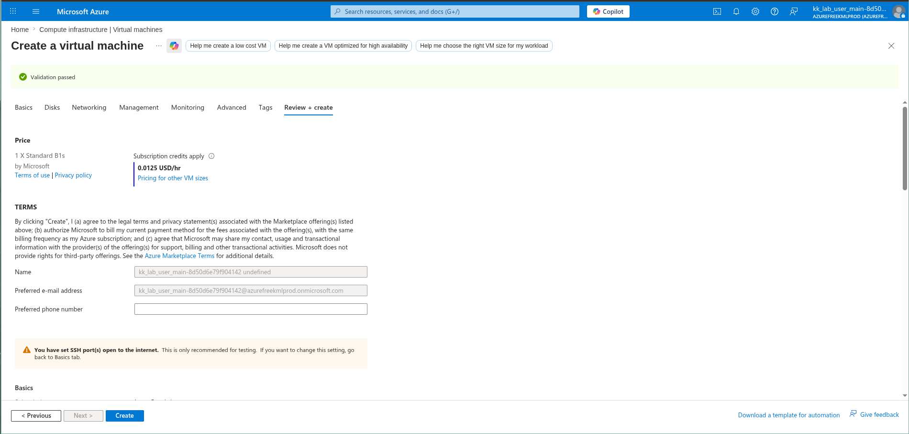
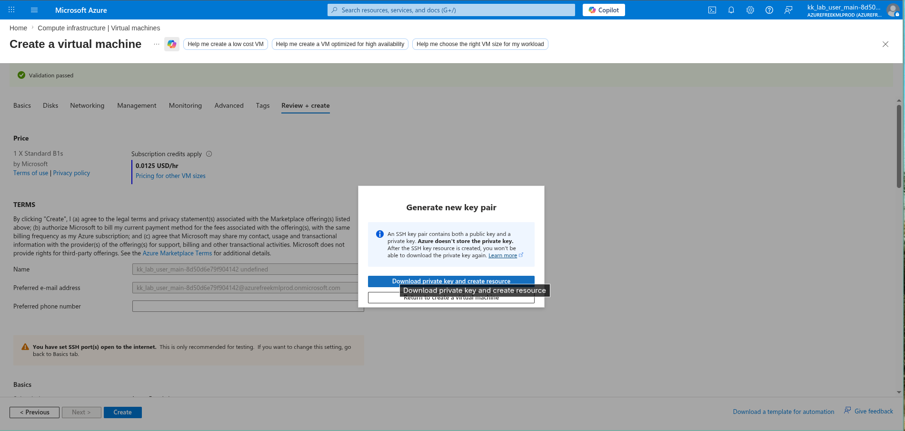
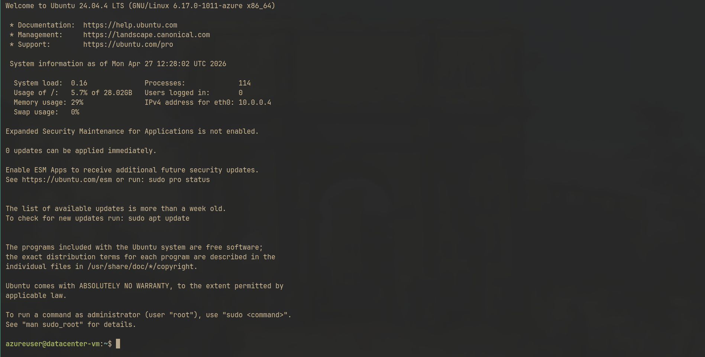

# 100 Days of Azure – Day 02  

## Azure Virtual Machine Deployment and SSH Access

## Overview  

This task focuses on deploying a Linux Virtual Machine in Microsoft Azure and accessing it securely using SSH.

---

## What I Did  

- Created a Linux Virtual Machine (Ubuntu 24.04 LTS)  
- Selected VM size: Standard B1s  
- Configured OS disk and default settings  
- Generated and downloaded SSH key pair  
- Allowed SSH (port 22) access  
- Connected to the VM using SSH  

---

## Screenshots  

### VM Configuration  

### VM Size Selection  

### Disk Configuration  

### Review and Create  

### SSH Key Download  

### SSH Login  

---

## Result  

Successfully deployed a Linux VM and connected to it via SSH.

---

## Author  

Hein Lin Zaw
