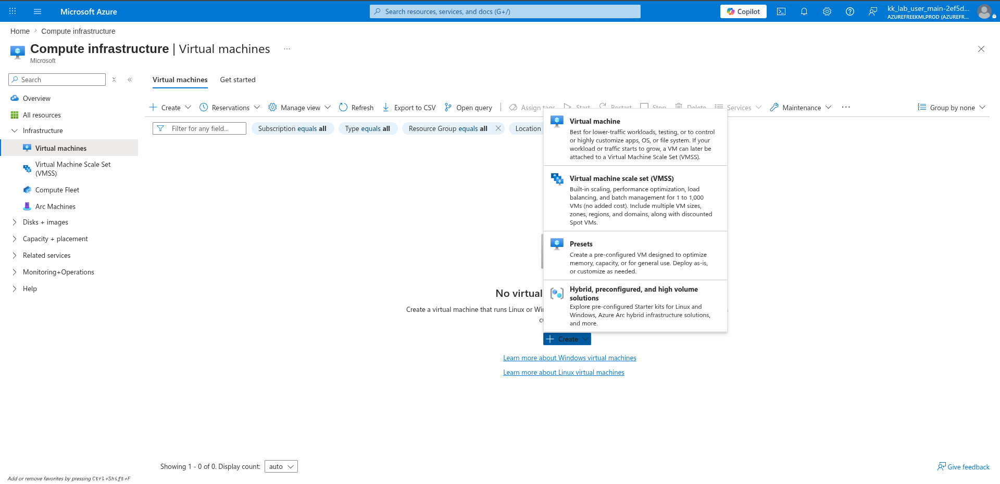
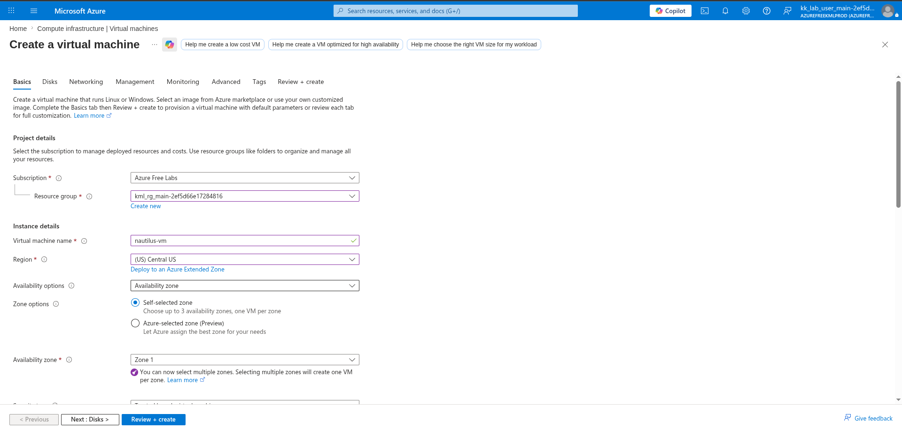
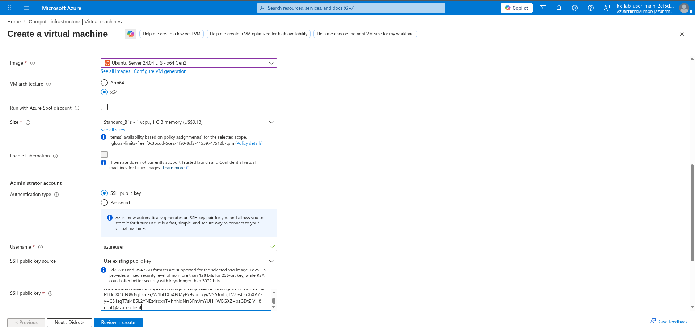
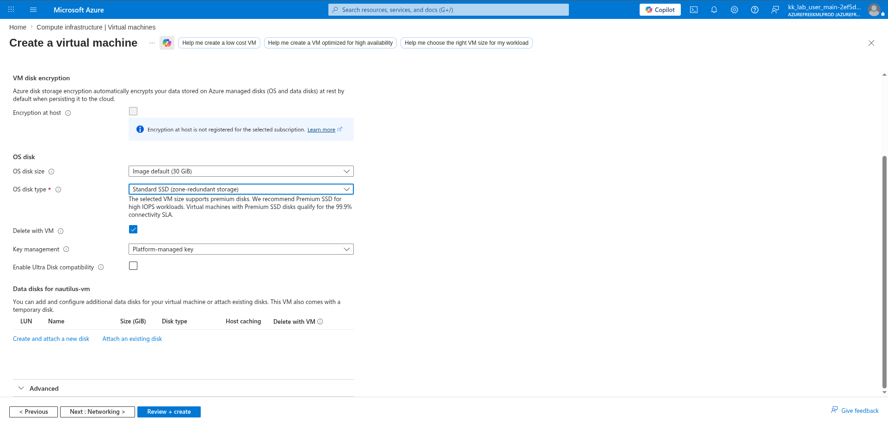
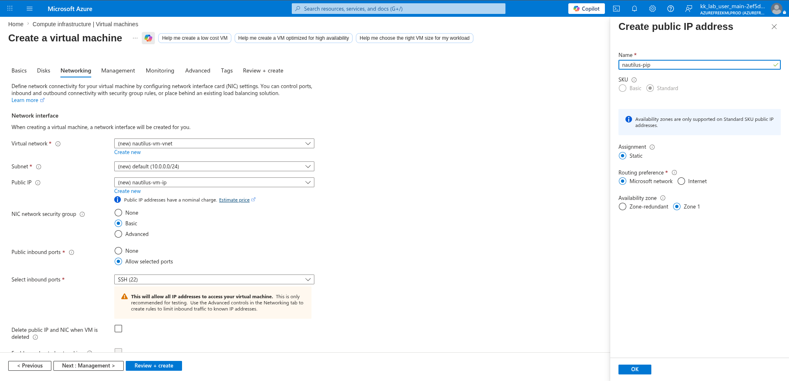
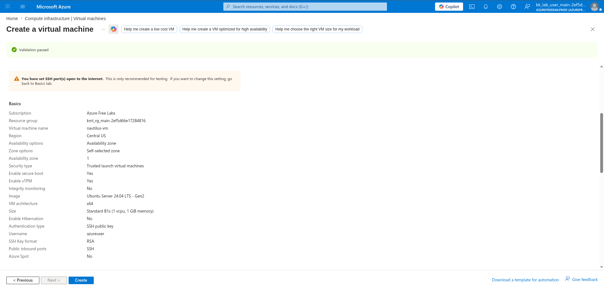
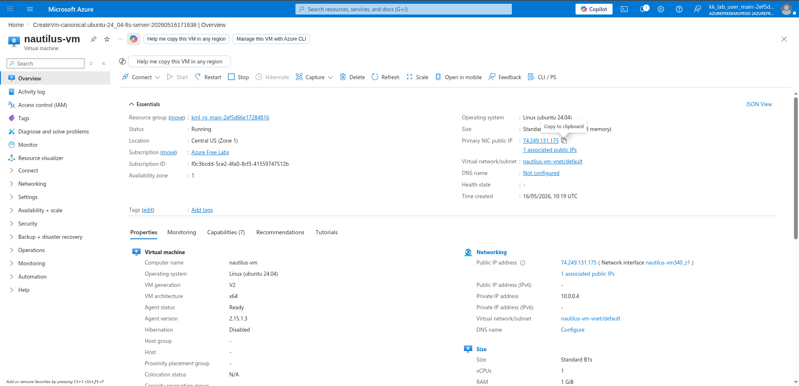

# 100 Days of Azure – Day 21  

## Creating and Connecting to an Azure Virtual Machine

## Overview  

This lab demonstrates how to create an Ubuntu virtual machine in Microsoft Azure and connect to it securely using SSH public key authentication.

---

## What I Did  

- Generated an SSH key pair on the Azure client machine  
- Copied the public SSH key  
- Created a new Azure Virtual Machine  
- Configured VM storage and networking settings  
- Created a static public IP  
- Connected to the VM using SSH  

---

## Steps Performed  

### 1. Open Virtual Machines Service  

Navigated to:

```text
Compute infrastructure → Virtual machines
```

Then clicked:

```text
Create → Virtual machine
```



---

### 2. Configure VM Basics  

Configured:

- VM name
- Region
- Availability zone
- Resource group



---

### 3. Configure Authentication  

On the Azure client machine:

```bash
ssh-keygen
```

Then displayed the public key:

```bash
cat ~/.ssh/id_rsa.pub
```

Copied the key and pasted it into the Azure VM SSH public key field.



---

### 4. Configure Disk Settings  

Selected the OS disk type:

```text
Standard SSD
```



---

### 5. Configure Networking and Public IP  

Configured:

- Virtual network
- SSH inbound access
- Static public IP



---

### 6. Review and Create VM  

Validated the configuration and created the virtual machine.



---

### 7. Verify VM Deployment  

Confirmed that the virtual machine was created successfully and obtained the public IP address.



---

### 8. Connect to the Virtual Machine  

Connected to the VM using SSH:

```bash
ssh azureuser@<your_public_ip>
```

Example:

```bash
ssh azureuser@74.xxx.xxx.xxx
```

---

## Result  

Successfully:

- Generated SSH keys
- Created an Ubuntu virtual machine in Azure
- Configured networking and storage settings
- Assigned a static public IP
- Connected securely to the VM using SSH

---

## Author  

Hein Lin Zaw
