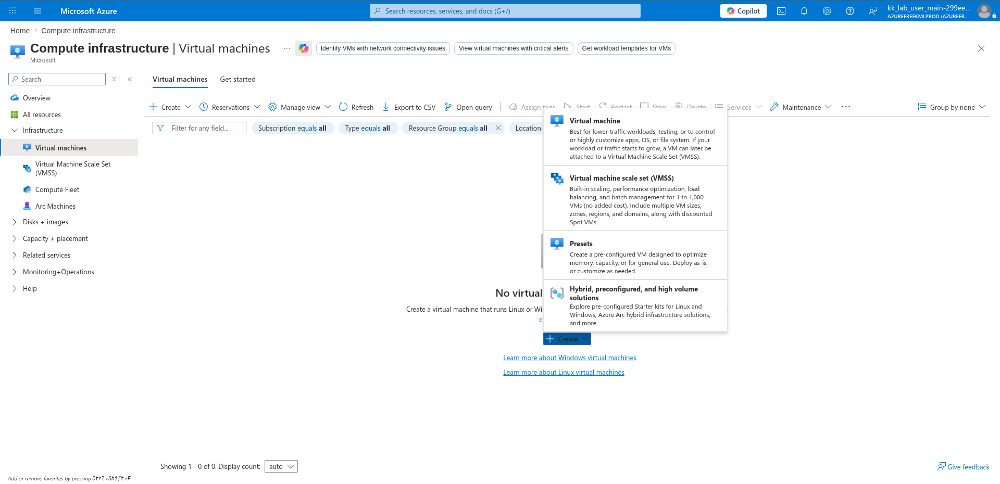
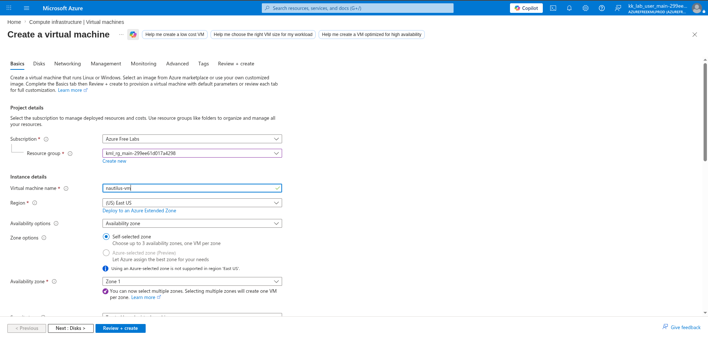
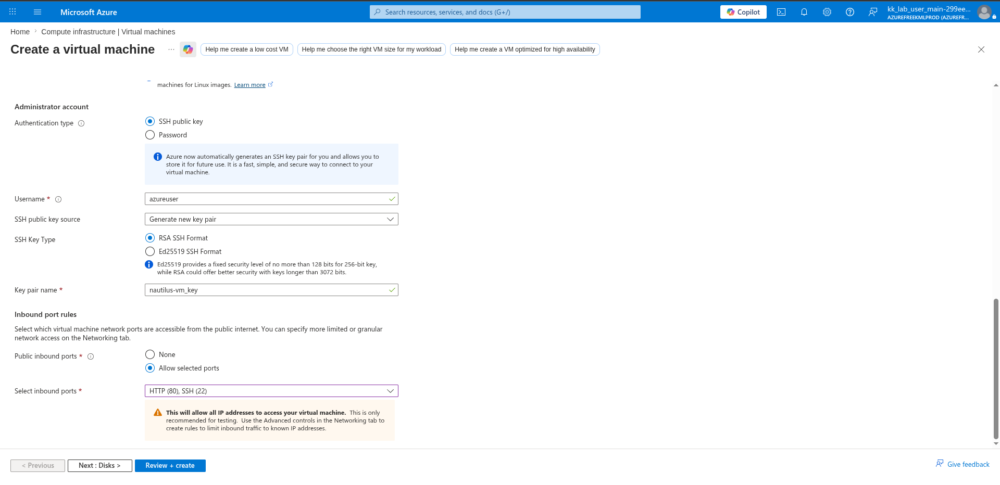
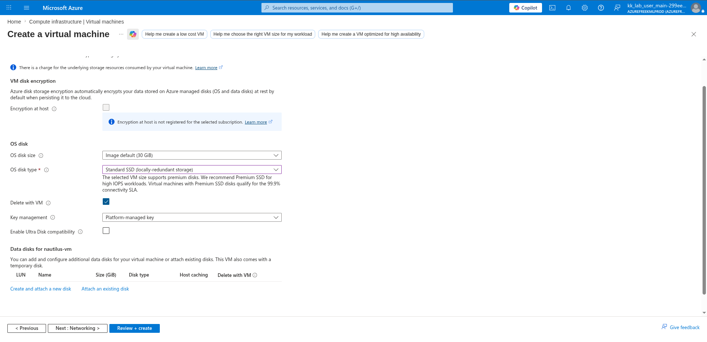
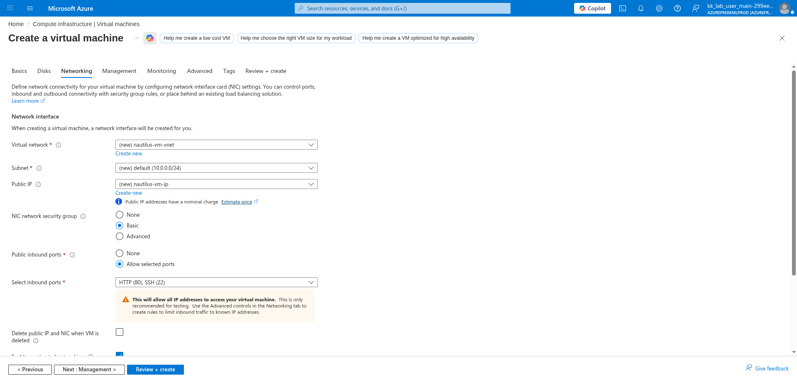
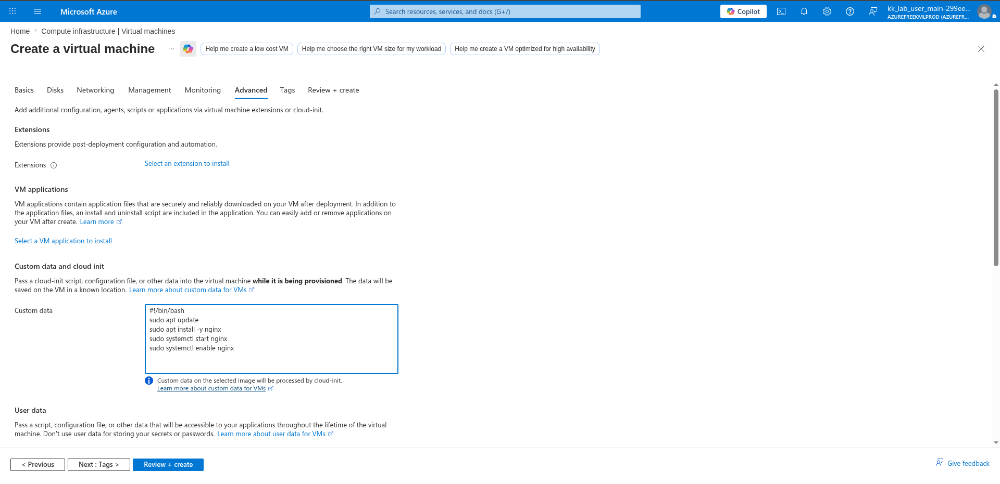
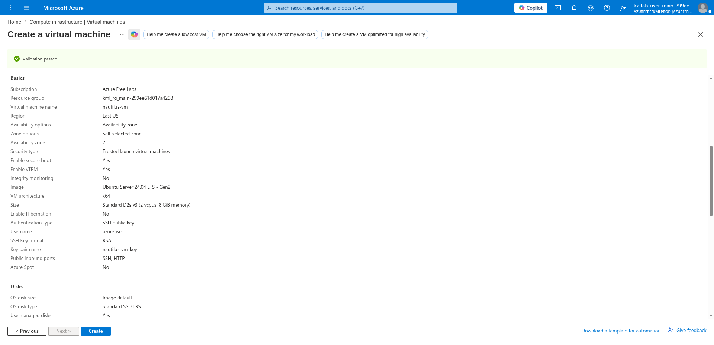

# 100 Days of Azure – Day 22  

## Deploying an NGINX Web Server on Azure VM Using Custom Data

## Overview  

This lab demonstrates how to create an Azure Virtual Machine and automatically install and configure NGINX during deployment using custom cloud-init data.

---

## What I Did  

- Created a new Azure Virtual Machine  
- Configured VM networking and storage  
- Allowed HTTP and SSH inbound traffic  
- Added a custom script  
- Automatically installed and enabled NGINX during provisioning  

---

## Steps Performed  

### 1. Open Virtual Machines Service  

Navigated to:

```text
Compute infrastructure → Virtual machines
```

Then clicked:

```text
Create → Virtual machine
```



---

### 2. Configure VM Basics  

Configured:

- Resource group
- VM name
- Region
- Availability zone



---

### 3. Configure Authentication and HTTP Access  

Configured:

- SSH public key authentication
- HTTP (80)
- SSH (22)



---

### 4. Configure Disk Settings  

Selected:

```text
Standard SSD
```



---

### 5. Configure Networking  

Verified that inbound HTTP access was enabled.



---

### 6. Add Custom Cloud-Init Script  

Added the following custom data script:

```bash
#!/bin/bash
sudo apt update
sudo apt install -y nginx
sudo systemctl start nginx
sudo systemctl enable nginx
```

This automatically installs and starts NGINX during VM provisioning.



---

### 7. Review and Create VM  

Validated the configuration and created the virtual machine.



---

## Result  

Successfully:

- Created an Azure Virtual Machine
- Configured SSH and HTTP access
- Added custom cloud-init configuration
- Automatically installed and enabled NGINX
- Prepared the VM for web hosting

---

## Author  

Hein Lin Zaw
