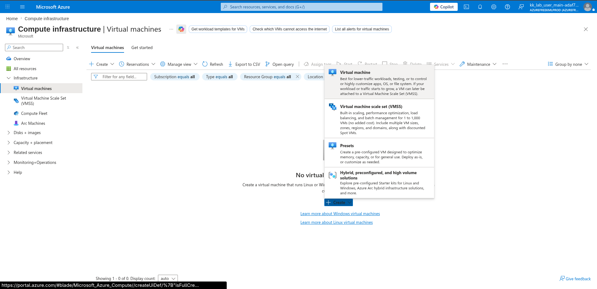
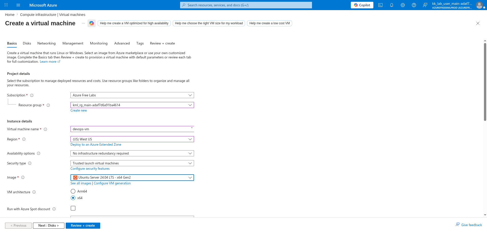
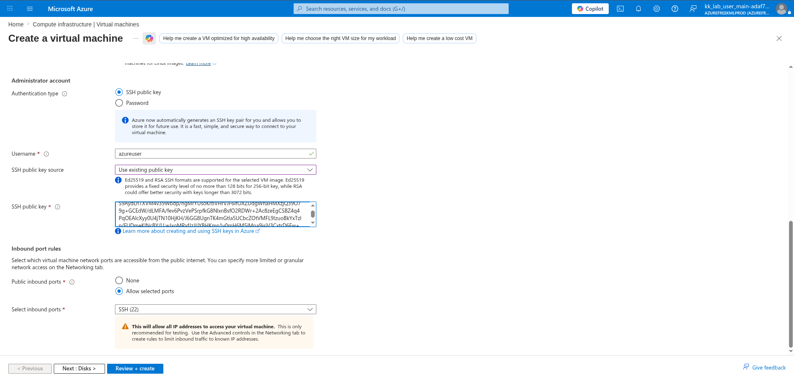
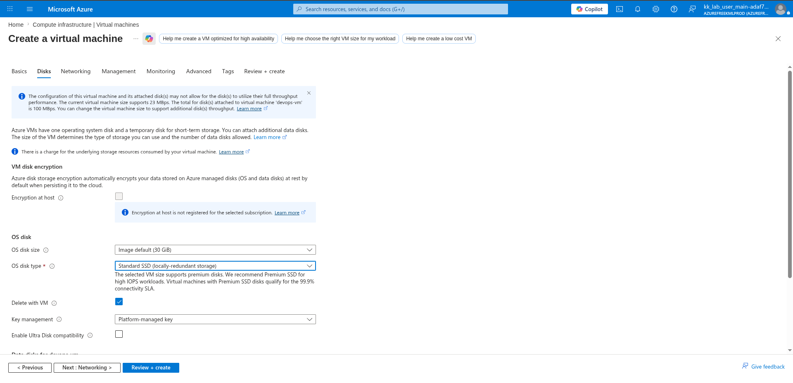
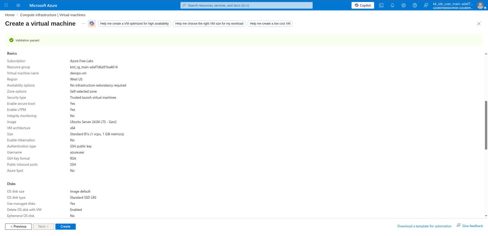
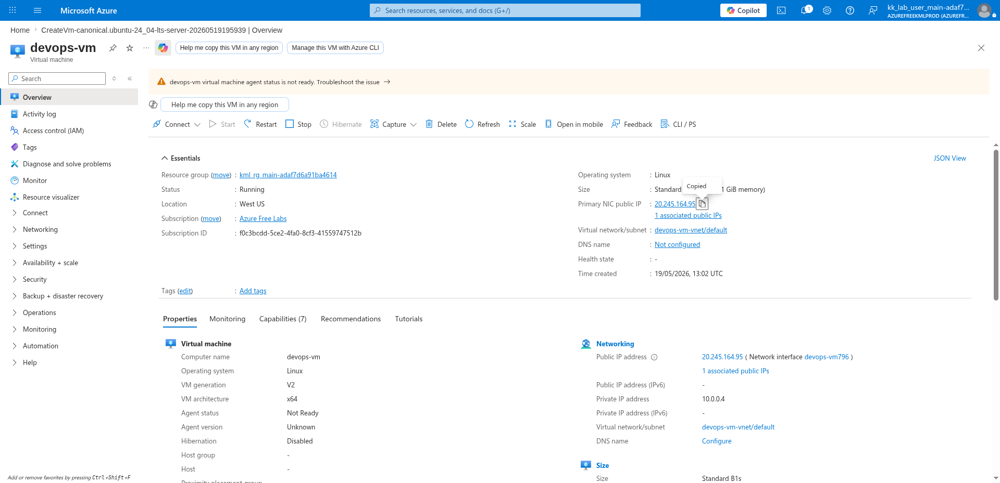

# 100 Days of Azure – Day 24  
## Creating and Accessing an Azure Linux Virtual Machine with SSH Keys

## Overview  
This lab demonstrates how to create an Azure Linux Virtual Machine using an existing SSH public key and connect to it securely using SSH.

---

## What I Did  
- Checked for existing SSH key pairs
- Generated SSH keys if not available
- Copied the public SSH key
- Created a new Azure Linux VM
- Configured VM storage and authentication
- Connected to the VM using SSH

---

## Steps Performed  

### 1. Check Existing SSH Keys  

```bash
ls .ssh/
```

Verified whether an SSH key pair already existed.

---

### 2. Generate SSH Key Pair (If Needed)  

If no SSH key existed:

```bash
ssh-keygen
```

---

### 3. Copy Public SSH Key  

```bash
cat .ssh/id_rsa.pub
```

Copied the public key for Azure VM authentication.

---

### 4. Open Virtual Machines Service  

Navigated to:

```text
Compute infrastructure → Virtual machines
```

Then clicked:

```text
Create → Virtual machine
```



---

### 5. Configure VM Basics  

Configured:
- Resource group
- VM name
- Region
- Ubuntu 24.04 image



---

### 6. Configure Authentication  

Configured:
- SSH public key authentication
- Existing public SSH key
- SSH inbound access



---

### 7. Configure Disk Settings  

Selected:

```text
Standard SSD
```



---

### 8. Review and Create VM  

Validated the configuration and created the virtual machine.



---

### 9. Copy Public IP Address  

After deployment, copied the VM public IP address.



---

### 10. Connect to the Virtual Machine  

```bash
ssh azureuser@<your_pub_ip>
```

---

## Author  
Hein Lin Zaw
