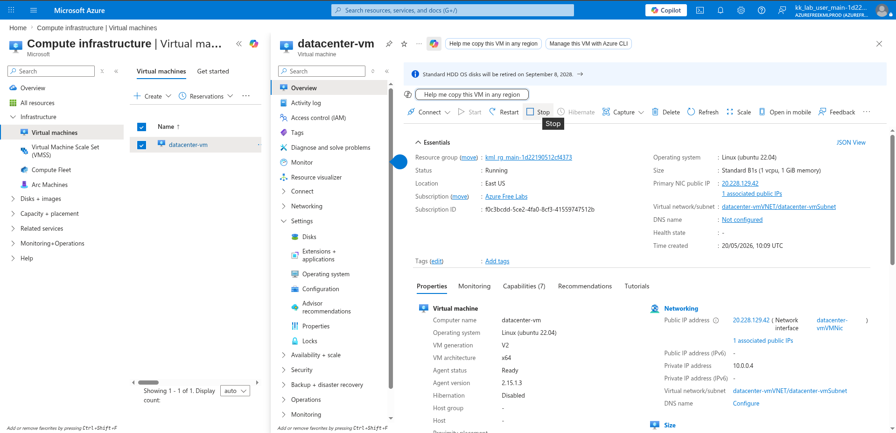
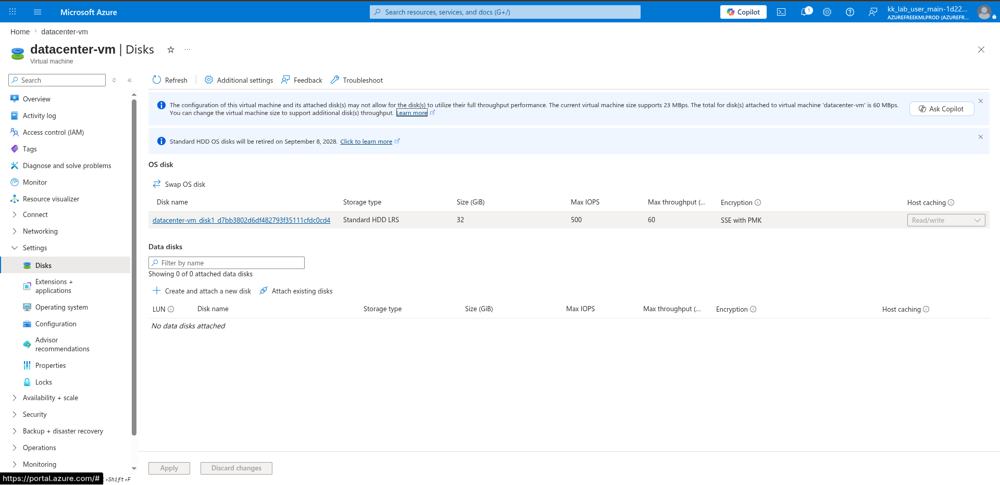
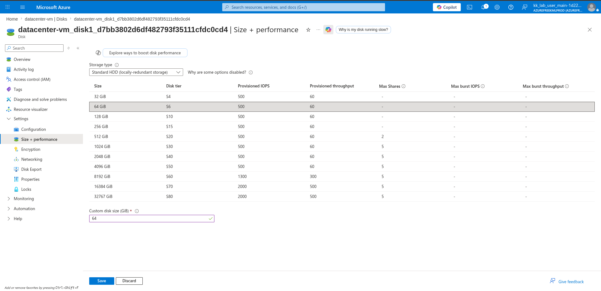
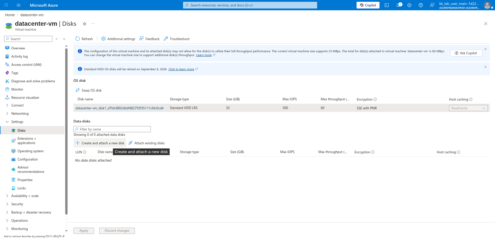
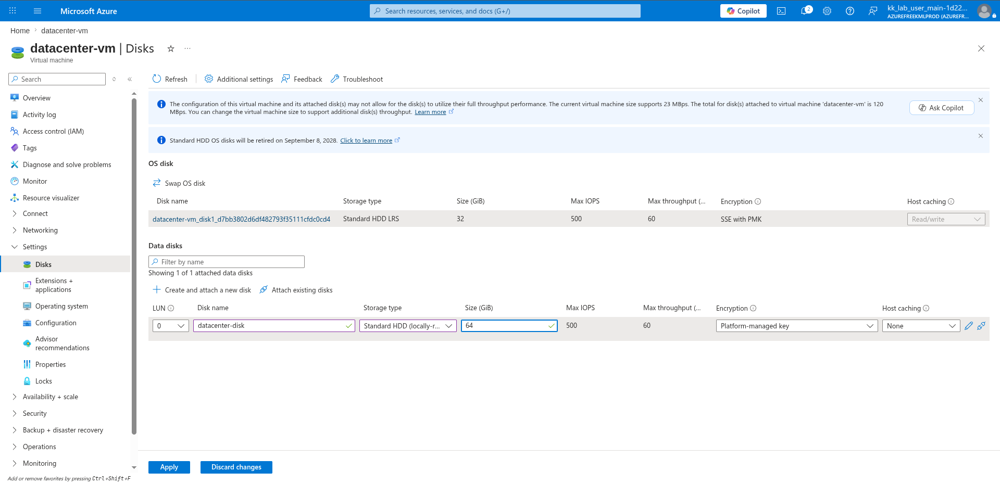
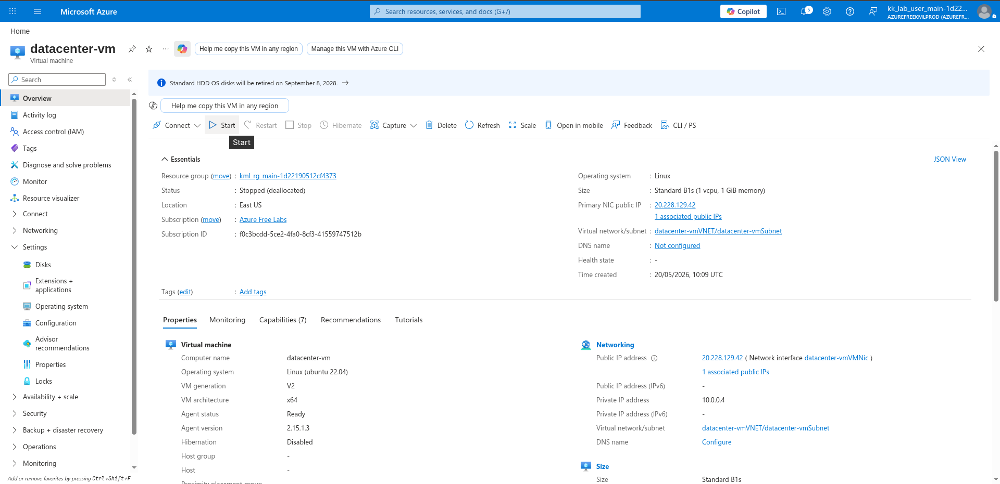
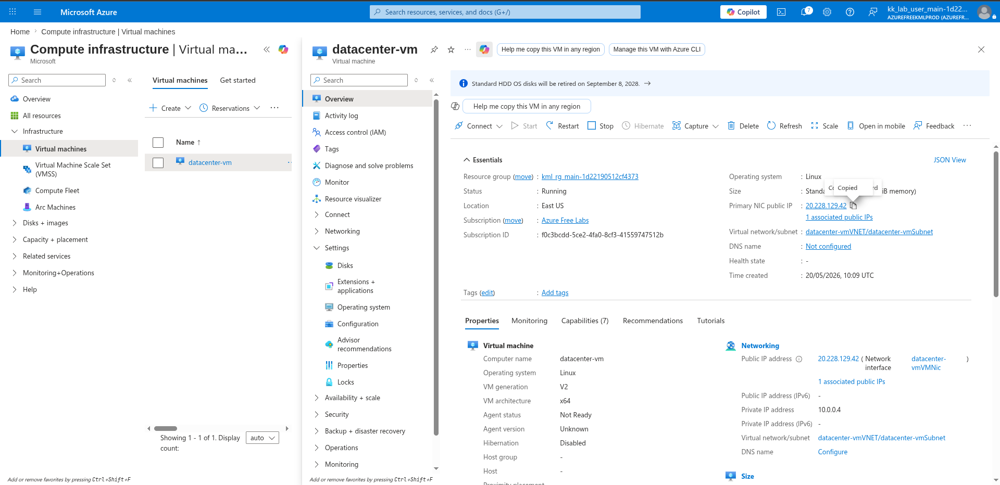

# 100 Days of Azure – Day 25  

## Resizing an Azure Managed Disk and Attaching a New HDD Disk

## Overview  

This lab demonstrates how to resize an Azure managed OS disk and attach a new HDD managed disk to an Azure Linux Virtual Machine.

---

## What I Did  

- Stopped the Azure virtual machine
- Opened VM disk settings
- Resized the managed OS disk
- Created and attached a new HDD data disk
- Restarted the VM
- Connected to the VM using SSH
- Partitioned and formatted the attached disk
- Mounted the disk to the filesystem
- Configured persistent mounting using `/etc/fstab`

---

## Steps Performed  

### 1. Stop the Virtual Machine  

Stopped the running virtual machine before modifying disk configurations.



---

### 2. Open Disk Settings  

Navigated to:

```text
Virtual Machine → Disks
```



---

### 3. Resize the OS Disk  

Opened the OS disk configuration page and increased the disk size.



---

### 4. Create and Attach a New HDD Disk  

Returned to the VM disk settings and clicked:

```text
Create and attach a new disk
```

Configured:

- Disk name
- HDD storage type
- Disk size



---

### 5. Configure and Apply the new Disk  



---

### 6. Restart the Virtual Machine  

Started the virtual machine again after disk configuration changes.



---

### 7. Copy Public IP Address  

Copied the VM public IP address from the Overview page.



---

### 8. Connect to the Virtual Machine  

```bash
ssh azureuser@<your_public_ip>
```

---

### 9. Verify Attached Disks  

```bash
lsblk
```

---

### 10. Create a Partition Table and Partition  

```bash
sudo parted /dev/sda --script mklabel gpt mkpart xfspart xfs 0% 100%
```

> Replace `/dev/sda` with your actual attached disk.

---

### 11. Format the Partition with XFS  

```bash
sudo mkfs.xfs /dev/sda1
```

---

### 12. Reload Partition Table  

```bash
sudo partprobe /dev/sda1
```

---

### 13. Create Mount Directory  

```bash
sudo mkdir /mnt/datacenter-disk
```

---

### 14. Mount the Disk  

```bash
sudo mount /dev/sda1 /mnt/datacenter-disk
```

---

### 15. Verify Mounted Disk  

```bash
lsblk
```

---

### 16. Get Disk UUID Information  

```bash
blkid
```

or

```bash
sudo blkid /dev/sda1
```

---

### 17. Configure Persistent Mounting  

```bash
sudo vim /etc/fstab
```

Added the disk UUID entry into `/etc/fstab`.

---

### 18. Verify Disk Usage  

```bash
df -h
```

---

## Author  

Hein Lin Zaw
