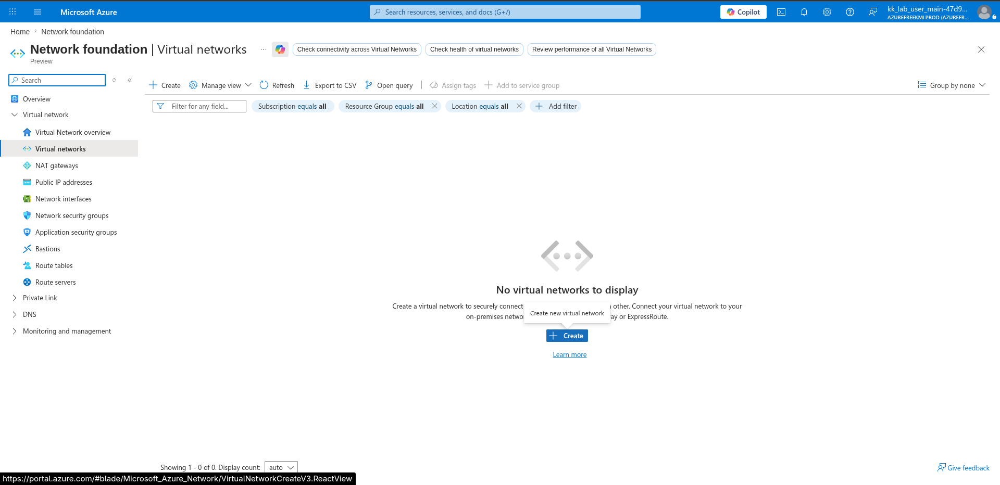
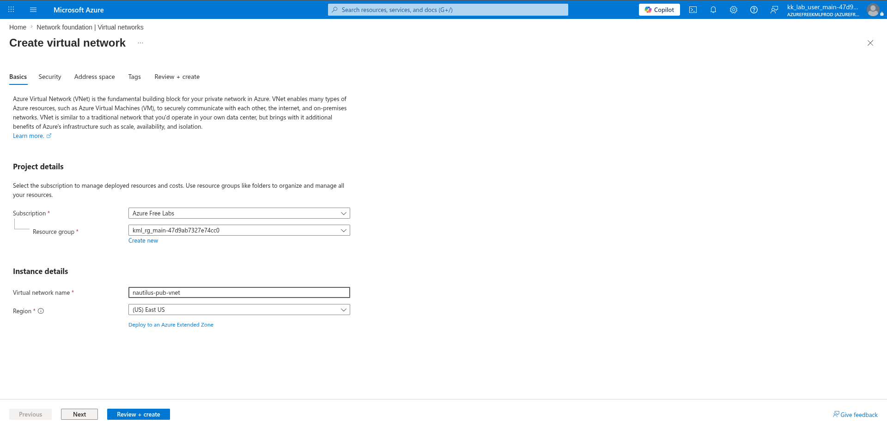
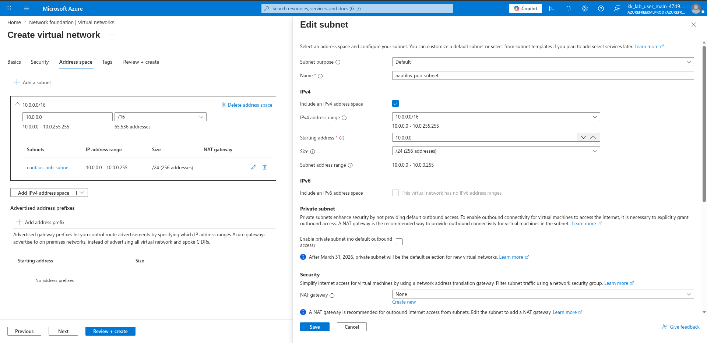
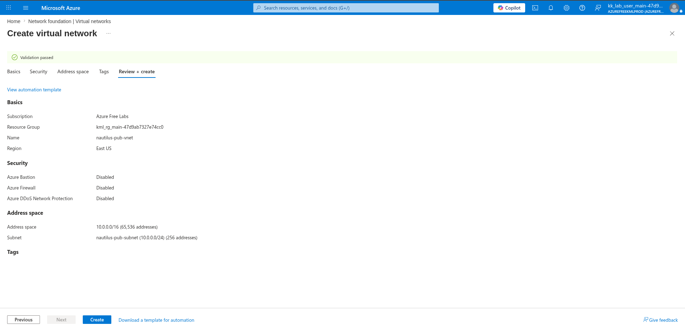
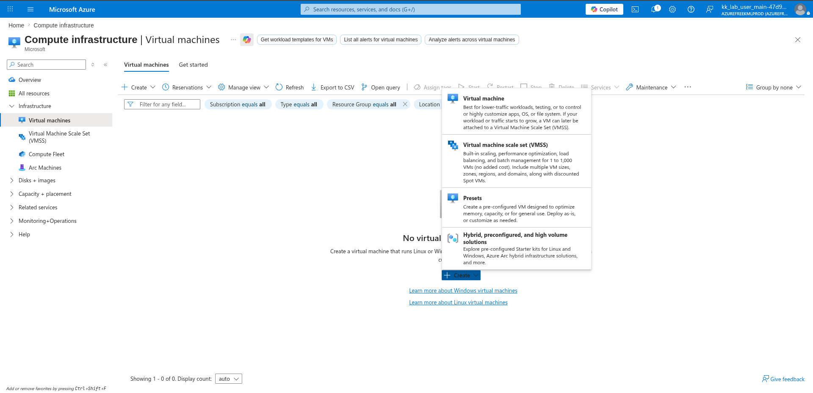
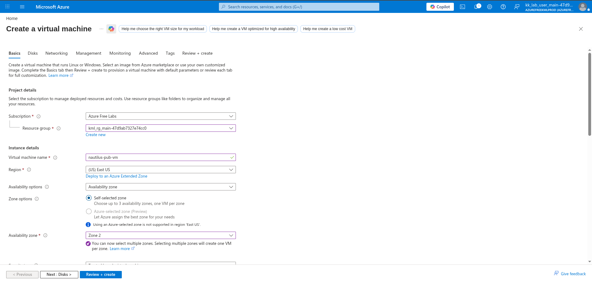
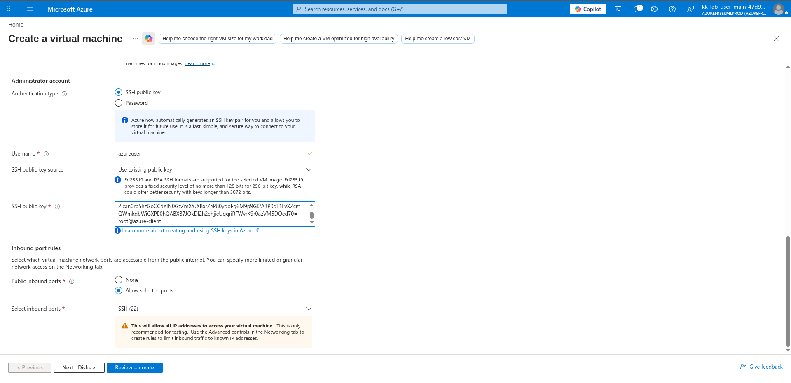
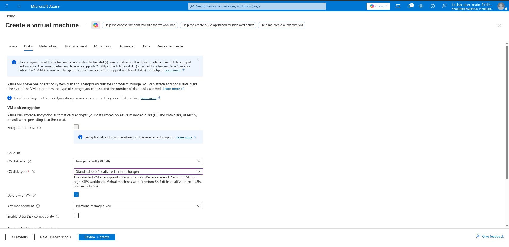
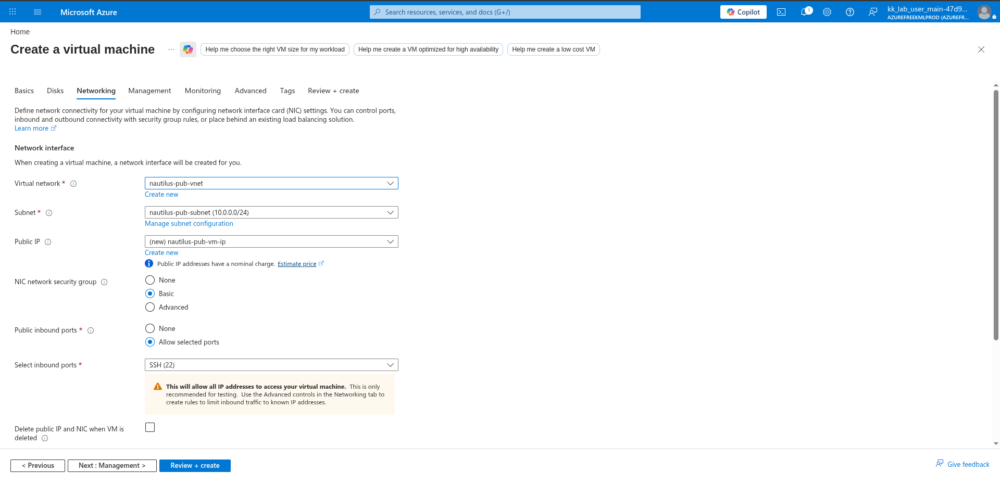
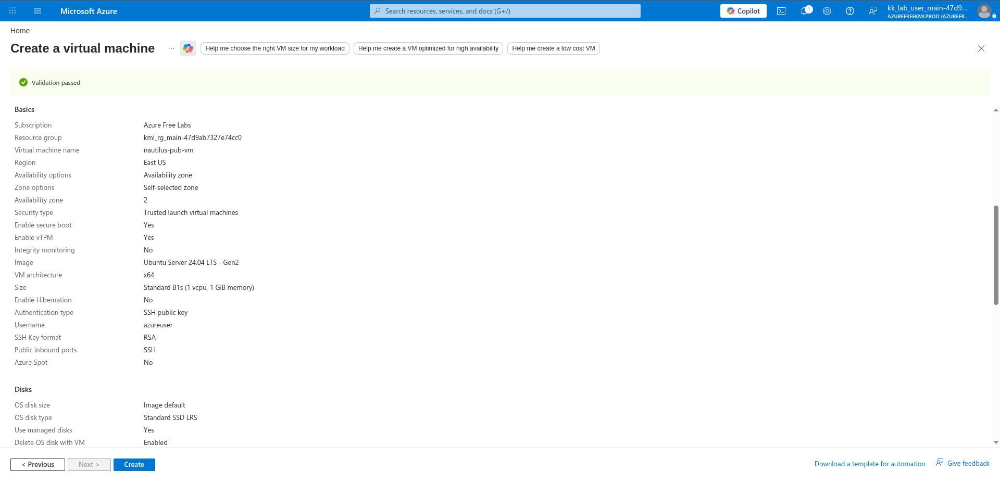

# 100 Days of Azure – Day 26  

## Creating a Virtual Network and Deploying an Azure Linux Virtual Machine

## Overview  

This lab demonstrates how to create a Virtual Network (VNet), configure a subnet, generate SSH keys using Azure CLI, and deploy an Ubuntu Linux Virtual Machine connected to the created network.

---

## What I Did  

- Created a Virtual Network (VNet)
- Configured subnet address ranges
- Generated SSH keys using Azure CLI
- Copied the public SSH key
- Created an Ubuntu Linux VM
- Attached the VM to the created VNet
- Configured SSH authentication
- Opened inbound SSH access
- Reviewed and deployed Azure resources

---

## Steps Performed  

### 1. Open Virtual Networks  

Navigated to:

```text
Network foundation → Virtual networks
```

Clicked:

```text
Create
```



---

### 2. Configure Virtual Network Name and Region  

Configured:

- Resource Group
- Virtual Network Name
- Azure Region



---

### 3. Configure Address Space and Subnet  

Configured:

- Address space
- Subnet name
- Subnet CIDR range

Example:

```text
10.0.0.0/16
10.0.0.0/24
```



---

### 4. Review and Create the Virtual Network  

Reviewed the VNet configuration and created the resource.



---

## Generate SSH Keys Using Azure CLI  

### 5. Generate SSH Key Pair  

```bash
ssh-keygen
```

Press Enter through the prompts to generate the key pair.

---

### 6. Display the Public SSH Key  

```bash
cat ~/.ssh/id_rsa.pub
```

Copied the displayed public key.

---

## Create the Virtual Machine  

### 7. Open Virtual Machines  

Navigated to:

```text
Compute infrastructure → Virtual machines
```

Clicked:

```text
Create → Virtual machine
```



---

### 8. Configure VM Name and Region  

Configured:

- VM name
- Region
- Availability zone
- Ubuntu Linux image
- VM size



---

### 9. Configure SSH Authentication  

Configured:

- Authentication type → SSH public key
- Username
- SSH public key source → Use existing public key

Pasted the copied SSH public key.



---

### 10. Configure OS Disk  

Selected:

```text
Standard SSD (locally-redundant storage)
```



---

### 11. Attach the Created Virtual Network  

Attached:

- Existing Virtual Network
- Existing Subnet
- Enabled SSH inbound access



---

### 12. Review and Create the VM  

Reviewed all VM configurations before deployment.



---

## Useful Commands  

### Generate SSH Keys

```bash
ssh-keygen
```

### Display Public Key

```bash
cat ~/.ssh/id_rsa.pub
```

### Connect to the VM

```bash
ssh azureuser@<public_ip>
```

---

## Author  

Hein Lin Zaw
