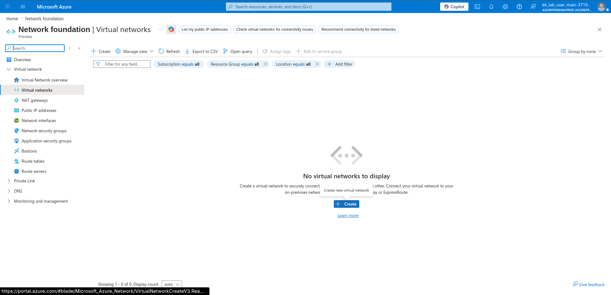
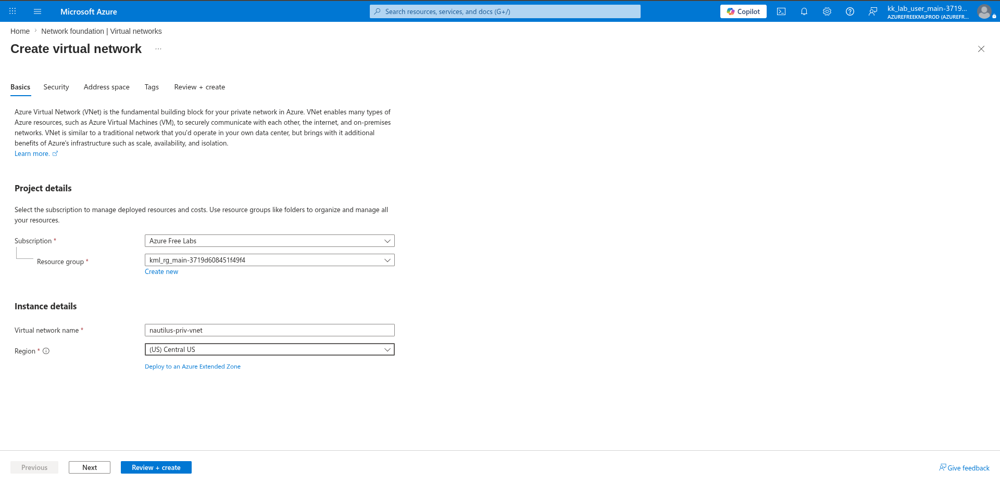
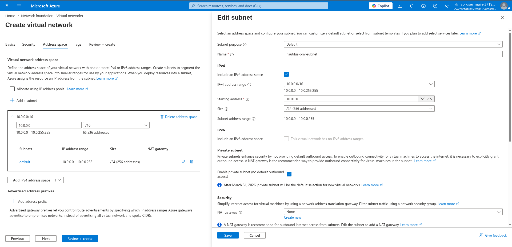
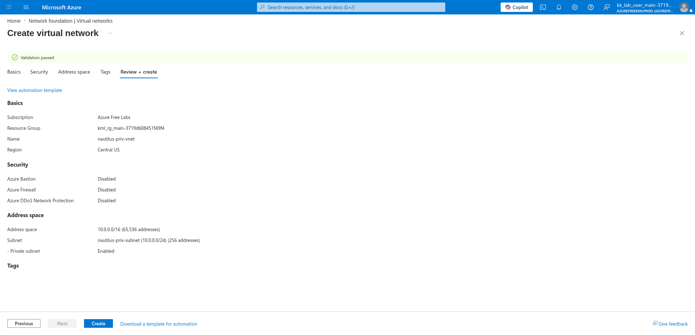
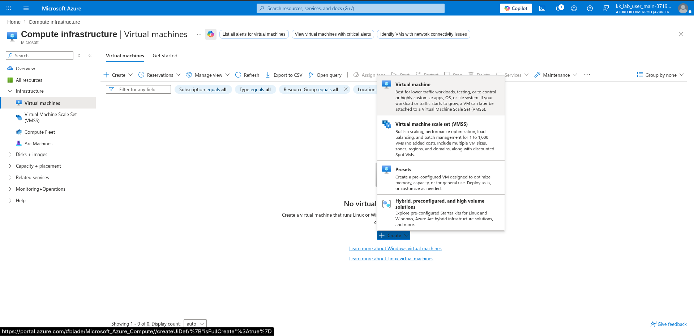
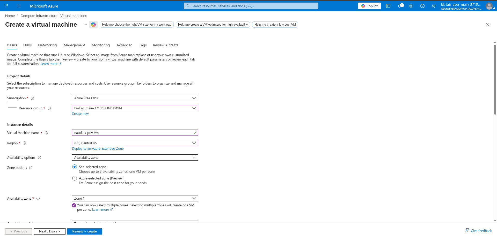
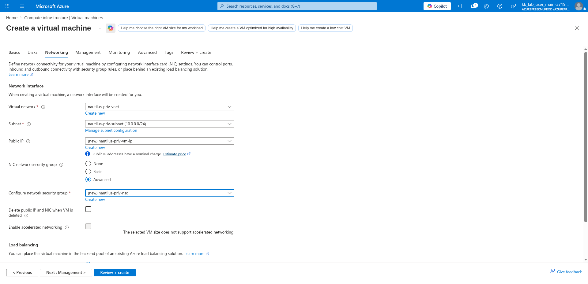
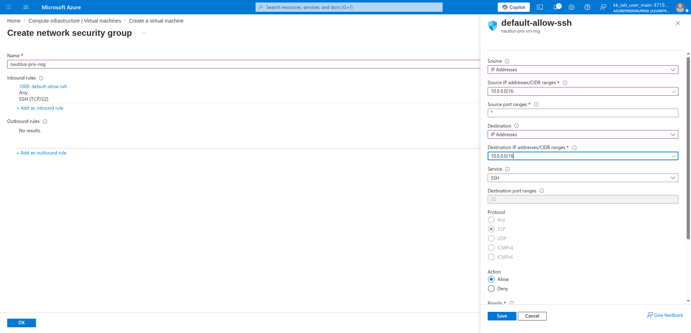
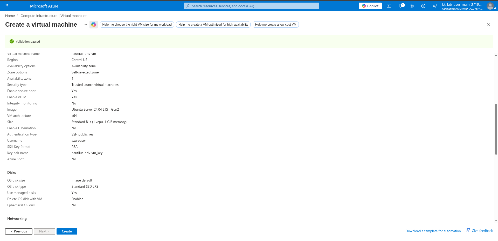

# 100 Days of Azure – Day 27  

## Creating a Private Virtual Network and Securing Azure VM Access with NSG

## Overview  

This lab demonstrates how to create a private Virtual Network (VNet), configure a private subnet, create a Network Security Group (NSG), and deploy an Ubuntu Linux Virtual Machine securely inside the private network.

---

## What I Did  

- Created a private Virtual Network
- Configured private subnet settings
- Enabled private subnet access restrictions
- Created a Network Security Group (NSG)
- Added inbound SSH security rule
- Restricted SSH traffic to internal network range
- Created an Ubuntu Linux VM
- Attached the VM to the private VNet and subnet
- Reviewed and deployed Azure resources

---

## Steps Performed  

### 1. Open Virtual Networks  

Navigated to:

```text
Network foundation → Virtual networks
```

Clicked:

```text
Create
```



---

### 2. Configure Virtual Network Name and Region  

Configured:

- Resource Group
- Virtual Network Name
- Region

Example:

```text
nautilus-priv-vnet
Central US
```



---

### 3. Configure Private Subnet  

Configured:

- Address space
- Subnet name
- Subnet CIDR range

Enabled:

```text
Private subnet (no default outbound access)
```

Example:

```text
10.0.0.0/16
10.0.0.0/24
```



---

### 4. Review and Create the Virtual Network  

Reviewed the configuration and created the VNet.



---

## Create the Virtual Machine  

### 5. Open Virtual Machines  

Navigated to:

```text
Compute infrastructure → Virtual machines
```

Clicked:

```text
Create → Virtual machine
```



---

### 6. Configure VM Name and Region  

Configured:

- VM name
- Region
- Availability zone
- Ubuntu Linux image
- VM size

Example:

```text
nautilus-priv-vm
```



---

### 7. Configure Networking and NSG  

Attached:

- Existing private VNet
- Existing private subnet

Selected:

```text
Advanced
```

Created a new NSG:

```text
nautilus-priv-nsg
```



---

### 8. Configure NSG Inbound SSH Rule  

Configured inbound SSH rule:

- Source: IP Addresses
- Source CIDR:

  ```text
  10.0.0.0/16
  ```

- Destination CIDR:

  ```text
  10.0.0.0/16
  ```

- Protocol: TCP
- Port: 22
- Action: Allow

This restricts SSH access to systems inside the private network only.



---

### 9. Review and Create the VM  

Reviewed:

- VM configuration
- Networking
- NSG rules
- Storage settings



---

### 10. Deploy the Virtual Machine  

Clicked:

```text
Create
```

Azure started provisioning:

- Virtual Machine
- Network Interface
- NSG
- Private networking resources

---

## Author  

Hein Lin Zaw
