# 100 Days of Azure – Day 28

## Exposing a Private Azure VM to the Internet with Public IP, Route Table, and NSG

## Overview

This lab demonstrates how to expose a previously private Azure VM to the internet by assigning a Public IP address, updating the Route Table to allow outbound internet traffic, adding an inbound HTTP (port 80) rule to the Network Security Group, and installing Nginx to serve web traffic.

---

## What I Did

- Located the existing Public IP address resource
- Associated the Public IP with the VM's Network Interface Card (NIC)
- Navigated to the VNet subnet linked to the Route Table
- Opened the existing Route Table (nautilus-rtb)
- Deleted the existing `Block-Internet` route
- Added a new `Allow_access` route pointing to the Internet
- Navigated to the NSG attached to the VM
- Added a new inbound security rule to allow HTTP traffic on port 80
- Tested public access with curl
- SSH'd into the VM and installed Nginx

---

## Steps Performed

### 1. Go to Existing Public IP Address

Navigated to:

```text
Network foundation → Public IP addresses
```

Selected the existing Public IP resource:

```text
nautilus-pip
IP address: 20.237.210.8
SKU: Standard
```

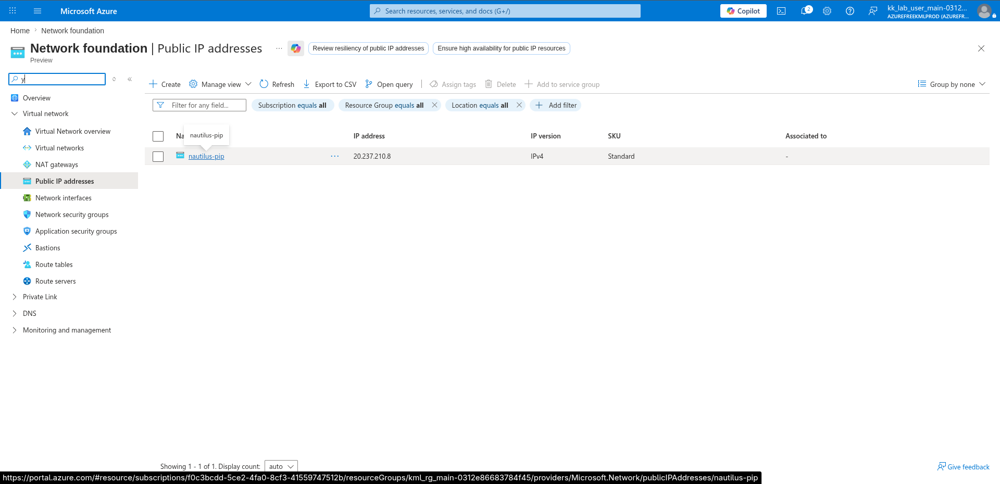

---

### 2. Associate the Public IP with the VM NIC

Clicked:

```text
Associate
```

Configured:

- Resource type: `Network interface`
- Network interface: `nautilus-vmVMNic`

Clicked:

```text
OK
```

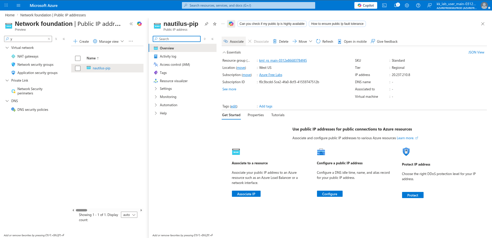

---

### 3. Attach Public IP with VM NIC Confirmation

Verified the association was set to the correct network interface:

```text
nautilus-vmVMNic
resource group: kml_rg_main-0312e86683784f45
```

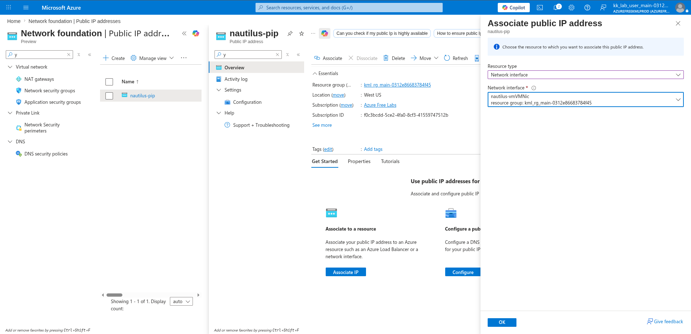

---

### 4. Go to VNet and Open Subnets

Navigated to:

```text
nautilus-vnet → Subnets
```

Confirmed the subnet and its linked Route Table:

- Subnet name: `nautilus-subnet`
- Address range: `10.0.0.0/24`
- Route table: `nautilus-rtb`

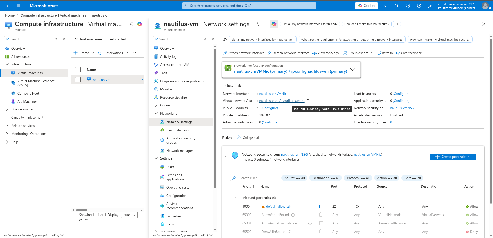

---

### 5. Go to Route Table

Clicked on the linked route table:

```text
nautilus-rtb
```

Reviewed the overview:

- Existing route: `Block-Internet` (Address prefix: `0.0.0.0/0`, Next hop type: `None`)
- Associated subnet: `nautilus-subnet` (`10.0.0.0/24`)

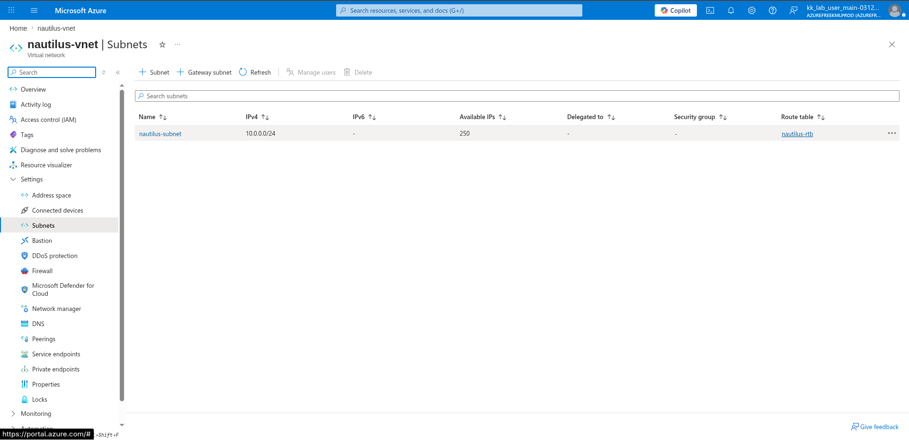

---

### 6. Go to Configuration / Routes

Navigated to:

```text
Settings → Routes
```

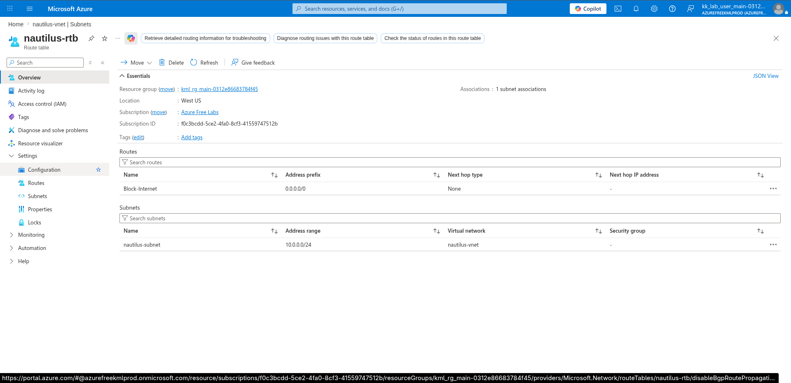

---

### 7. Delete the Existing Block-Internet Route

Clicked the `...` menu next to the `Block-Internet` route and selected:

```text
Delete
```

Confirmed the deletion prompt:

```text
Do you want to delete the route 'Block-Internet'?
→ Yes
```

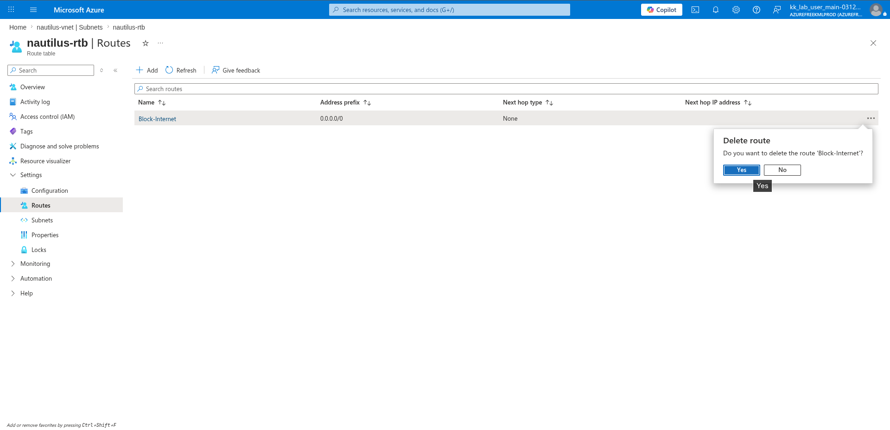

---

### 8. Add New Internet-Allow Route

Clicked:

```text
+ Add
```

Configured the new route:

- Route name: `Allow_access`
- Destination type: `IP Addresses`
- Destination IP addresses/CIDR ranges: `0.0.0.0/0`
- Next hop type: `Internet`

Clicked:

```text
Add
```

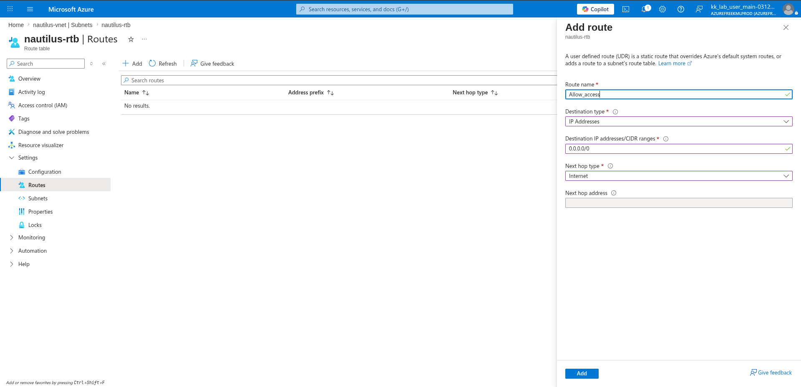

---

### 9. Go to NSG

Navigated to the VM's Network Settings to locate the attached NSG:

```text
nautilus-vm → Networking → Network settings
```

Confirmed the NSG attached to the NIC:

```text
nautilus-vmNSG
```

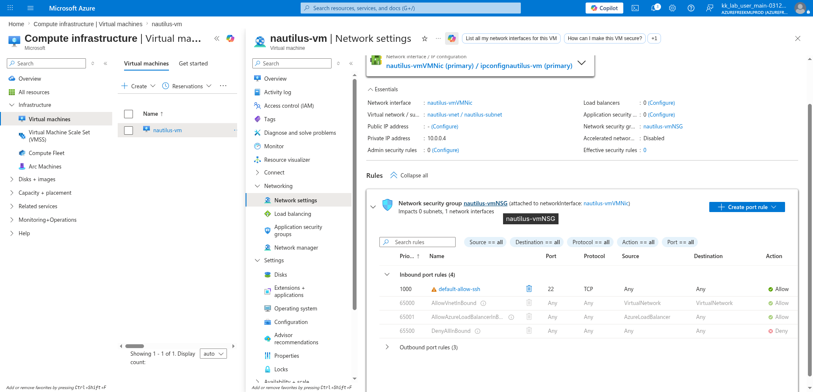

---

### 10. Add New Inbound Security Rule

Clicked:

```text
+ Add
```

on the Inbound security rules page of `nautilus-vmNSG`.

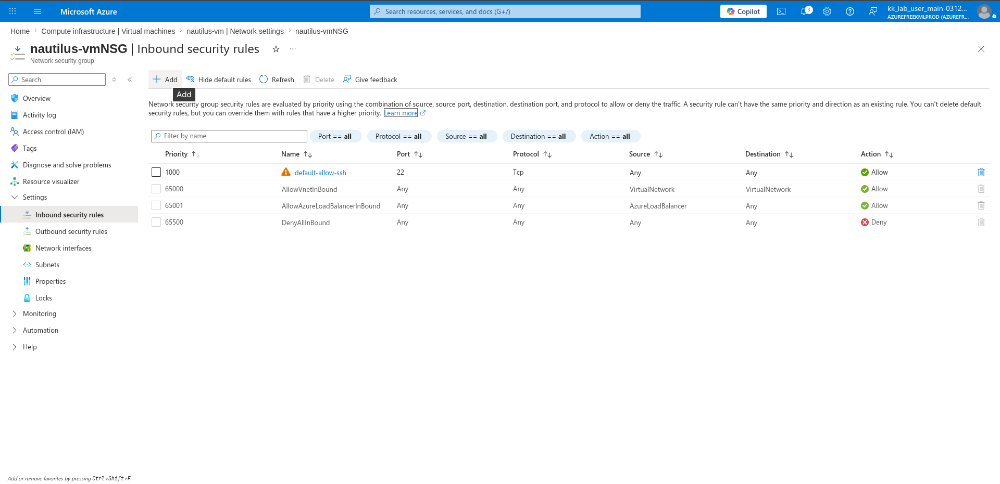

---

### 11. Configure Port 80 HTTP Inbound Rule

Configured the new inbound rule:

- Source port ranges: `*`
- Destination: `Any`
- Service: `HTTP`
- Destination port ranges: `80`
- Protocol: `TCP`
- Action: `Allow`
- Priority: `1010`
- Name: `Allow_http_from_public`

Clicked:

```text
Add
```

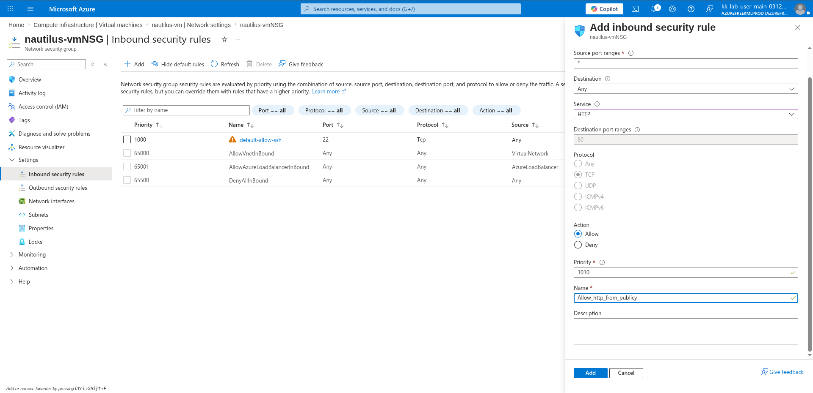

---

### 12. Test Public Access with curl

After associating the Public IP and updating the route table, tested HTTP access from a local machine:

```bash
curl <public-ip>
```

The request did not return a response — the VM had no web server running yet to serve traffic on port 80.

---

### 13. SSH into the VM

Connected to the VM using the newly assigned Public IP:

```bash
ssh azureuser@<public-ip>
```

Successfully authenticated and gained shell access to the Ubuntu VM.

---

### 14. Install Nginx

Installed the Nginx web server:

```bash
sudo apt install nginx
```

---

### 15. Enable and Start Nginx

Enabled Nginx to start on boot and started the service immediately:

```bash
sudo systemctl enable --now nginx
```

With Nginx running and port 80 open via the NSG inbound rule, the VM now serves HTTP traffic on the public IP.

---

## Author

Hein Lin Zaw
