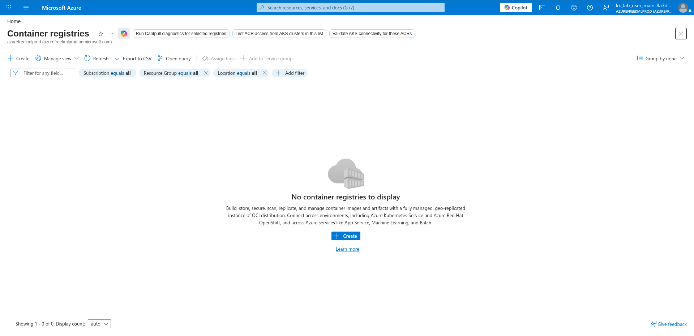
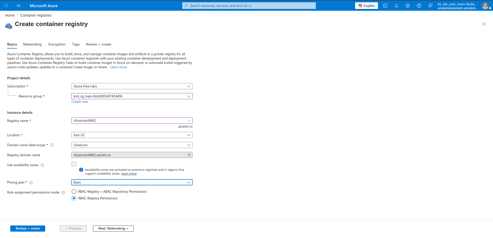
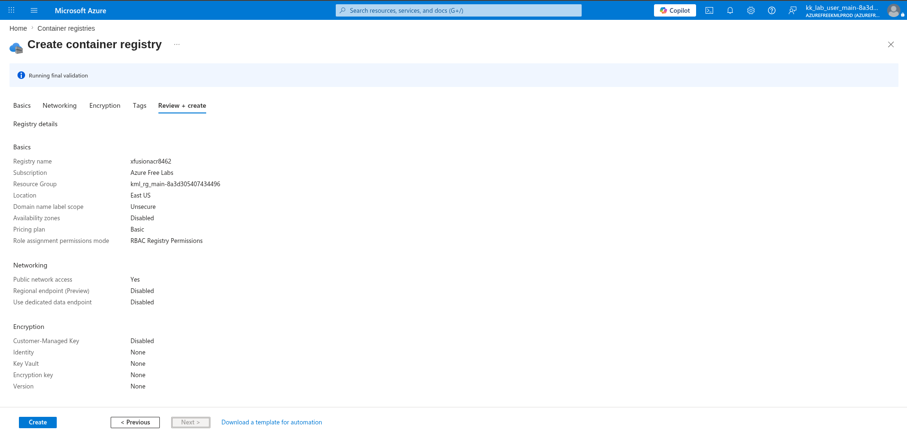
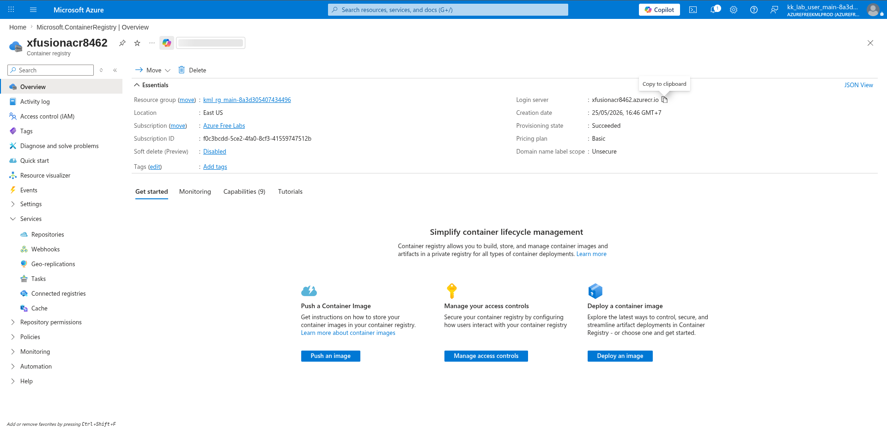
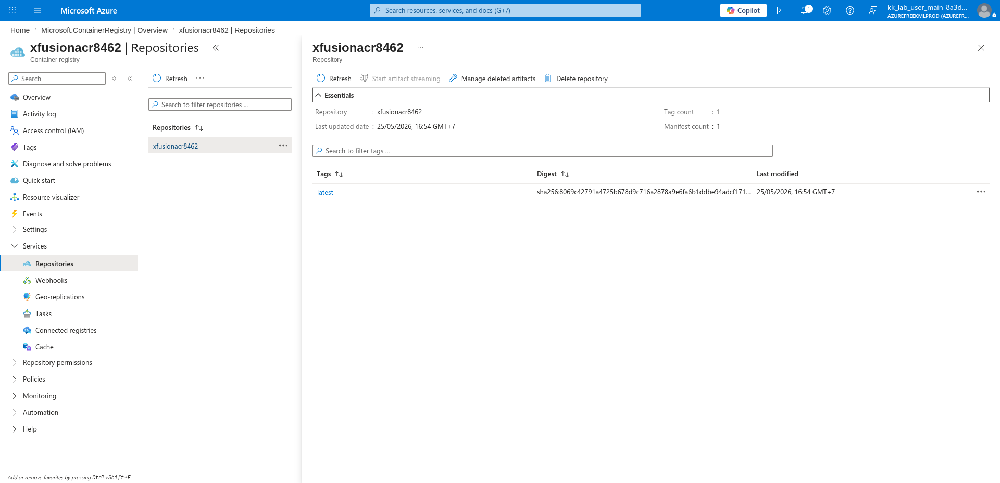

# 100 Days of Azure – Day 29

## Creating an Azure Container Registry and Pushing a Docker Image

## Overview

This lab demonstrates how to create an Azure Container Registry (ACR), build a Docker image from a local Python application, and push the image to the registry using the Azure CLI.

---

## What I Did

- Navigated to Container Registries and created a new ACR
- Configured registry name, region, and pricing plan
- Reviewed and deployed the registry
- Copied the login server address
- Logged into ACR using the Azure CLI
- Built a Docker image from a local Python app
- Pushed the image to the ACR repository
- Verified the image appeared in the ACR Repositories

---

## Steps Performed

### 1. Open Container Registries

Navigated to:

```text
Home → Container registries
```

No registries existed yet. Clicked:

```text
+ Create
```



---

### 2. Configure Registry Name, Region, and Pricing Plan

Configured:

- Subscription: `Azure Free Labs`
- Resource group: `kml_rg_main-8a3d305407434496`
- Registry name: `xfusionacr8462`
- Location: `East US`
- Domain name label scope: `Unsecure`
- Pricing plan: `Basic`
- Role assignment permissions mode: `RBAC Registry Permissions`



---

### 3. Review and Create

Reviewed the final configuration:

- Registry name: `xfusionacr8462`
- Location: `East US`
- Pricing plan: `Basic`
- Public network access: `Yes`
- Customer-Managed Key: `Disabled`

Clicked:

```text
Create
```



---

### 4. Copy the Login Server

After deployment, opened the ACR overview and copied the login server address:

```text
xfusionacr8462.azurecr.io
```



---

### 5. Navigate to the Python App Directory

In the Azure CLI, navigated to the local Python app folder and confirmed the Dockerfile was present:

```bash
cd pyapp/
ls
```

Expected output should include:

```text
Dockerfile
```

---

### 6. Log In to the ACR

Authenticated Docker to the Azure Container Registry:

```bash
az acr login --name <acr_name>
```

Example:

```bash
az acr login --name xfusionacr8462
```

---

### 7. Build the Docker Image

Built the Docker image and tagged it with the ACR login server and repository name:

```bash
docker build -t <acr_login_server>/<acr_name>:latest .
```

Example:

```bash
docker build -t xfusionacr8462.azurecr.io/xfusionacr8462:latest .
```

---

### 8. Push the Image to ACR

Pushed the tagged image to the Azure Container Registry:

```bash
docker push <acr_login_server>/<acr_name>:latest
```

Example:

```bash
docker push xfusionacr8462.azurecr.io/xfusionacr8462:latest
```

---

### 9. Verify the Image in ACR Repositories

Navigated to:

```text
xfusionacr8462 → Services → Repositories
```

Confirmed the image was successfully pushed:

- Repository: `xfusionacr8462`
- Tag: `latest`



---

## Author

Hein Lin Zaw
