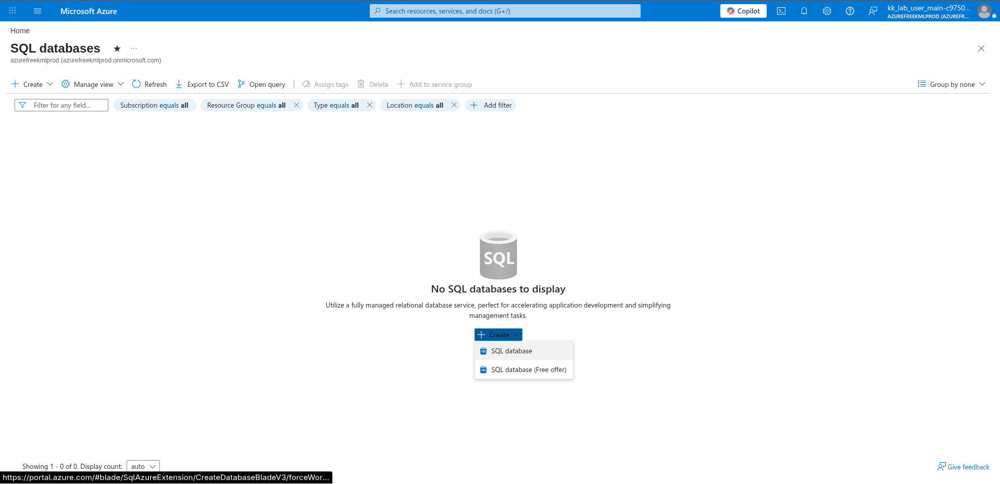
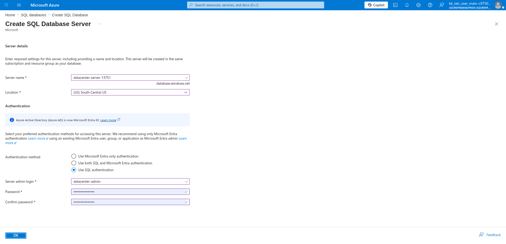
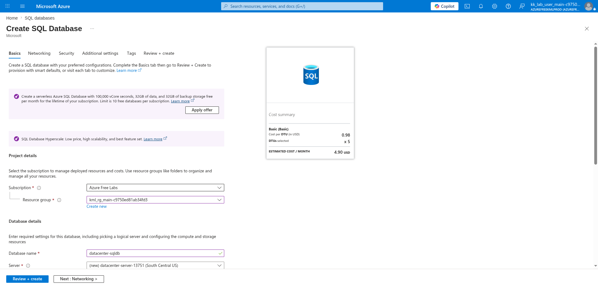
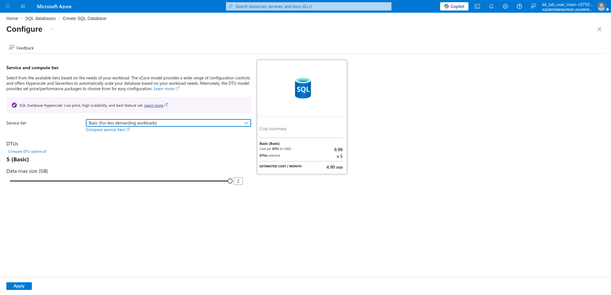
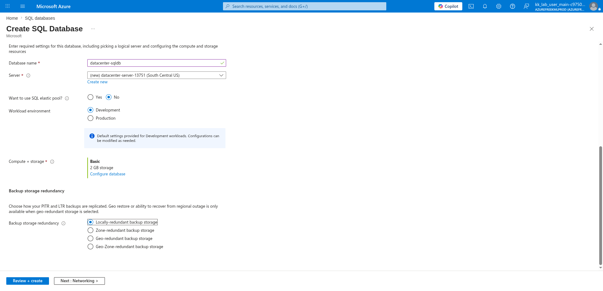

# 100 Days of Azure – Day 30

## Creating an Azure SQL Database with a New Logical Server

## Overview

This lab demonstrates how to create an Azure SQL Database by provisioning a new logical SQL server, configuring compute and storage settings, and deploying the database resource.

---

## What I Did

- Navigated to SQL Databases and initiated a new database creation
- Created a new logical SQL Database Server
- Configured server name, region, and SQL authentication
- Set the database name and selected the server
- Configured compute and storage tier
- Selected backup storage redundancy
- Reviewed and deployed the SQL Database

---

## Steps Performed

### 1. Open SQL Databases

Navigated to:

```text
Home → SQL databases
```

No databases existed yet. Clicked:

```text
+ Create → SQL database
```



---

### 2. Create a New Logical Server

On the Basics tab, clicked:

```text
Create new
```

next to the Server field to create a new logical SQL server.

Configured:

- Server name: `datacenter-server-13751`
- Location: `(US) South Central US`
- Authentication method: `Use SQL authentication`
- Server admin login: `datacenter-admin`
- Password: `••••••••••••••`

Clicked:

```text
OK
```



---

### 3. Configure Database Name and Server

Back on the Basics tab, configured:

- Subscription: `Azure Free Labs`
- Resource group: `kml_rg_main-c9750ed81ab34fd3`
- Database name: `datacenter-sqldb`
- Server: `(new) datacenter-server-13751 (South Central US)`
- Want to use SQL elastic pool: `No`
- Workload environment: `Development`
- Backup storage redundancy: `Locally-redundant backup storage`



---

### 4. Configure Compute and Storage

Clicked:

```text
Configure database
```

Selected the service and compute tier:

- Service tier: `Basic (For less demanding workloads)`
- DTUs: `5 (Basic)`
- Data max size: `2 GB`

Clicked:

```text
Apply
```



---

### 5. Review and Create

Reviewed the final configuration:

- Registry name: `datacenter-sqldb`
- Server: `datacenter-server-13751 (South Central US)`
- Pricing plan: `Basic`
- DTUs: `5`
- Data max size: `2 GB`
- Public network access: `Yes`
- Backup storage redundancy: `Locally-redundant`

Clicked:

```text
Create
```



---

## Author

Hein Lin Zaw
