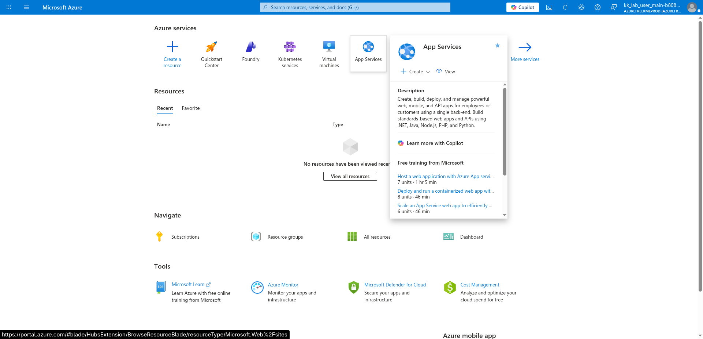
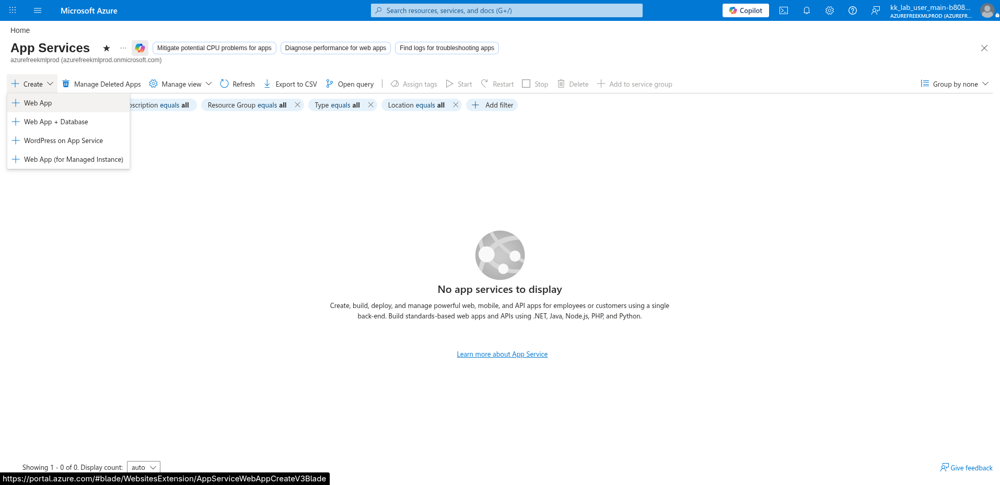
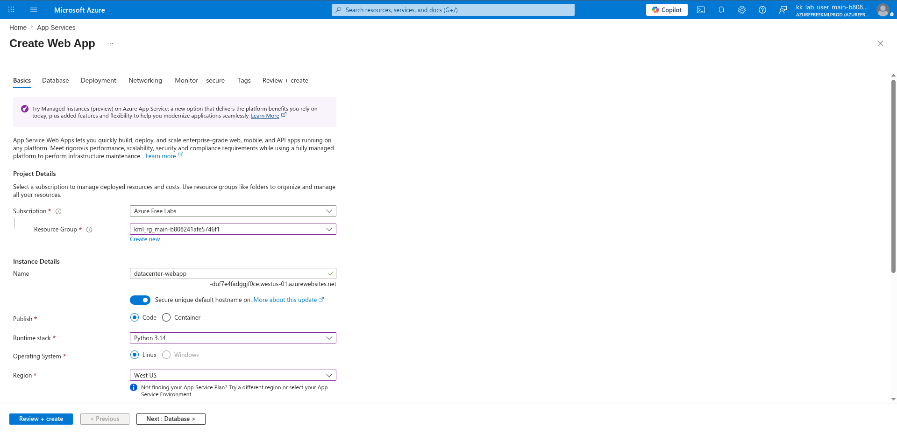
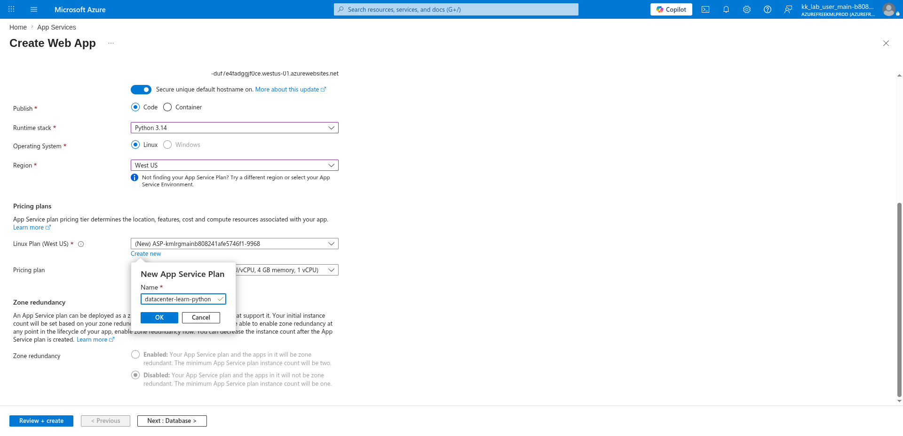
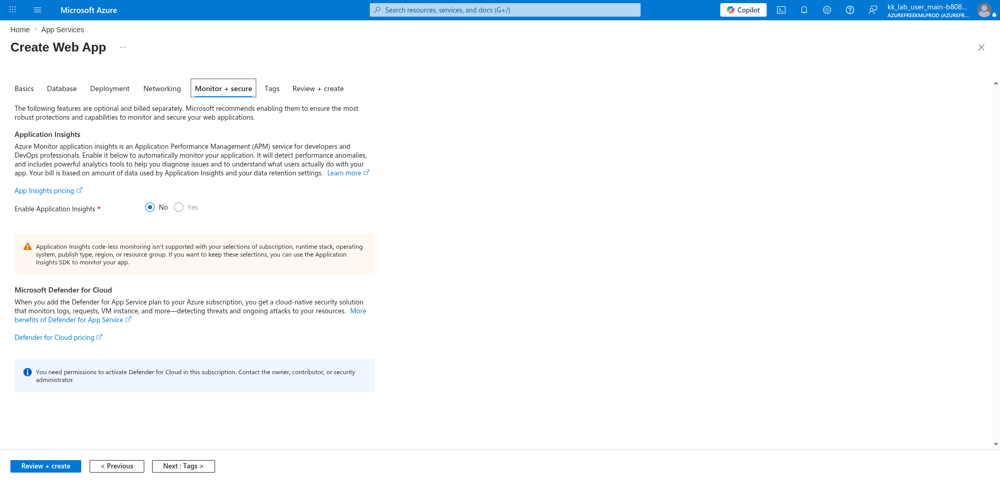
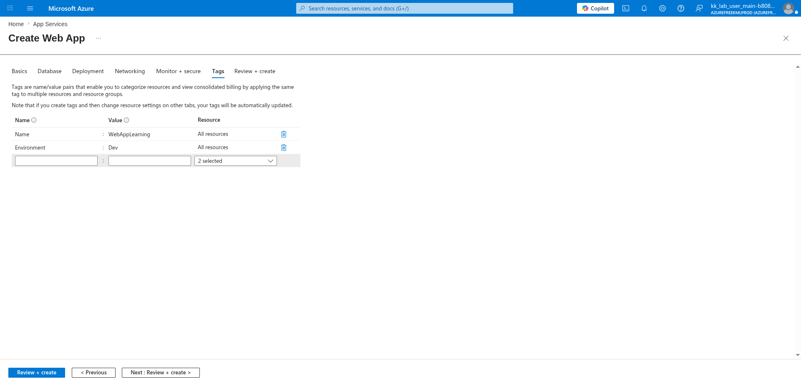
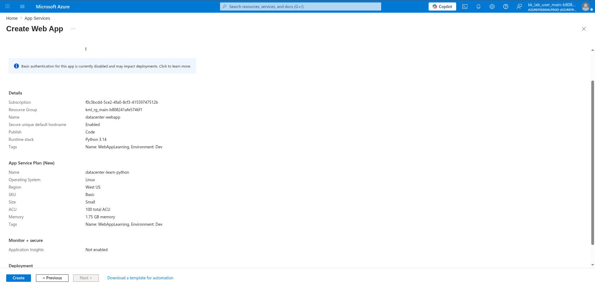

# 100 Days of Azure – Day 31

## Creating an Azure App Service Web App with a Python Runtime

## Overview

This lab demonstrates how to create an Azure App Service Web App running Python 3.14 on Linux, configure a new App Service Plan, disable Application Insights, add resource tags, and deploy the web application.

---

## What I Did

- Navigated to App Services from the Azure Home portal
- Selected Web App from the Create menu
- Configured the web app name, runtime stack, and region
- Created a new App Service Plan
- Disabled Application Insights monitoring
- Added resource tags for categorization
- Reviewed and deployed the Web App

---

## Steps Performed

### 1. Open App Services

From the Azure Home portal, clicked:

```text
App Services
```



---

### 2. Click Web App

No app services existed yet. Clicked:

```text
+ Create → Web App
```



---

### 3. Configure Name, Region, and Runtime Stack

On the Basics tab, configured:

- Subscription: `Azure Free Labs`
- Resource group: `kml_rg_main-b808241afe5746f1`
- Name: `datacenter-webapp`
- Publish: `Code`
- Runtime stack: `Python 3.14`
- Operating System: `Linux`
- Region: `West US`



---

### 4. Create New App Service Plan

Scrolled down to the Pricing plans section and clicked:

```text
Create new
```

Entered the new App Service Plan name:

```text
datacenter-learn-python
```

Clicked:

```text
OK
```



---

### 5. Disable Application Insights

Navigated to the **Monitor + secure** tab.

Set:

- Enable Application Insights: `No`

Note: Application Insights code-less monitoring is not supported with the selected runtime stack, operating system, and region combination.



---

### 6. Create Two Tags

Navigated to the **Tags** tab.

Added two tags applied to all resources:

| Name        | Value          |
|-------------|----------------|
| Name        | WebAppLearning |
| Environment | Dev            |



---

### 7. Review and Create

Reviewed the final configuration:

**Details:**

- Name: `datacenter-webapp`
- Publish: `Code`
- Runtime stack: `Python 3.14`
- Tags: `Name: WebAppLearning, Environment: Dev`

**App Service Plan (New):**

- Name: `datacenter-learn-python`
- Operating System: `Linux`
- Region: `West US`
- SKU: `Basic`
- Size: `Small`
- ACU: `100 total ACU`
- Memory: `1.75 GB memory`

**Monitor + secure:**

- Application Insights: `Not enabled`

Clicked:

```text
Create
```



---

## Author

Hein Lin Zaw
