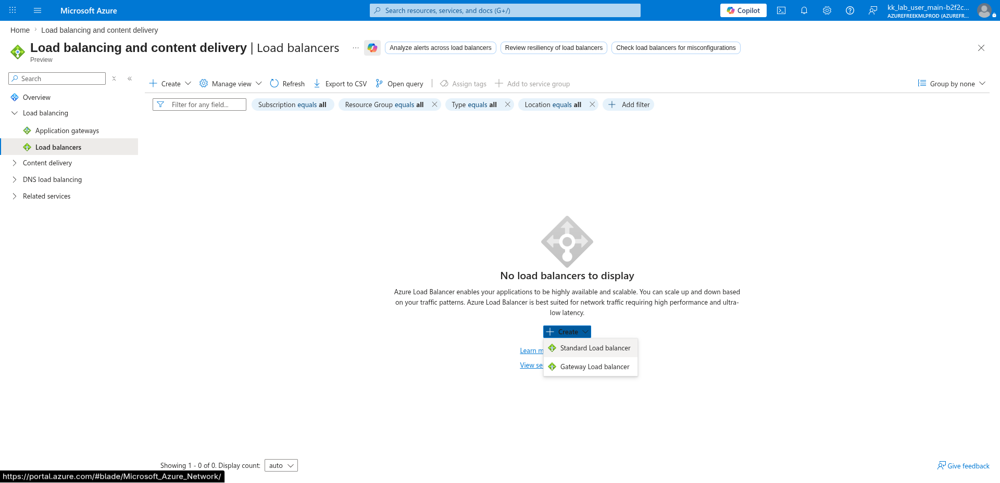
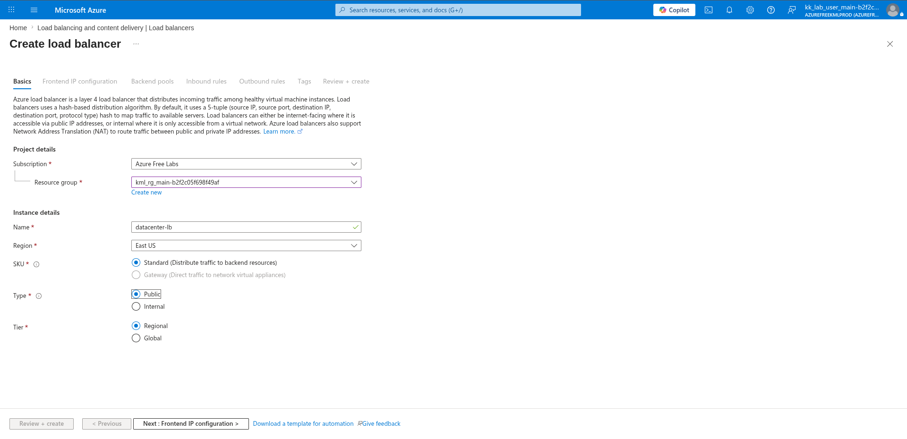
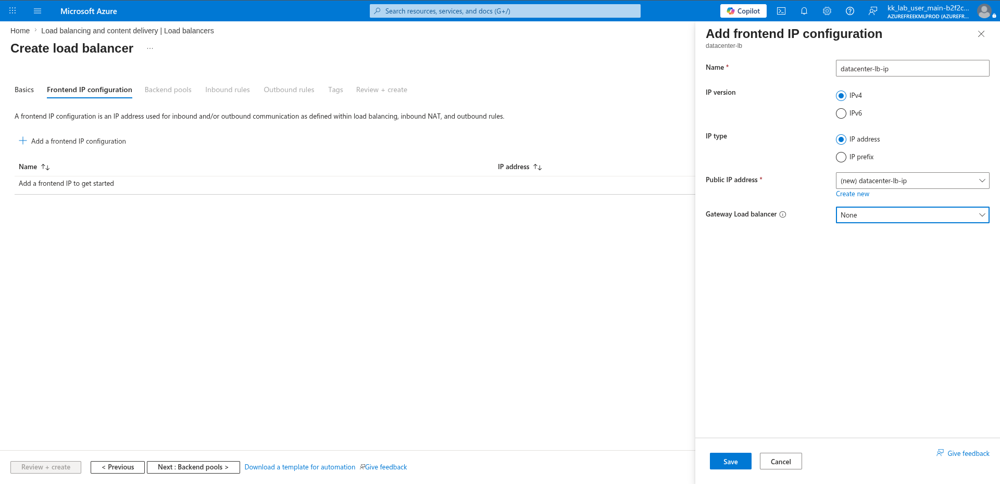
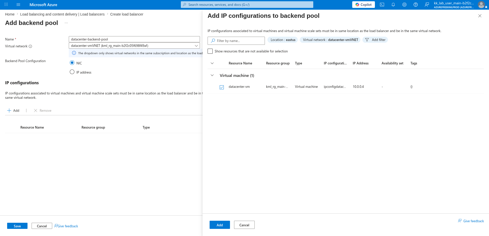
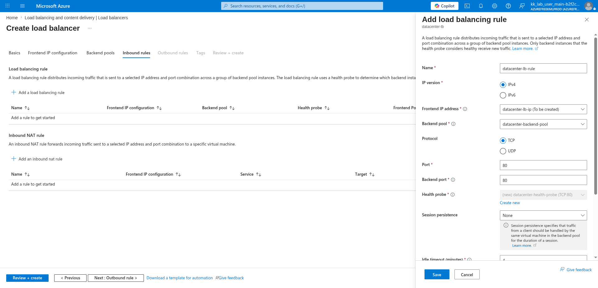
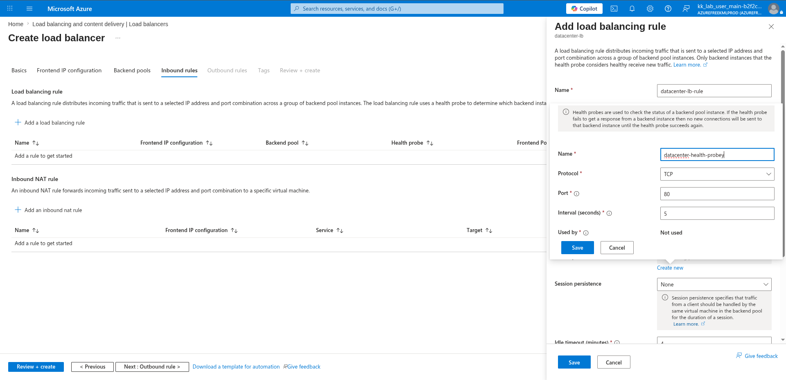
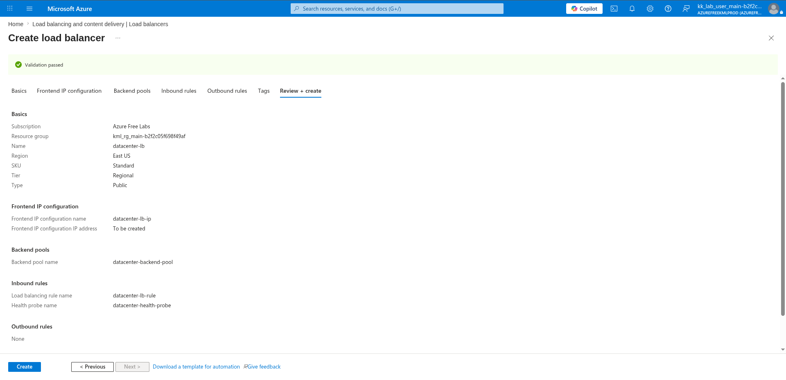
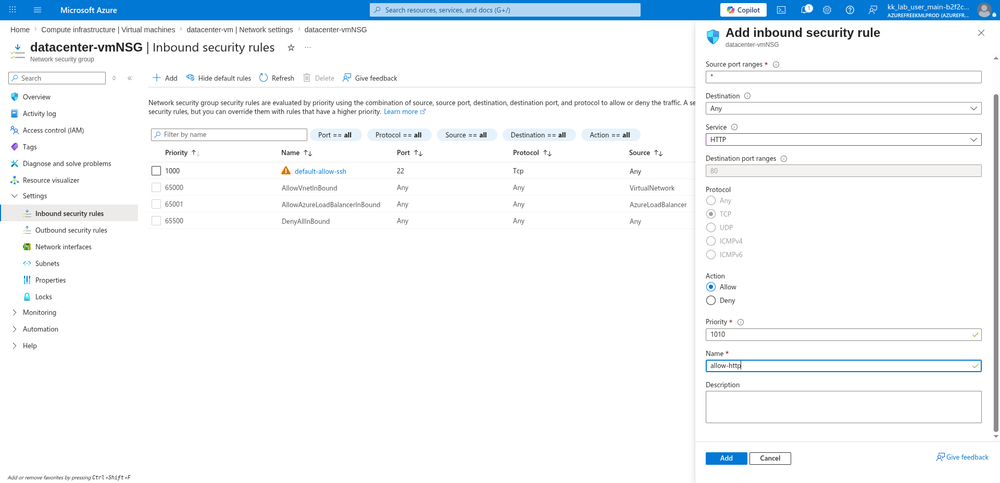
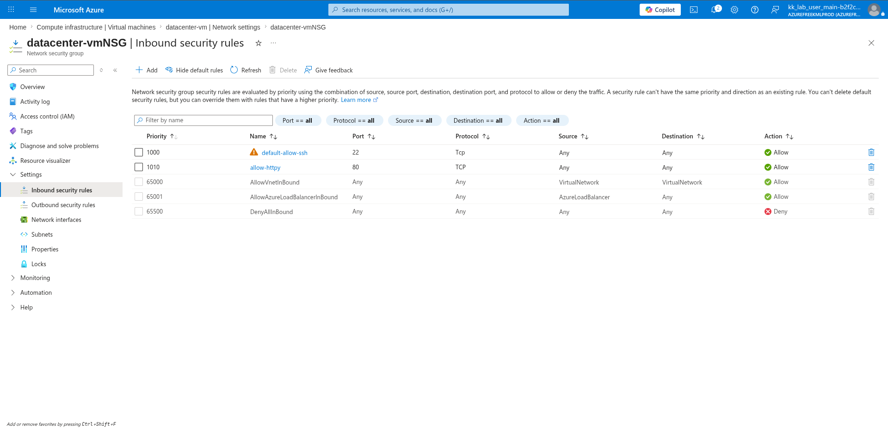

# 100 Days of Azure – Day 33

## Creating a Standard Public Load Balancer and Attaching a VM Backend

## Overview

This lab demonstrates how to create a Standard Public Azure Load Balancer, configure a frontend IP, add a backend pool with an existing VM, create a health probe, set up a load balancing rule for HTTP traffic on port 80, and update the VM's NSG to allow that traffic.

---

## What I Did

- Navigated to Load Balancers and created a new Standard Public Load Balancer
- Configured the load balancer name and region
- Added a frontend IP configuration with a new public IP
- Configured a backend pool and added an existing VM
- Created a health probe on port 80
- Added a load balancing rule for HTTP traffic
- Updated the existing VM's NSG inbound rules to allow port 80
- Reviewed and deployed the load balancer

---

## Steps Performed

### 1. Open Load Balancers and Create Standard Load Balancer

Navigated to:

```text
Load balancing and content delivery → Load balancers
```

No load balancers existed yet. Clicked:

```text
+ Create → Standard Load balancer
```



---

### 2. Configure Name and Region

On the Basics tab, configured:

- Subscription: `Azure Free Labs`
- Resource group: `kml_rg_main-b2f2c05f698f49af`
- Name: `datacenter-lb`
- Region: `East US`
- SKU: `Standard`
- Type: `Public`
- Tier: `Regional`



---

### 3. Configure Frontend IP

Navigated to the **Frontend IP configuration** tab. Clicked:

```text
+ Add a frontend IP configuration
```

Configured:

- Name: `datacenter-lb-ip`
- IP version: `IPv4`
- IP type: `IP address`
- Public IP address: `(new) datacenter-lb-ip`
- Gateway Load balancer: `None`

Clicked:

```text
Save
```



---

### 4. Configure Backend Pool

Navigated to the **Backend pools** tab. Clicked:

```text
+ Add a backend pool
```

Configured:

- Name: `datacenter-backend-pool`
- Virtual network: `datacenter-vmVNET (kml_rg_main-b2f2c05f698f49af)`
- Backend Pool Configuration: `NIC`

Clicked:

```text
+ Add
```

Selected the existing VM from the IP configurations panel:

- Resource Name: `datacenter-vm`
- Type: `Virtual machine`
- IP Address: `10.0.0.4`

Clicked:

```text
Add
```

then:

```text
Save
```



---

### 5. Add Load Balancing Rule

Navigated to the **Inbound rules** tab. Clicked:

```text
+ Add a load balancing rule
```

Configured:

- Name: `datacenter-lb-rule`
- IP version: `IPv4`
- Frontend IP address: `datacenter-lb-ip (To be created)`
- Backend pool: `datacenter-backend-pool`
- Protocol: `TCP`
- Port: `80`
- Backend port: `80`
- Session persistence: `None`



---

### 6. Create New Health Probe

Within the load balancing rule panel, clicked:

```text
Create new
```

next to the Health probe field. Configured:

- Name: `datacenter-health-probe`
- Protocol: `TCP`
- Port: `80`
- Interval (seconds): `5`

Clicked:

```text
Save
```



---

### 7. Review and Create

Reviewed the final configuration:

**Basics:**

- Name: `datacenter-lb`
- Region: `East US`
- SKU: `Standard`
- Tier: `Regional`
- Type: `Public`

**Frontend IP configuration:**

- Name: `datacenter-lb-ip`
- IP address: `To be created`

**Backend pools:**

- Name: `datacenter-backend-pool`

**Inbound rules:**

- Load balancing rule name: `datacenter-lb-rule`
- Health probe name: `datacenter-health-probe`

**Outbound rules:** `None`

Clicked:

```text
Create
```



---

### 8. Edit Inbound Rule of Existing VM NSG

Navigated to the existing VM's NSG:

```text
datacenter-vm → Networking → Network settings → datacenter-vmNSG → Inbound security rules
```

Clicked:

```text
+ Add
```

Configured a new inbound rule to allow HTTP traffic:

- Source port ranges: `*`
- Destination: `Any`
- Service: `HTTP`
- Destination port ranges: `80`
- Protocol: `TCP`
- Action: `Allow`
- Priority: `1010`
- Name: `allow-httpy`

Clicked:

```text
Add
```



---

### 9. Ensure Inbound Rule is Applied

Verified the NSG inbound rules for `datacenter-vmNSG` now included the new HTTP rule:

| Priority | Name                        | Port | Protocol | Source           | Destination      | Action |
|----------|-----------------------------|------|----------|------------------|------------------|--------|
| 1000     | default-allow-ssh           | 22   | TCP      | Any              | Any              | Allow  |
| 1010     | allow-httpy                 | 80   | TCP      | Any              | Any              | Allow  |
| 65000    | AllowVnetInBound            | Any  | Any      | VirtualNetwork   | VirtualNetwork   | Allow  |
| 65001    | AllowAzureLoadBalancerInBound | Any | Any     | AzureLoadBalancer| Any              | Allow  |
| 65500    | DenyAllInBound              | Any  | Any      | Any              | Any              | Deny   |



---

## Author

Hein Lin Zaw
