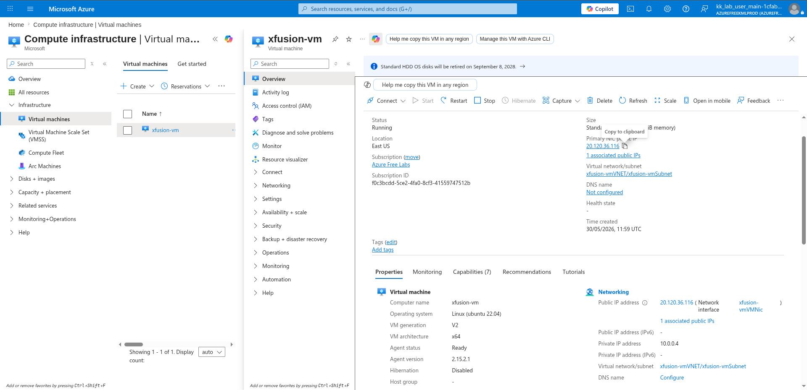
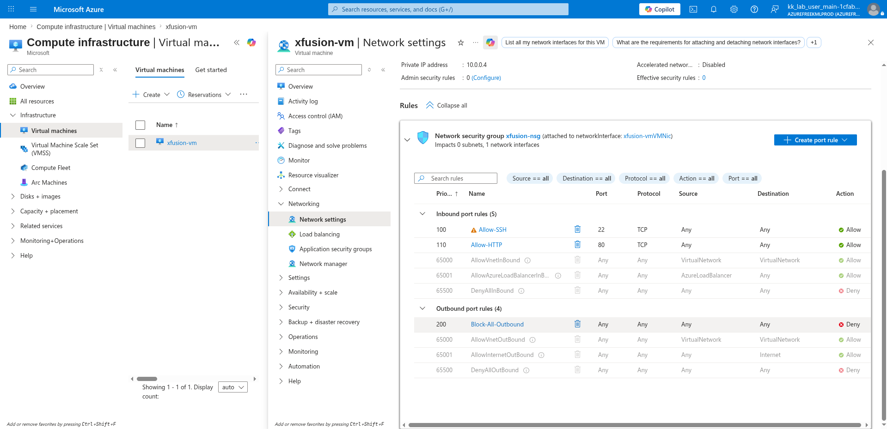

# 100 Days of Azure – Day 34

## Testing Outbound Traffic Control with NSG Outbound Rules on an Azure VM

## Overview

This lab demonstrates how outbound NSG rules affect internet access on an Azure VM. We SSH into the VM, test outbound connectivity, observe a blocked outbound rule, delete it, and verify that connectivity is restored.

---

## What I Did

- SSH'd into the VM
- Tested outbound internet access with `sudo apt update`
- Observed the `Block-All-Outbound` NSG rule blocking traffic
- Deleted the outbound deny rule
- Tested outbound internet access again to confirm it was restored

---

## Steps Performed

### 1. Copy the Public IP to SSH into the VM

Navigated to:

```text
xfusion-vm → Overview
```

Copied the Public IP address:

```text
20.120.36.116
```



---

### 2. SSH into the VM

Connected to the VM using the copied Public IP:

```bash
ssh azureuser@<your-pip>
```

Example:

```bash
ssh azureuser@20.120.36.116
```

---

### 3. Test Outbound Internet Access (First Attempt)

Ran a package update to test outbound internet connectivity:

```bash
sudo apt update
```

The command hung or failed — outbound traffic was being blocked by the `Block-All-Outbound` NSG rule at priority `200`, which denied all outbound traffic before the default allow rules could take effect.

---

### 4. Delete the Block-All-Outbound Rule

Navigated to the VM's Network Settings to locate the outbound rule:

```text
xfusion-vm → Networking → Network settings → xfusion-nsg → Outbound port rules
```

Confirmed the blocking rule:

| Priority | Name               | Port | Protocol | Source | Destination | Action |
|----------|--------------------|------|----------|--------|-------------|--------|
| 200      | Block-All-Outbound | Any  | Any      | Any    | Any         | Deny   |

Clicked the delete icon next to `Block-All-Outbound` and confirmed the deletion.



---

### 5. Test Outbound Internet Access Again (Second Attempt)

Back in the SSH session, ran the package update again:

```bash
sudo apt update
```

This time the command succeeded — with the blocking rule removed, outbound traffic was permitted by the default `AllowInternetOutBound` rule at priority `65001`.

---

## Author

Hein Lin Zaw
