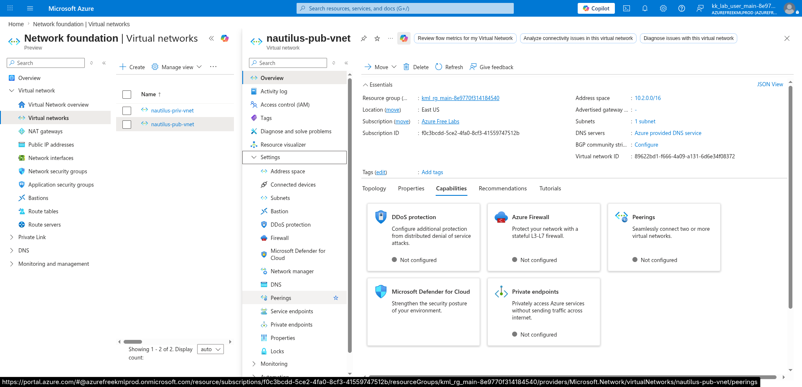
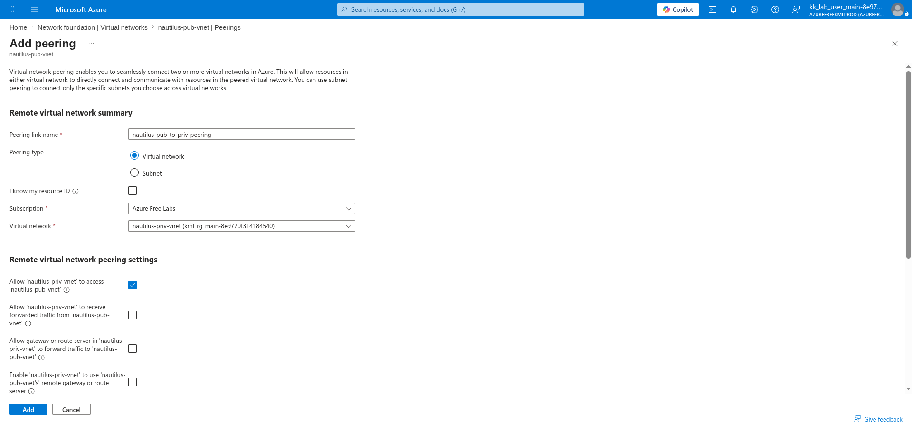
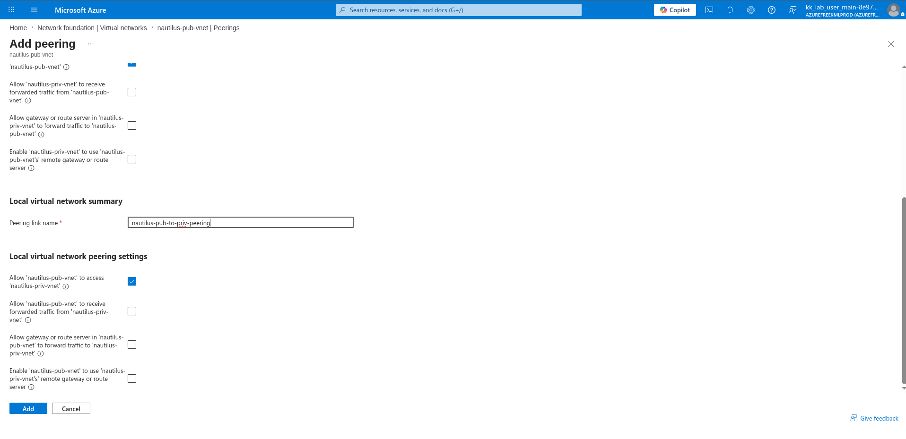
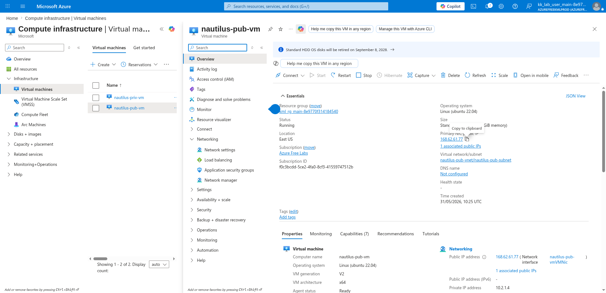
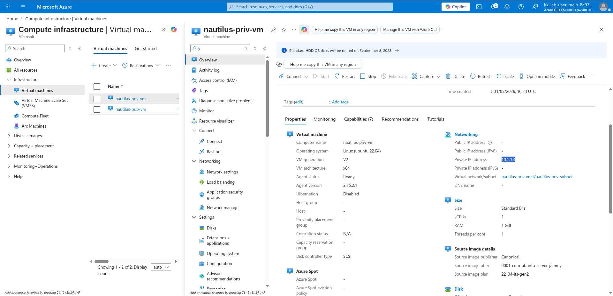

# 100 Days of Azure – Day 35

## Connecting Two Virtual Networks with VNet Peering and Testing Connectivity

## Overview

This lab demonstrates how to peer two Azure Virtual Networks (a public VNet and a private VNet), then verify cross-VNet connectivity by SSH-ing into the public VM and pinging the private VM's internal IP address.

---

## What I Did

- Navigated to the public VNet and configured a peering to the private VNet
- Enabled bidirectional access between both VNets
- Copied the public VM's Public IP to SSH into it
- Copied the private VM's Private IP to use as the ping target
- SSH'd into the public VM
- Pinged the private VM's Private IP to verify cross-VNet connectivity

---

## Steps Performed

### 1. Go to Public VNet Peerings

Navigated to:

```text
Network foundation → Virtual networks → nautilus-pub-vnet → Settings → Peerings
```



---

### 2. Configure Peering Name and Choose Private VNet

Clicked:

```text
+ Add
```

Configured the **Remote virtual network summary**:

- Peering link name: `nautilus-pub-to-priv-peering`
- Peering type: `Virtual network`
- Subscription: `Azure Free Labs`
- Virtual network: `nautilus-priv-vnet (kml_rg_main-8e9770f314184540)`

Enabled under **Remote virtual network peering settings**:

- Allow `nautilus-priv-vnet` to access `nautilus-pub-vnet`: ✅



---

### 3. Allow Public VNet Access to Private VNet and Hit Add

Scrolled down to the **Local virtual network summary** section.

Configured:

- Peering link name: `nautilus-pub-to-priv-peering`

Enabled under **Local virtual network peering settings**:

- Allow `nautilus-pub-vnet` to access `nautilus-priv-vnet`: ✅

Clicked:

```text
Add
```



---

### 4. Copy the Public VM's Public IP

Navigated to:

```text
Virtual machines → nautilus-pub-vm → Overview
```

Copied the Public IP address to use for SSH:

```text
168.62.61.77
```

- Private IP address: `10.2.1.4`
- Virtual network/subnet: `nautilus-pub-vnet / nautilus-pub-subnet`



---

### 5. Copy the Private VM's Private IP

Navigated to:

```text
Virtual machines → nautilus-priv-vm → Overview
```

Copied the Private IP address to use as the ping target:

```text
10.1.1.4
```

- Public IP address: `-` (none — private only)
- Virtual network/subnet: `nautilus-priv-vnet / nautilus-priv-subnet`



---

### 6. SSH into the Public VM

Connected to the public VM using its copied Public IP:

```bash
ssh azureuser@<your-pip>
```

Example:

```bash
ssh azureuser@168.62.61.77
```

---

### 7. Ping the Private VM to Test Cross-VNet Connectivity

From inside the public VM's SSH session, pinged the private VM using its copied Private IP:

```bash
ping <your-priv-ip>
```

Example:

```bash
ping 10.1.1.4
```

A successful ping response confirms that VNet peering is working and the two virtual networks can communicate with each other over their private IP addresses.

---

## Author

Hein Lin Zaw
