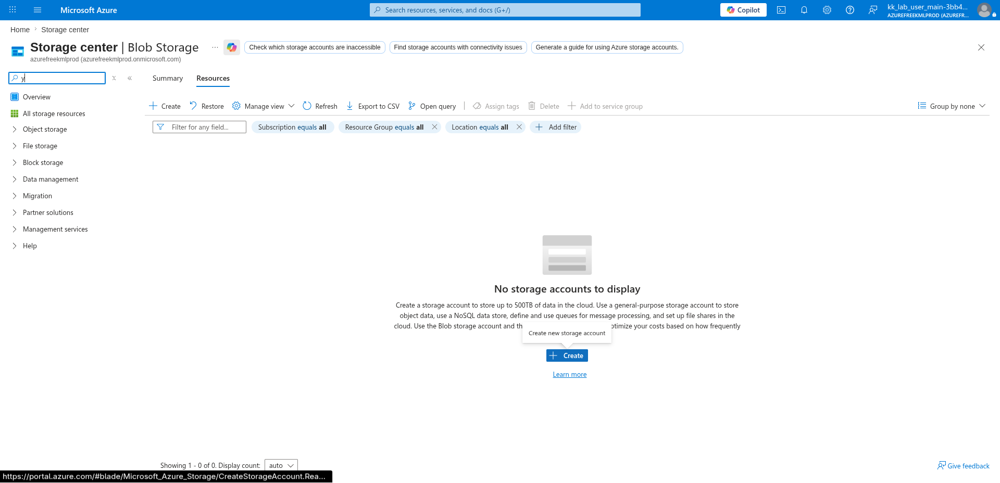
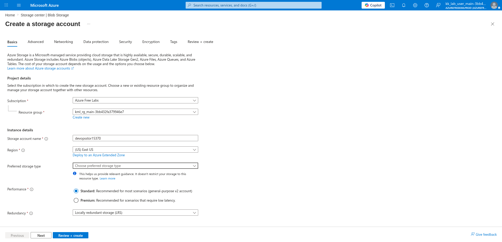
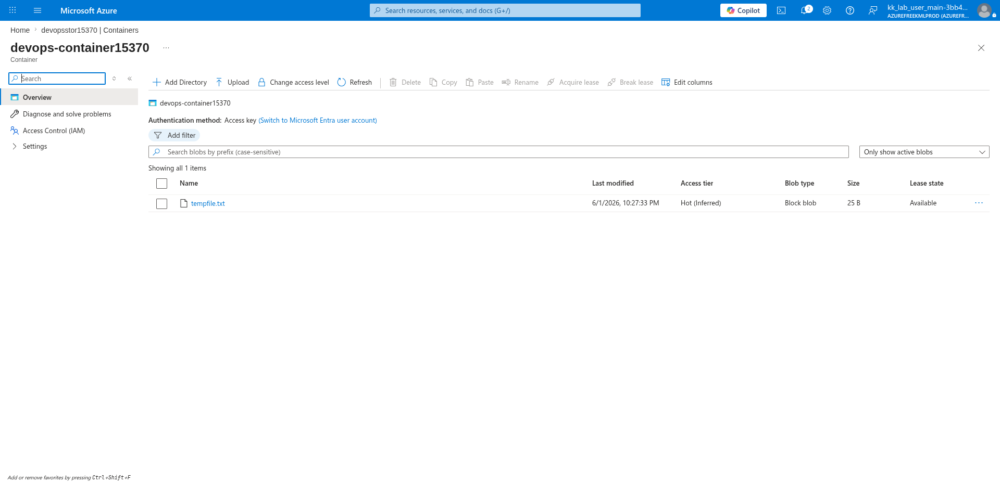
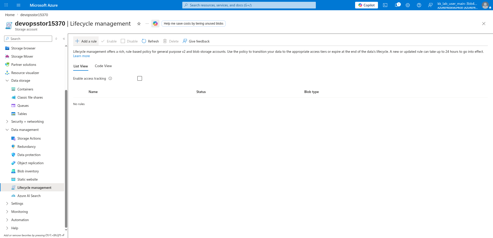
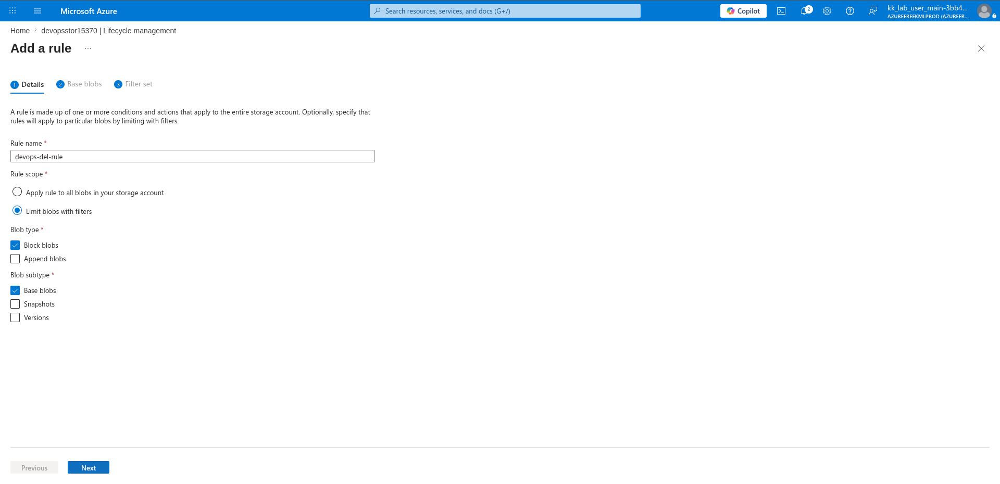
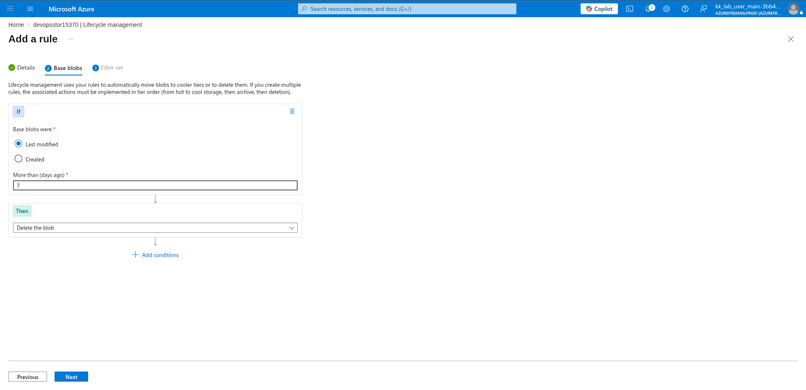
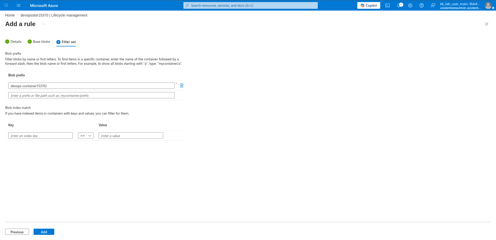

# 100 Days of Azure – Day 36

## Automating Blob Deletion with Azure Storage Lifecycle Management

## Overview

This lab demonstrates how to create a Storage Account, upload a blob via the Azure CLI, and configure a Lifecycle Management policy to automatically delete blobs in a specific container after 7 days of inactivity.

---

## What I Did

- Navigated to Storage Center and created a new Storage Account
- Configured the storage account name, region, and redundancy
- Created a blob container and uploaded a file using the Azure CLI
- Navigated to Lifecycle Management
- Added a lifecycle rule with a name, scope, and blob type
- Configured the rule condition and action
- Added a blob prefix filter to target a specific container
- Deployed the lifecycle rule

---

## Steps Performed

### 1. Open Storage Center and Create Storage Account

Navigated to:

```text
Storage center | Blob Storage
```

No storage accounts existed yet. Clicked:

```text
+ Create
```



---

### 2. Configure Name and Region

On the Basics tab, configured:

- Subscription: `Azure Free Labs`
- Resource group: `kml_rg_main-3bb432fa379946e7`
- Storage account name: `devopsstor15370`
- Region: `(US) East US`
- Performance: `Standard`
- Redundancy: `Locally redundant storage (LRS)`

Clicked:

```text
Review + create → Create
```



---

### 3. Create a Blob Container and Upload a File

After the storage account was deployed, created a container and uploaded a file using the Azure CLI:

```bash
az storage blob upload \
  --account-name <storage-account-name> \
  --container-name <container-name> \
  --name <blob-name> \
  --file <local-file-path>
```

Example:

```bash
az storage blob upload \
  --account-name devopsstor15370 \
  --container-name devops-container15370 \
  --name tempfile.txt \
  --file ./tempfile.txt
```

Verified the upload in the portal:

- Container: `devops-container15370`
- Blob: `tempfile.txt`
- Size: `25 B`
- Access tier: `Hot (Inferred)`
- Blob type: `Block blob`



---

### 4. Go to Lifecycle Management and Add a Rule

Navigated to:

```text
devopsstor15370 → Data management → Lifecycle management
```

No rules existed yet. Clicked:

```text
+ Add a rule
```



---

### 5. Set Rule Name and Scope

On the **Details** tab, configured:

- Rule name: `devops-del-rule`
- Rule scope: `Limit blobs with filters`
- Blob type: `Block blobs` ✅
- Blob subtype: `Base blobs` ✅

Clicked:

```text
Next
```



---

### 6. Configure the Rule Condition and Action

On the **Base blobs** tab, configured:

**If:**

- Base blobs were: `Last modified`
- More than (days ago): `7`

**Then:**

- Action: `Delete the blob`

Clicked:

```text
Next
```



---

### 7. Add Blob Prefix and Click Add

On the **Filter set** tab, added a blob prefix to scope the rule to a specific container:

```text
devops-container15370/
```

Clicked:

```text
Add
```



---

## Key Takeaway

Azure Blob Lifecycle Management allows you to automate storage cost optimization by defining rules that automatically delete or tier blobs based on their age or last modified date. Scoping the rule to a specific container using a blob prefix ensures only the intended blobs are affected.

---

## Author

Hein Lin Zaw
