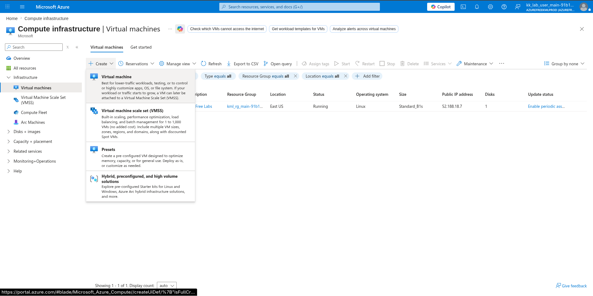
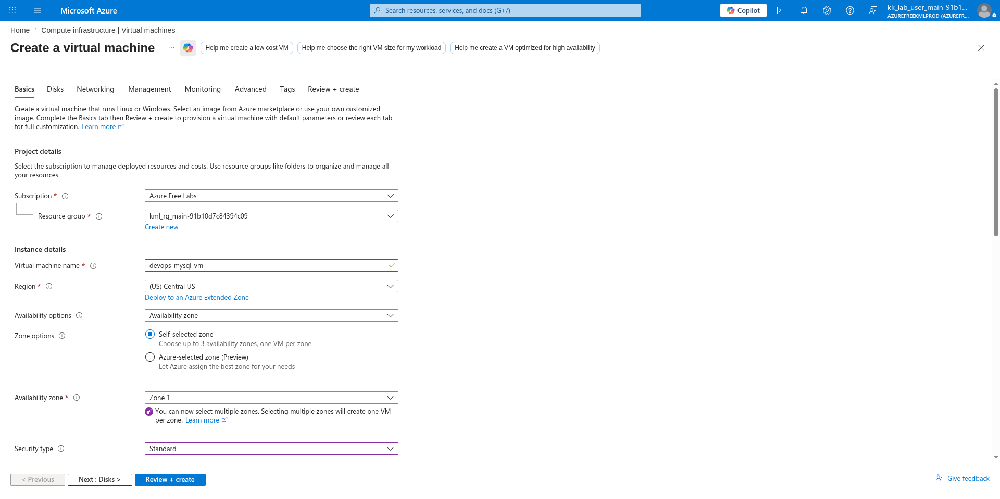
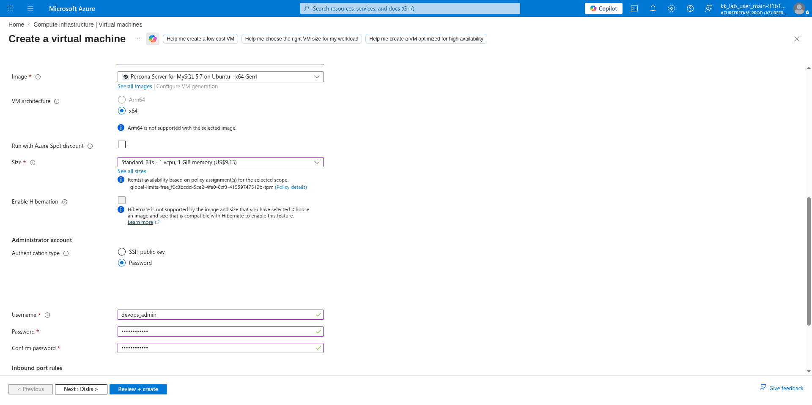
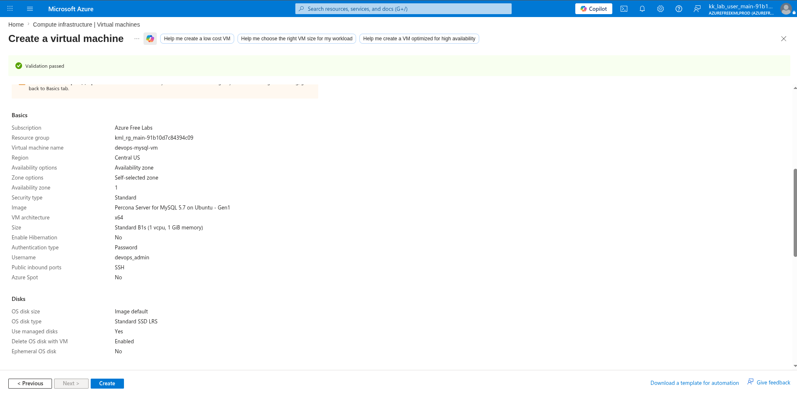
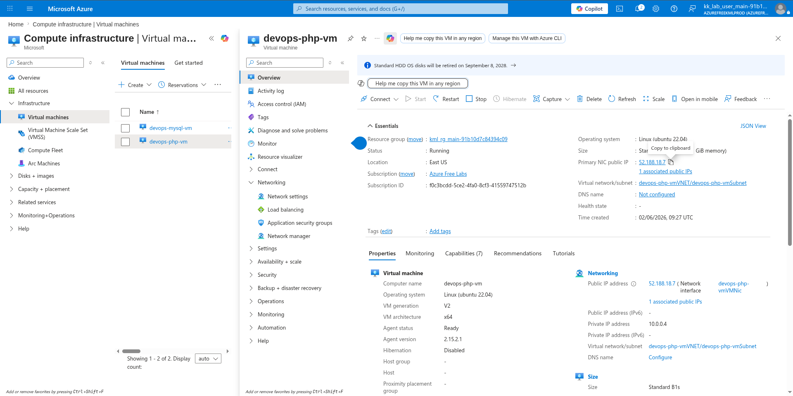
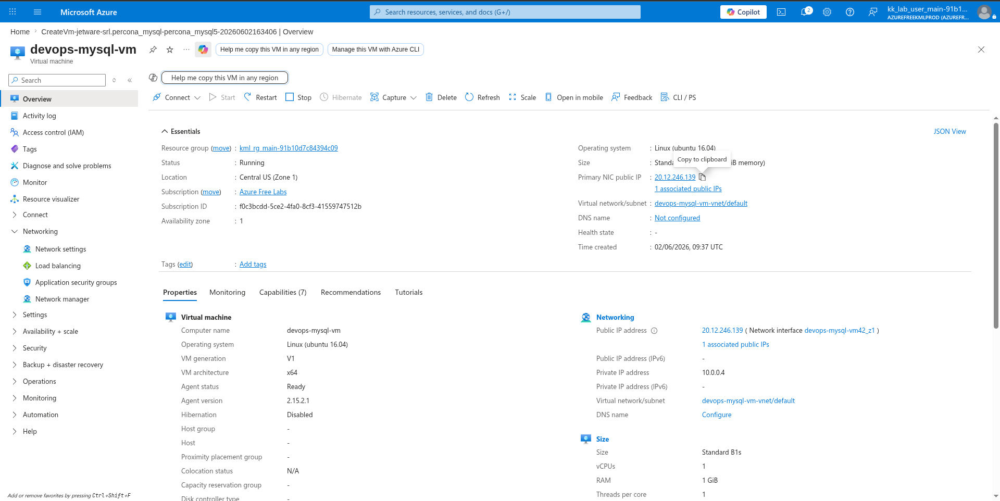
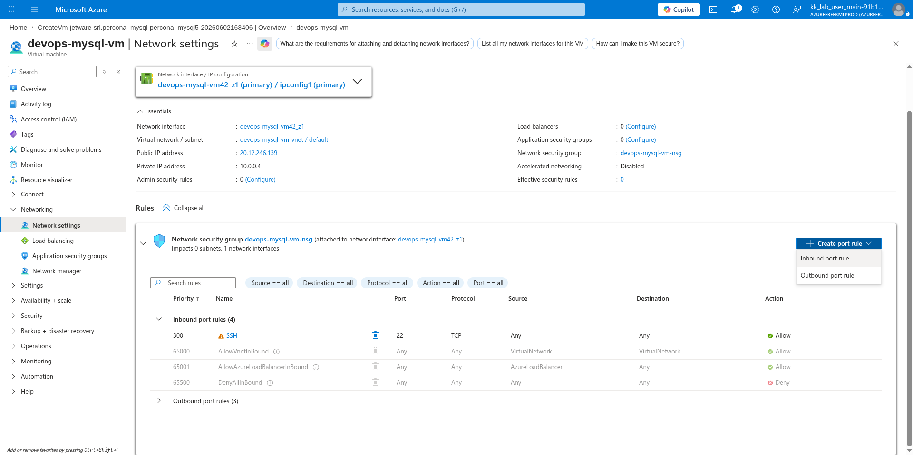
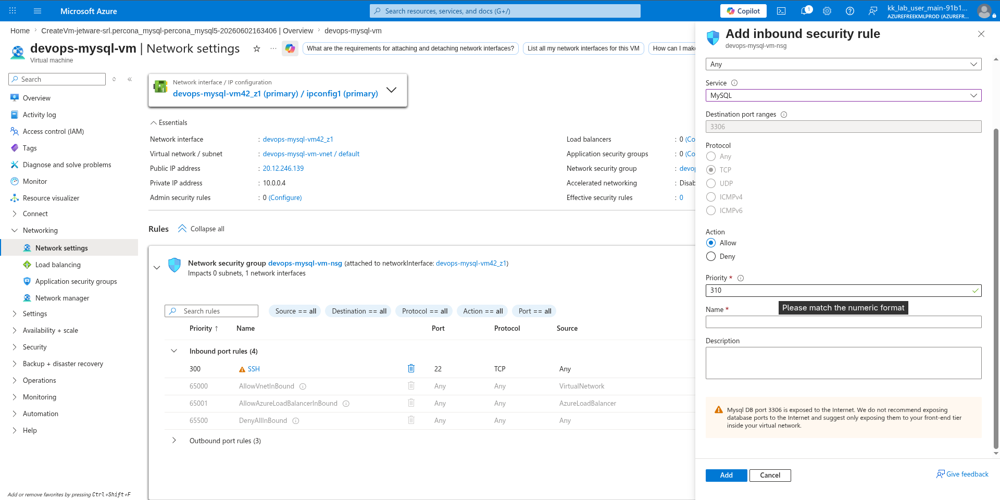

# 100 Days of Azure – Day 37

## Setting Up MySQL Database Server and Connecting from a PHP Application

## Overview

This lab demonstrates how to create a Percona MySQL Server VM, configure its Network Security Group to allow MySQL traffic, set up a database and user, and then connect from a PHP application VM to test the database connectivity.

---

## What I Did

- Created a new MySQL VM running Percona Server 5.7
- Added an inbound MySQL rule to the MySQL VM's NSG
- Copied the PHP VM's Public IP address
- Copied the MySQL VM's Public IP address
- SSH'd into the MySQL VM and created a database and user
- Granted privileges to the PHP VM
- SSH'd into the PHP VM
- Configured an existing PHP file to test database connectivity

---

## Steps Performed

### 1. Create New VM

Navigated to:

```text
Compute infrastructure → Virtual machines → + Create
```



---

### 2. Configure Name and Region

On the Basics tab, configured:

- Subscription: `Azure Free Labs`
- Resource group: `kml_rg_main-91b10d7c84394c09`
- Virtual machine name: `devops-mysql-vm`
- Region: `(US) Central US`
- Availability zone: `Zone 1`



---

### 3. Configure Image and Credentials

Selected the MySQL image and configured authentication:

- Image: `Percona Server for MySQL 5.7 on Ubuntu - x64 Gen1`
- VM architecture: `x64`
- Size: `Standard B1s (1 vcpu, 1 GiB memory)`
- Authentication type: `Password`
- Username: `devops_admin`
- Password: `••••••••••••••`



---

### 4. Review and Create

Reviewed the final configuration and clicked:

```text
Create
```



---

### 5. Copy PHP VM IP

After the MySQL VM was deployed, navigated to the PHP VM to get its Public IP:

```text
Virtual machines → devops-php-vm → Overview
```

Copied the Public IP:

```text
52.188.18.7
```



---

### 6. Copy MySQL VM IP

Navigated to the MySQL VM overview:

```text
Virtual machines → devops-mysql-vm → Overview
```

Copied the Public IP:

```text
20.12.246.139
```



---

### 7. Add MySQL Inbound Rule to NSG

Navigated to the MySQL VM's Network Settings:

```text
devops-mysql-vm → Networking → Network settings → devops-mysql-vm-nsg
```

Clicked:

```text
+ Add
```

Configured the MySQL inbound rule:

- Service: `MySQL`
- Destination port ranges: `3306`
- Protocol: `TCP`
- Action: `Allow`
- Priority: `310`



---

### 8. Confirm MySQL Inbound Rule

Verified the NSG now has the MySQL rule:

| Priority | Name                      | Port | Protocol | Source | Destination | Action |
|----------|---------------------------|------|----------|--------|-------------|--------|
| 300      | SSH                       | 22   | TCP      | Any    | Any         | Allow  |
| 310      | MySQL                     | 3306 | TCP      | Any    | Any         | Allow  |
| 65000    | AllowVnetInBound          | Any  | Any      | VNet   | VNet        | Allow  |
| 65001    | AllowAzureLoadBalancerIn  | Any  | Any      | Azure  | Any         | Allow  |
| 65500    | DenyAllInBound            | Any  | Any      | Any    | Any         | Deny   |



---

### 9. SSH into MySQL VM and Create Database

Connected to the MySQL VM:

```bash
ssh devops_admin@<mysql-vm-ip>
```

Example:

```bash
ssh devops_admin@20.12.246.139
```

Entered MySQL:

```bash
sudo /jet/enter mysql
```

Created the database:

```sql
CREATE DATABASE devops_db;
```

Created a database user and granted privileges to the PHP VM's IP:

```sql
CREATE USER 'devops_user'@'<php-vm-ip>' IDENTIFIED BY 'password123';
```

Example:

```sql
CREATE USER 'devops_user'@'52.188.18.7' IDENTIFIED BY 'password123';
```

Granted all privileges on the database:

```sql
GRANT ALL PRIVILEGES ON devops_db.* TO 'devops_user'@'<php-vm-ip>';
```

Example:

```sql
GRANT ALL PRIVILEGES ON devops_db.* TO 'devops_user'@'52.188.18.7';
```

Flushed privileges to apply changes:

```sql
FLUSH PRIVILEGES;
```

Exited MySQL:

```sql
\q
```

Exited the MySQL VM:

```bash
exit
```

---

### 10. SSH into PHP VM and Configure PHP Test file

Connected to the PHP VM:

```bash
ssh azureuser@<php-vm-ip>
```

Example:

```bash
ssh azureuser@52.188.18.7
```

Navigated to the web root:

```bash
cd /var/www/html/
```

Created a PHP database test script:

```bash
sudo vi db_test.php
```

Configured the following PHP code with the MySQL VM credentials:

```php
<?php
$servername = "<mysql-vm-ip>";
$username = "devops_user";
$password = "password123";
$dbname = "devops_db";

$conn = new mysqli($servername, $username, $password, $dbname);

if ($conn->connect_error) {
    die("Connection failed: " . $conn->connect_error);
}
echo "Connected successfully to devops_db!";
$conn->close();
?>
```

Example with actual IP:

```php
<?php
$servername = "20.12.246.139";
$username = "devops_user";
$password = "password123";
$dbname = "devops_db";

$conn = new mysqli($servername, $username, $password, $dbname);

if ($conn->connect_error) {
    die("Connection failed: " . $conn->connect_error);
}
echo "Connected successfully to devops_db!";
$conn->close();
?>
```

Saved the file and tested the connection by visiting the PHP script in a browser or using curl.

---

## Author

Hein Lin Zaw
