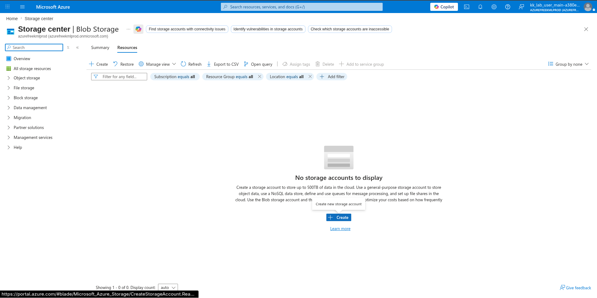
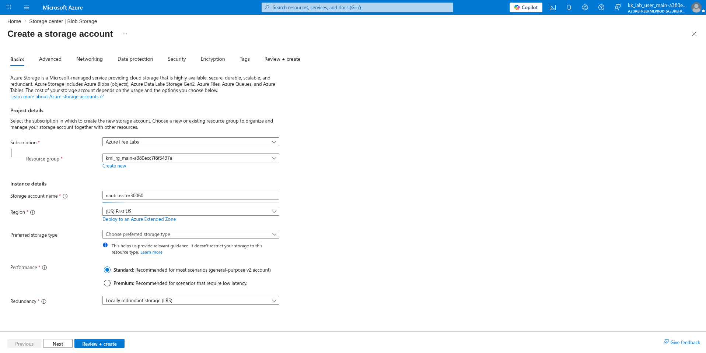
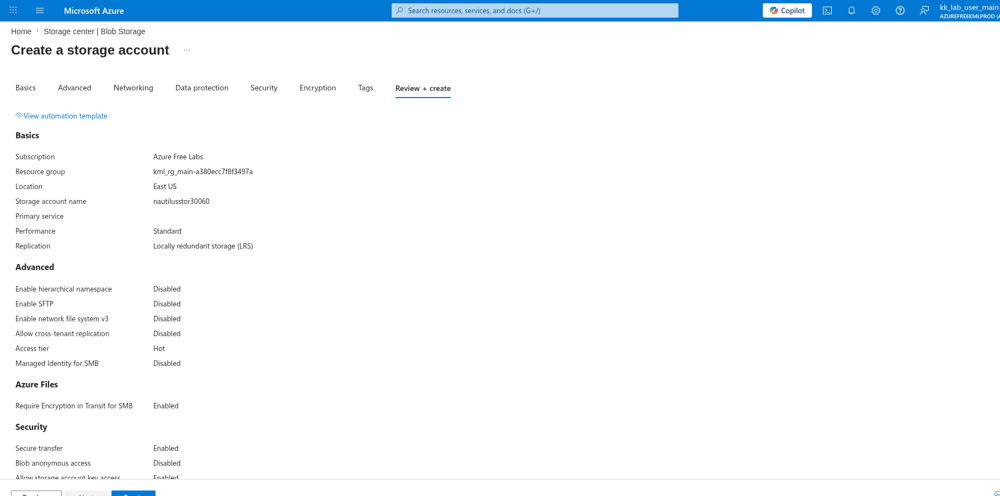
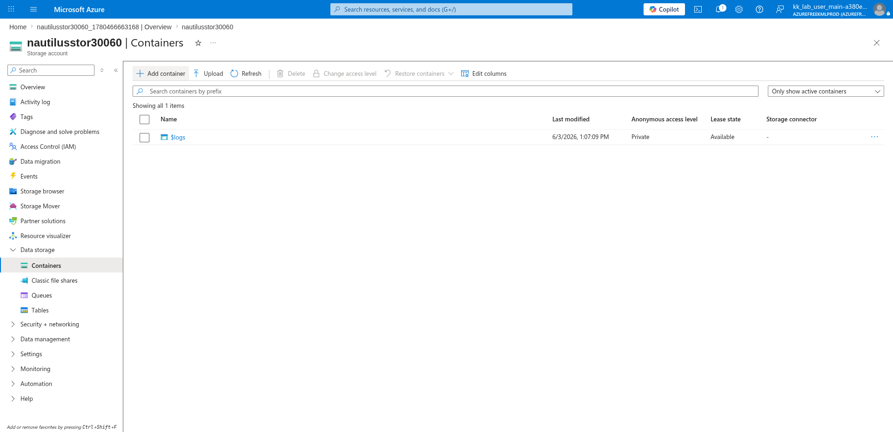
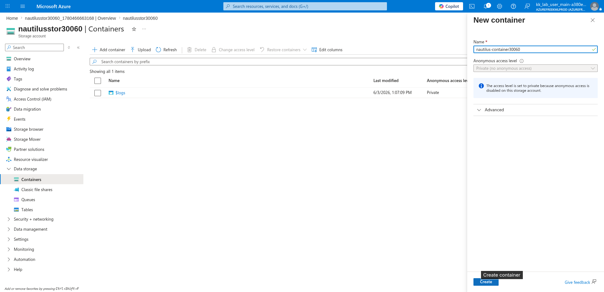

# 100 Days of Azure – Day 38

## Creating a Storage Account, Container, and Uploading a Blob from a VM via Azure CLI

## Overview

This lab demonstrates how to create a Storage Account and a Blob Container, then SSH into an existing VM to create a file and upload it to the container using the Azure CLI with an access key.

---

## What I Did

- Navigated to Storage Center and created a new Storage Account
- Configured the storage account name, region, and redundancy
- Reviewed and deployed the storage account
- Navigated to Containers and added a new container
- Copied the storage account access key
- SSH'd into an existing VM
- Created a test file on the VM
- Uploaded the file to the blob container using the Azure CLI

---

## Steps Performed

### 1. Open Storage Center and Create Storage Account

Navigated to:

```text
Storage center | Blob Storage
```

No storage accounts existed yet. Clicked:

```text
+ Create
```



---

### 2. Configure Name and Region

On the Basics tab, configured:

- Subscription: `Azure Free Labs`
- Resource group: `kml_rg_main-a380ecc7f8f3497a`
- Storage account name: `nautilusstor30060`
- Region: `(US) East US`
- Performance: `Standard`
- Redundancy: `Locally redundant storage (LRS)`



---

### 3. Review and Create

Reviewed the final configuration:

- Storage account name: `nautilusstor30060`
- Location: `East US`
- Performance: `Standard`
- Replication: `Locally redundant storage (LRS)`

Clicked:

```text
Create
```



---

### 4. Add New Container

After the storage account was deployed, navigated to:

```text
nautilusstor30060 → Data storage → Containers
```

Clicked:

```text
+ Add container
```



---

### 5. Set Container Name and Create

In the New container panel, configured:

- Name: `nautilus-container30060`
- Anonymous access level: `Private (no anonymous access)`

Clicked:

```text
Create
```



---

### 6. Copy the Storage Account Access Key

Navigated to:

```text
nautilusstor30060 → Security + networking → Access keys
```

Copied one of the access keys to use for CLI authentication.

---

### 7. SSH into the Existing VM

Connected to the existing VM using its Public IP:

```bash
ssh azureuser@<your-vm-pip>
```

Example:

```bash
ssh azureuser@52.188.18.7
```

---

### 8. Create a Test File on the VM

Created a simple text file on the VM to use as the upload target:

```bash
echo 'this is a file' > testfile.txt
```

---

### 9. Upload the File to the Blob Container Using Azure CLI

Uploaded the file from the VM to the Azure Blob Container using the storage account name, access key, container name, and file path:

```bash
az storage blob upload \
  --account-name <storage-account-name> \
  --account-key <access-key> \
  --container-name <container-name> \
  --name <blob-name> \
  --file <local-file-path>
```

Example with actual names:

```bash
az storage blob upload \
  --account-name nautilusstor30060 \
  --account-key <your-access-key> \
  --container-name nautilus-container30060 \
  --name testfile.txt \
  --file /home/azureuser/testfile.txt
```

The file was successfully uploaded to the container as a block blob.

---

## Author

Hein Lin Zaw
