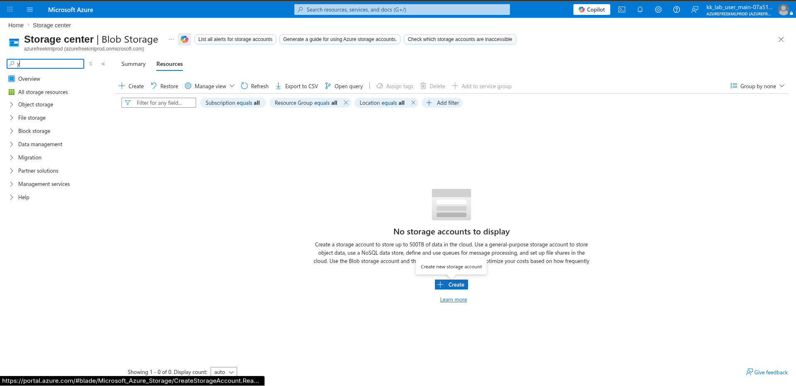
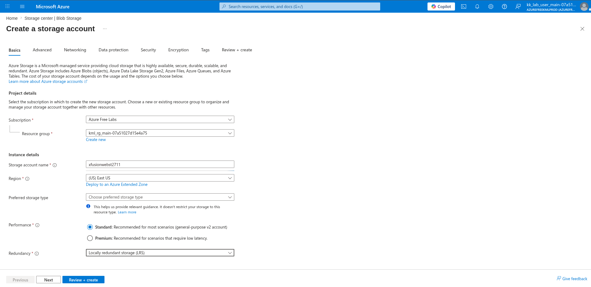
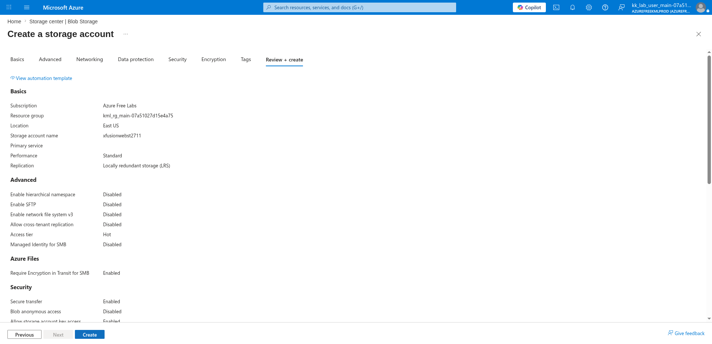
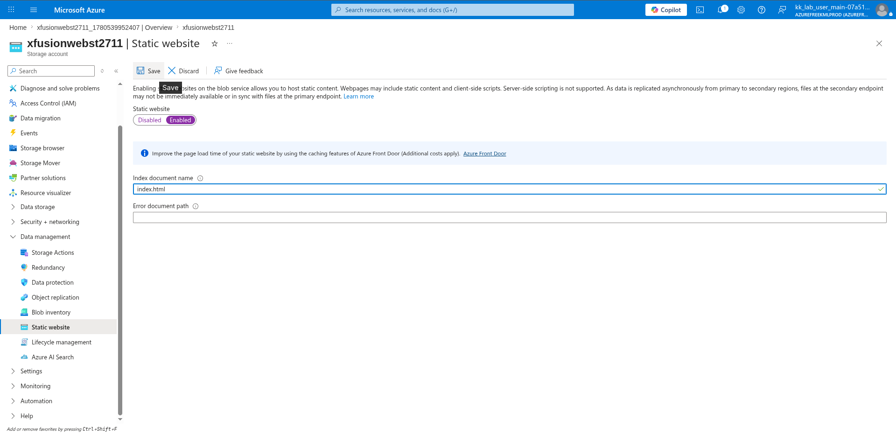
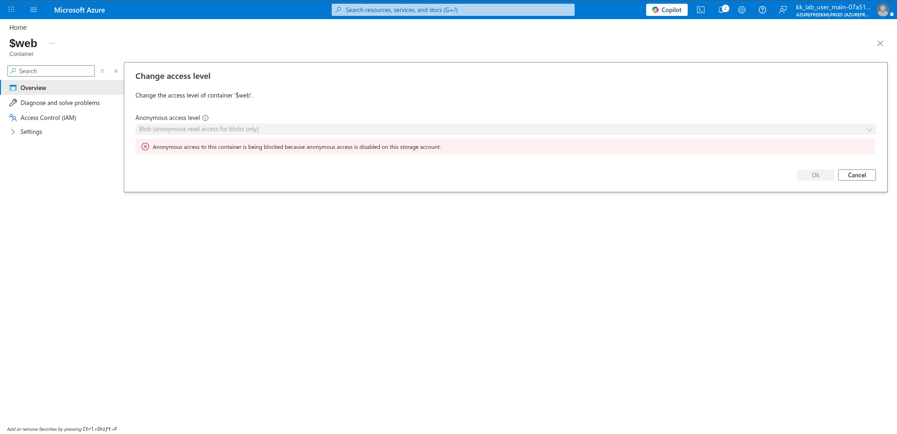
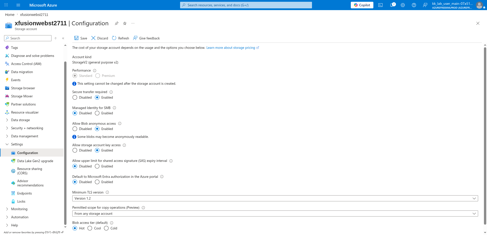
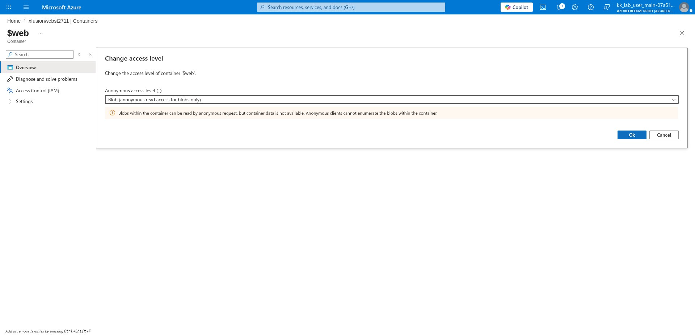

# 100 Days of Azure – Day 39

## Hosting a Static Website on Azure Blob Storage

## Overview

This lab demonstrates how to create a Storage Account, enable Static Website hosting, understand why anonymous access must be enabled at the account level before changing container access levels, and upload an HTML file to the `$web` container using the Azure CLI.

---

## What I Did

- Navigated to Storage Center and created a new Storage Account
- Reviewed and deployed the storage account
- Navigated to Static website and enabled it with `index.html` as the index document
- Attempted to change the `$web` container access level and observed the blocked error
- Navigated to Settings → Configuration and enabled Blob anonymous access
- Successfully changed the `$web` container access level to Blob
- Uploaded `index.html` to the `$web` container using the Azure CLI
- Verified the site using the primary static website endpoint

---

## Steps Performed

### 1. Open Storage Center and Create Storage Account

Navigated to:

```text
Storage center | Blob Storage
```

No storage accounts existed yet. Clicked:

```text
+ Create
```



---

### 2. Configure Name and Region

On the Basics tab, configured:

- Subscription: `Azure Free Labs`
- Resource group: `kml_rg_main-07a51027d15e4a75`
- Storage account name: `xfusionwebst2711`
- Region: `(US) East US`
- Performance: `Standard`
- Redundancy: `Locally redundant storage (LRS)`



---

### 3. Review and Create

Reviewed the final configuration:

- Storage account name: `xfusionwebst2711`
- Location: `East US`
- Performance: `Standard`
- Replication: `Locally redundant storage (LRS)`

Clicked:

```text
Create
```



---

### 4. Go to Static Website and Enable It

After deployment, navigated to:

```text
xfusionwebst2711 → Data management → Static website
```

Set Static website to:

```text
Enabled
```

Configured:

- Index document name: `index.html`
- Error document path: *(left blank)*

Clicked:

```text
Save
```

Azure automatically created the `$web` container and provided a primary endpoint URL for the static site.



---

### 5. Attempt to Change Container Access Level — Blocked

Navigated to:

```text
xfusionwebst2711 → Data storage → Containers → $web → Change access level
```

Attempted to set the anonymous access level to:

```text
Blob (anonymous read access for blobs only)
```

Received the following error:

```text
Anonymous access to this container is being blocked because
anonymous access is disabled on this storage account.
```

The `Ok` button was greyed out — the change could not be made while anonymous access was disabled at the account level.



---

### 6. Go to Settings → Configuration and Enable Blob Anonymous Access

Navigated to:

```text
xfusionwebst2711 → Settings → Configuration
```

Changed:

- Allow Blob anonymous access: `Enabled`

Clicked:

```text
Save
```



---

### 7. Now Can Change the Access Level

Returned to:

```text
xfusionwebst2711 → Data storage → Containers → $web → Change access level
```

This time the dropdown was enabled. Set:

- Anonymous access level: `Blob (anonymous read access for blobs only)`

Clicked:

```text
Ok
```



---

### 8. Upload index.html to the $web Container Using Azure CLI

Uploaded the static site's index file to the `$web` container:

```bash
az storage blob upload \
  --account-name <storage-account-name> \
  --container-name '$web' \
  --name index.html \
  --file ./index.html
```

Example:

```bash
az storage blob upload \
  --account-name xfusionwebst2711 \
  --container-name '$web' \
  --name index.html \
  --file ./index.html
```

---

### 9. Verify with the Static Website Primary Endpoint

Retrieved the primary endpoint from:

```text
xfusionwebst2711 → Data management → Static website
```

The primary endpoint follows this format:

```text
https://<storage-account-name>.z13.web.core.windows.net/
```

Example:

```text
https://xfusionwebst2711.z13.web.core.windows.net/
```

Opened the URL in a browser to confirm the static website was live and serving `index.html`.

---

## Author

Hein Lin Zaw
