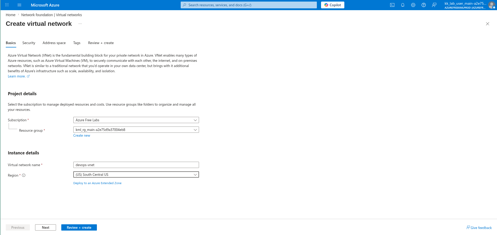
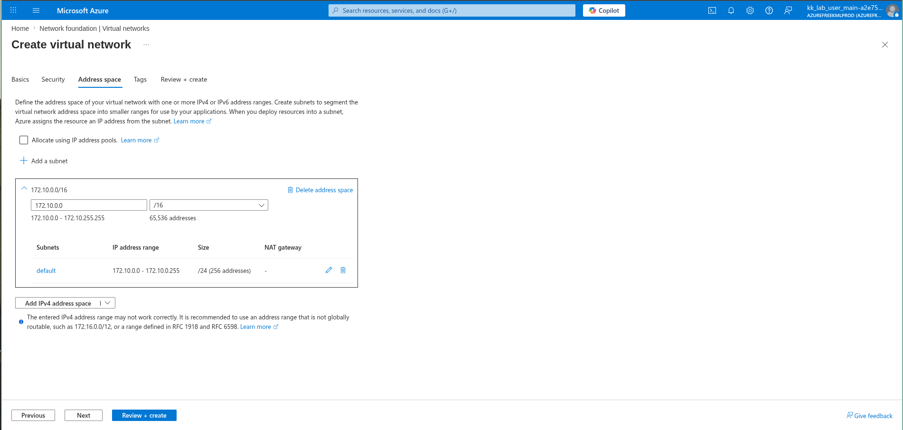
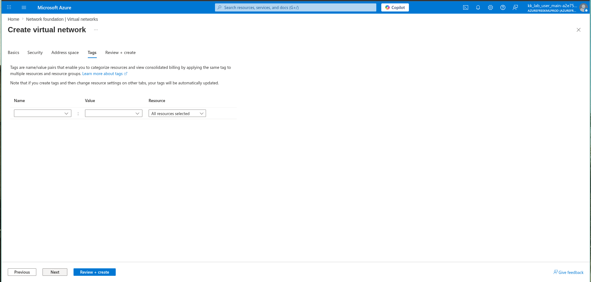
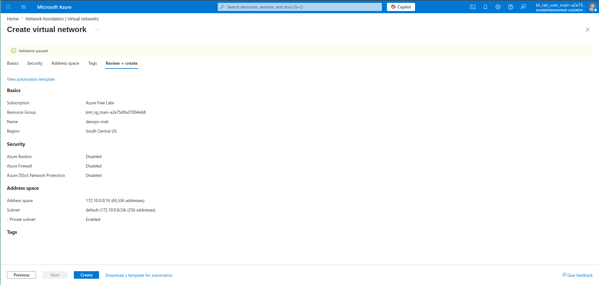

# 100 Days of Azure – Day 04  
## Azure Virtual Network (VNet) Creation

## Overview  
This task focuses on creating a Virtual Network in Azure for private networking.

---

## What I Did  
- Created a Virtual Network (VNet)  
- Name: devops-vnet  
- Region: South Central US  
- Configured address space and subnet  
- Used default subnet configuration  

---

## Screenshots  

### Name and Region  

### Address Space  

### Tags  

### Review and Create  

---

## Result  
Successfully created a Virtual Network with default subnet.

---

## Author  
Hein Lin Zaw
