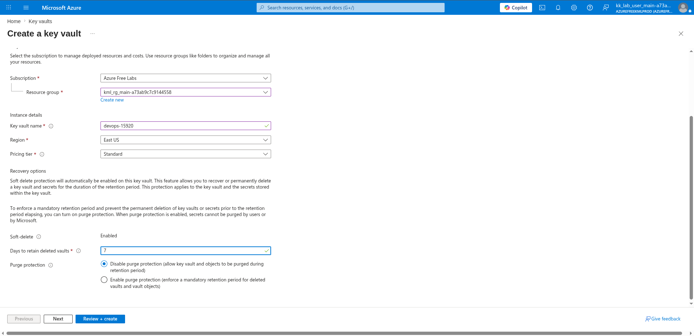
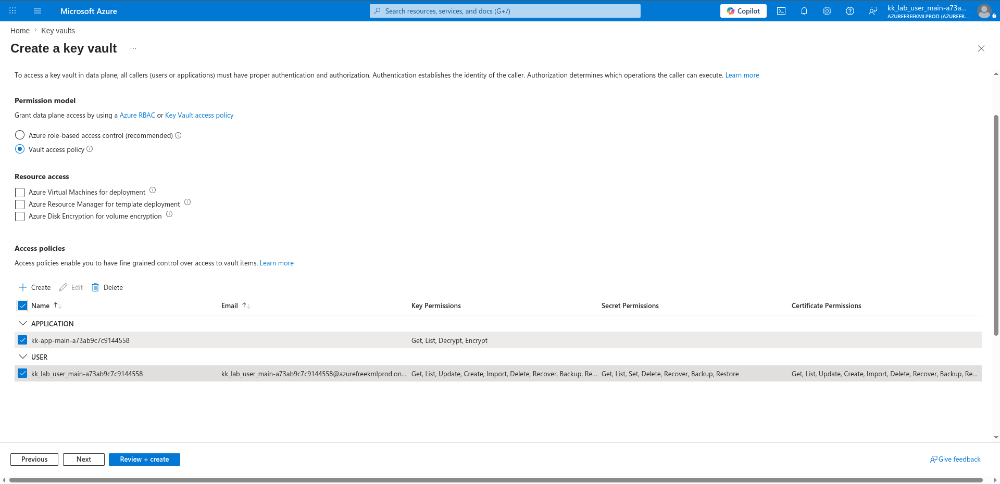
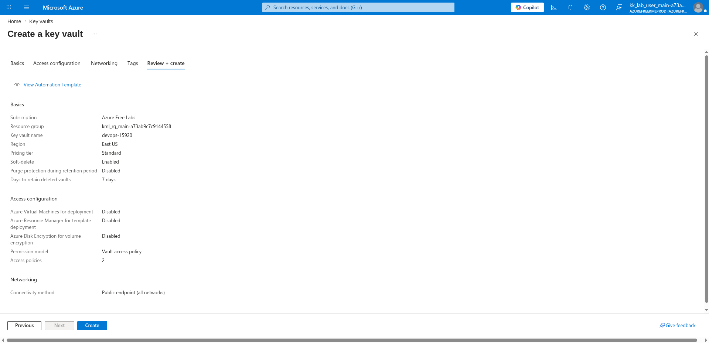
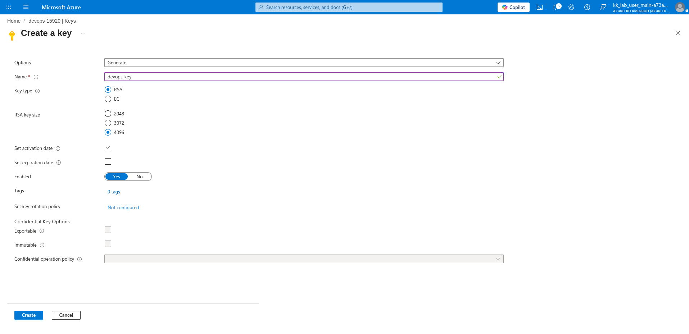

# 100 Days of Azure – Day 40

## Encrypting and Decrypting Data with Azure Key Vault RSA Key

## Overview

This lab demonstrates how to create an Azure Key Vault, configure a Vault access policy, generate an RSA key, and use the Azure CLI to encrypt a sensitive file and decrypt it back using the Key Vault key.

---

## What I Did

- Navigated to Key Vaults and created a new Key Vault
- Configured the vault name, region, and soft-delete settings
- Checked the current Azure account to identify the identity for the access policy
- Configured the access policy with an application identity
- Reviewed and deployed the Key Vault
- Generated an RSA-4096 key inside the vault
- Encrypted a sensitive file using the RSA key
- Decrypted the encrypted data back to its original content

---

## Steps Performed

### 1. Configure Name and Region

On the Basics tab, configured:

- Subscription: `Azure Free Labs`
- Resource group: `kml_rg_main-a73ab9c7c9144558`
- Key vault name: `devops-15920`
- Region: `East US`
- Pricing tier: `Standard`
- Soft-delete: `Enabled`
- Days to retain deleted vaults: `7`



---

### 2. Check Current Azure Account

Before configuring the access policy, verified the active account identity to know which user or application to grant permissions to:

```bash
az account show --query user.name -o tsv
```

The output returns the current signed-in user or service principal name, which is used as the identity in the access policy.

---

### 3. Configure a Policy with App ID

Navigated to the **Access configuration** tab.

Configured:

- Permission model: `Vault access policy`

Confirmed the pre-populated access policies using the identity retrieved in the previous step:

**APPLICATION:**

| Name | Key Permissions |
|------|----------------|
| kk-app-main-a73ab9c7c9144558 | Get, List, Decrypt, Encrypt |

**USER:**

| Name | Key Permissions | Secret Permissions | Certificate Permissions |
|------|----------------|-------------------|------------------------|
| kk_lab_user_main-a73ab9c7c9144558 | Get, List, Update, Create, Import, Delete, Recover, Backup, Re... | Get, List, Set, Delete, Recover, Backup, Restore | Get, List, Update, Create, Import, Delete, Recover, Backup, Re... |



---

### 4. Review and Create

Reviewed the final configuration:

**Basics:**

- Key vault name: `devops-15920`
- Region: `East US`
- Pricing tier: `Standard`
- Soft-delete: `Enabled`
- Purge protection: `Disabled`
- Days to retain deleted vaults: `7 days`

**Access configuration:**

- Permission model: `Vault access policy`
- Access policies: `2`
- Connectivity method: `Public endpoint (all networks)`

Clicked:

```text
Create
```



---

### 5. Configure Key and Generate

After the Key Vault was deployed, navigated to:

```text
devops-15920 → Keys → + Generate/Import
```

Configured the new key:

- Options: `Generate`
- Name: `devops-key`
- Key type: `RSA`
- RSA key size: `4096`
- Set activation date: ✅
- Set expiration date: ☐
- Enabled: `Yes`

Clicked:

```text
Create
```



---

### 6. Encrypt the Sensitive File

Encrypted the contents of `SensitiveData.txt` using the RSA key in the Key Vault:

```bash
az keyvault key encrypt \
  --vault-name <key-vault-name> \
  --name "<key-name>" \
  --algorithm RSA-OAEP \
  --value "$(cat /root/SensitiveData.txt | base64)" \
  --data-type base64 \
  --query "result" \
  -o tsv > /root/EncryptedData.bin
```

Example:

```bash
az keyvault key encrypt \
  --vault-name devops-15920 \
  --name "devops-key" \
  --algorithm RSA-OAEP \
  --value "$(cat /root/SensitiveData.txt | base64)" \
  --data-type base64 \
  --query "result" \
  -o tsv > /root/EncryptedData.bin
```

Verified the encrypted output was written:

```bash
cat EncryptedData.bin
```

---

### 7. Decrypt the Encrypted File

Decrypted the encrypted binary back to its original plaintext:

```bash
az keyvault key decrypt \
  --vault-name <key-vault-name> \
  --name "<key-name>" \
  --algorithm RSA-OAEP \
  --value "$(cat /root/EncryptedData.bin)" \
  --data-type base64 \
  --query "result" \
  -o tsv | base64 --decode
```

Example:

```bash
az keyvault key decrypt \
  --vault-name devops-15920 \
  --name "devops-key" \
  --algorithm RSA-OAEP \
  --value "$(cat /root/EncryptedData.bin)" \
  --data-type base64 \
  --query "result" \
  -o tsv | base64 --decode
```

The original contents of `SensitiveData.txt` were successfully restored.

---

## Author

Hein Lin Zaw
