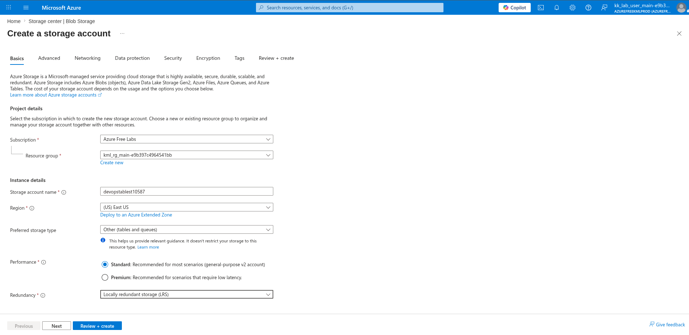
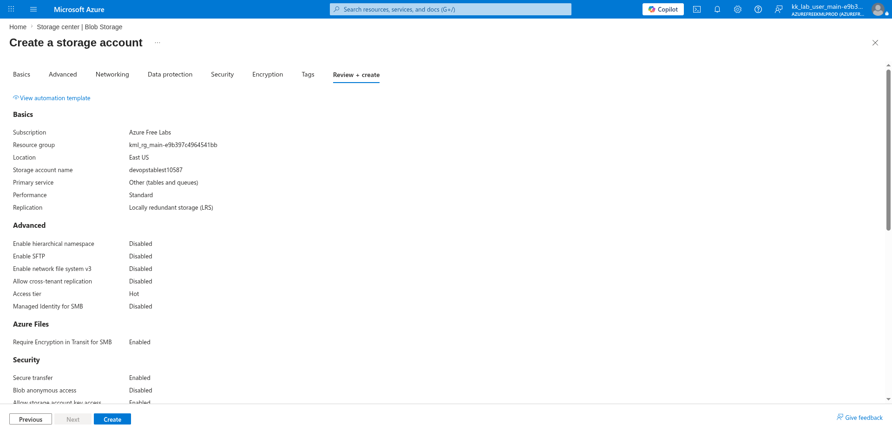
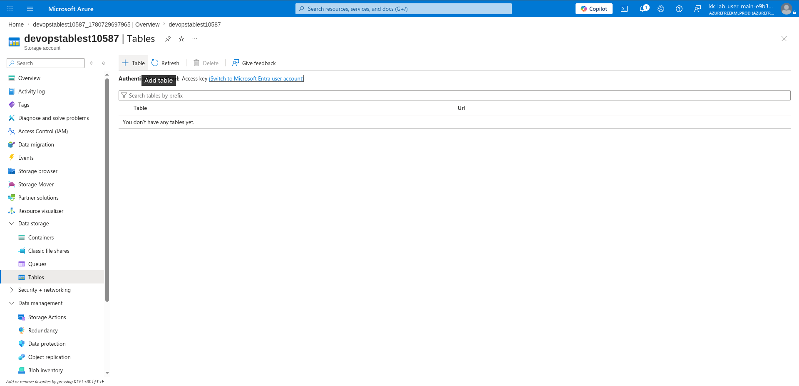

# 100 Days of Azure – Day 41

## Using Azure Table Storage to Store and Query Entities via CLI

## Overview

This lab demonstrates how to create a Storage Account optimized for tables and queues, create an Azure Table, and use the Azure CLI to insert and query entities in the table.

---

## What I Did

- Navigated to Storage Center and created a new Storage Account with Tables as the preferred storage type
- Reviewed and deployed the storage account
- Navigated to Tables and created a new table
- Inserted two entities into the table using the Azure CLI
- Queried individual entities by partition key and row key

---

## Steps Performed

### 1. Configure Name and Region of Storage Account

On the Basics tab, configured:

- Resource group: `kml_rg_main-e9b397c4964541bb`
- Storage account name: `devopstablest10587`
- Region: `(US) East US`
- Preferred storage type: `Other (tables and queues)`
- Performance: `Standard`
- Redundancy: `Locally redundant storage (LRS)`



---

### 2. Review and Create

Reviewed the final configuration:

- Storage account name: `devopstablest10587`
- Location: `East US`
- Primary service: `Other (tables and queues)`
- Performance: `Standard`
- Replication: `Locally redundant storage (LRS)`
- Access tier: `Hot`
- Blob anonymous access: `Disabled`
- Secure transfer: `Enabled`

Clicked:

```text
Create
```



---

### 3. Create a Table

After deployment, navigated to:

```text
devopstablest10587 → Data storage → Tables
```

Clicked:

```text
+ Table
```

Entered the table name:

```text
tasks
```

Clicked:

```text
OK
```



---

### 4. Insert First Entity

Inserted the first task entity into the `tasks` table:

```bash
az storage entity insert \
  --account-name <storage-account-name> \
  --table-name <table-name> \
  --entity PartitionKey=<partition-key> RowKey=<row-key> description='<description>' status=<status>
```

Example:

```bash
az storage entity insert \
  --account-name devopstablest10587 \
  --table-name tasks \
  --entity PartitionKey=tasks RowKey=1 description='Learn Table Storage' status=completed
```

---

### 5. Insert Second Entity

Inserted the second task entity into the `tasks` table:

```bash
az storage entity insert \
  --account-name <storage-account-name> \
  --table-name <table-name> \
  --entity PartitionKey=<partition-key> RowKey=<row-key> description='<description>' status=<status>
```

Example:

```bash
az storage entity insert \
  --account-name devopstablest10587 \
  --table-name tasks \
  --entity PartitionKey=tasks RowKey=2 description='Build To-Do App' status=in-progress
```

---

### 6. Show First Entity by Partition and Row Key

Retrieved the full details of the first entity using its partition key and row key:

```bash
az storage entity show \
  --account-name <storage-account-name> \
  --table-name <table-name> \
  --partition-key <partition-key> \
  --row-key <row-key>
```

Example:

```bash
az storage entity show \
  --account-name devopstablest10587 \
  --table-name tasks \
  --partition-key tasks \
  --row-key 1
```

Expected output:

```json
{
  "description": "Learn Table Storage",
  "status": "completed",
  "PartitionKey": "tasks",
  "RowKey": "1"
}
```

---

### 7. Show Second Entity by Partition and Row Key

Retrieved the full details of the second entity:

```bash
az storage entity show \
  --account-name <storage-account-name> \
  --table-name <table-name> \
  --partition-key <partition-key> \
  --row-key <row-key>
```

Example:

```bash
az storage entity show \
  --account-name devopstablest10587 \
  --table-name tasks \
  --partition-key tasks \
  --row-key 2
```

Expected output:

```json
{
  "description": "Build To-Do App",
  "status": "in-progress",
  "PartitionKey": "tasks",
  "RowKey": "2"
}
```

---

## Author

Hein Lin Zaw
