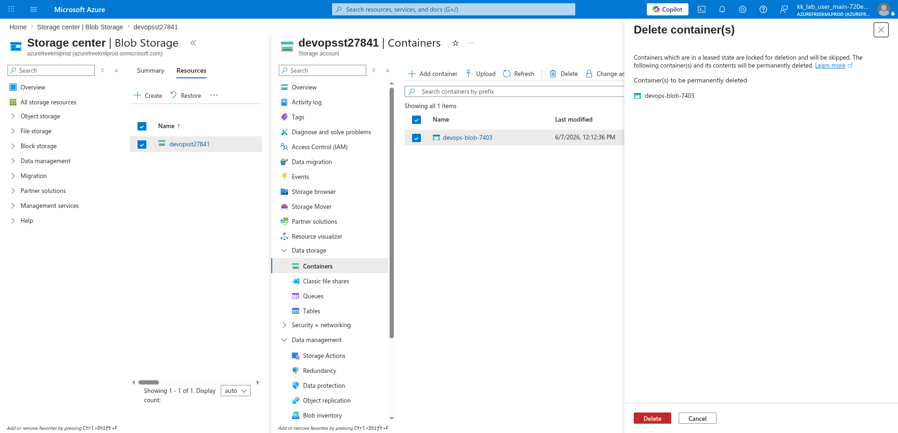

# 100 Days of Azure – Day 42

## Downloading Blobs in Batch and Deleting a Container via Azure CLI and Portal

## Overview

This lab demonstrates how to download all blobs from a container to a local directory using the Azure CLI batch download command, then delete the container from the Azure Portal.

---

## What I Did

- Used the Azure CLI to batch download all blobs from a container to a local directory
- Navigated to the storage account containers in the portal
- Selected the container and permanently deleted it

---

## Steps Performed

### 1. Batch Download All Blobs from the Container

Downloaded all blobs from the source container to a local destination directory using the Azure CLI:

```bash
az storage blob download-batch \
  --account-name <storage-account-name> \
  --source <container-name> \
  --destination <local-directory>
```

Example:

```bash
az storage blob download-batch \
  --account-name devopsst27841 \
  --source devops-blob-7403 \
  --destination /opt
```

All blobs from `devops-blob-7403` were downloaded to the `/opt` directory on the local machine.

---

### 2. Delete the Container

Navigated to:

```text
Storage center | Blob Storage → devopsst27841 → Data storage → Containers
```

Selected the container:

```text
devops-blob-7403
```

Clicked:

```text
Delete
```

Confirmed the deletion in the panel which showed:

```text
Container(s) to be permanently deleted:
devops-blob-7403
```

Clicked:

```text
Delete
```



---

## Author

Hein Lin Zaw
