# 100 Days of Azure – Day 43

## Deploying an Azure Application Gateway with a VM Backend Running Nginx

## Overview

This lab demonstrates how to create a Network Security Group, create a VM with Nginx, create a dedicated Application Gateway subnet, and deploy an Azure Application Gateway that routes HTTP traffic to the VM backend.

---

## What I Did

- Created a Network Security Group (NSG) with an HTTP inbound rule
- Generated an SSH key pair via the Azure CLI
- Created a VM with Ubuntu, attached the NSG
- Created a new subnet in the existing VNet for the Application Gateway
- Created an Application Gateway with a frontend public IP, backend pool, HTTP settings, listener, and routing rule
- Reviewed and deployed the Application Gateway

---

## Steps Performed

### 1. Configure NSG

Navigated to:

```text
Network foundation → Network security groups → + Create
```

Configured:

- Subscription: `Azure Free Labs`
- Resource group: `kml_rg_main-6351021118f74db4`
- Name: `devops-nsg`
- Region: `West US`

Clicked:

```text
Review + create → Create
```

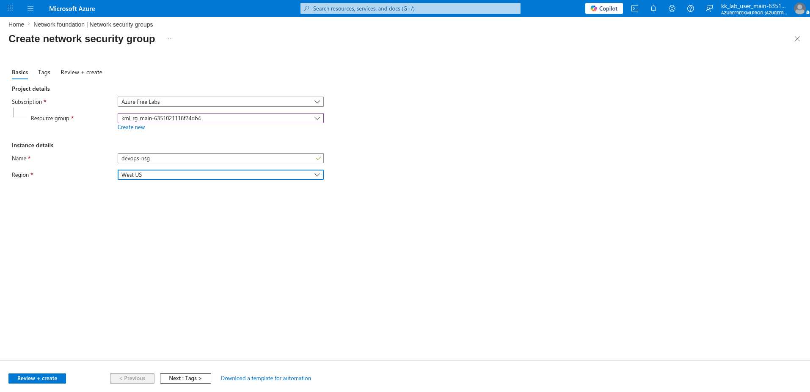

---

### 2. Add HTTP Inbound Rule to NSG

Navigated to:

```text
devops-nsg → Settings → Inbound security rules → + Add
```

Configured:

- Source port ranges: `*`
- Destination: `Any`
- Service: `HTTP`
- Destination port ranges: `80`
- Protocol: `TCP`
- Action: `Allow`
- Priority: `100`
- Name: `Allow-HTTP`

Clicked:

```text
Add
```

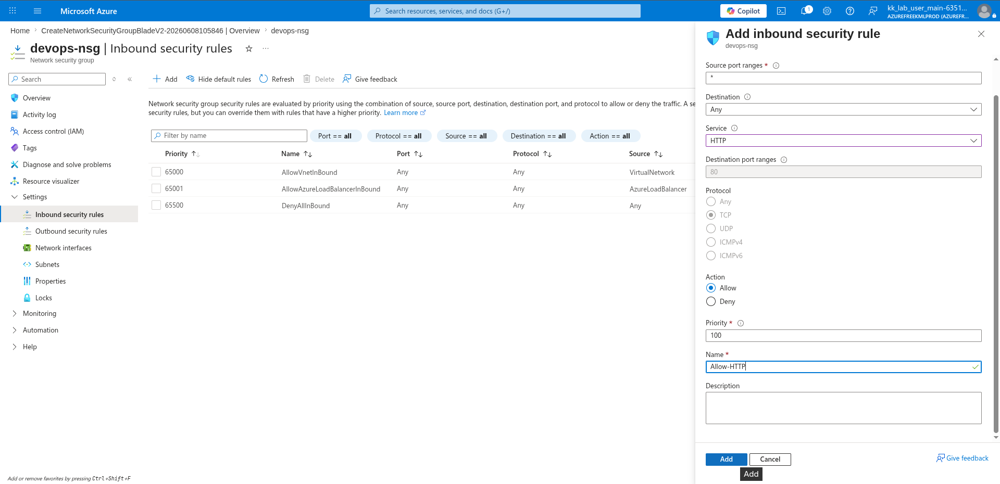

---

### 3. Generate SSH Key Pair via Azure CLI

Generated an SSH key pair on the client machine:

```bash
ssh-keygen
```

Copied the public key content to use during VM creation:

```bash
cat .ssh/id_rsa.pub
```

Copied the output to use as the SSH public key in the VM creation wizard.

---

### 4. Configure VM Name and Region

Navigated to:

```text
Compute infrastructure → Virtual machines → + Create → Virtual machine
```

On the Basics tab, configured:

- Subscription: `Azure Free Labs`
- Resource group: `kml_rg_main-6351021118f74db4`
- Virtual machine name: `devops-vm`
- Region: `(US) West US`
- Image: `Ubuntu Server 24.04 LTS - x64 Gen2`

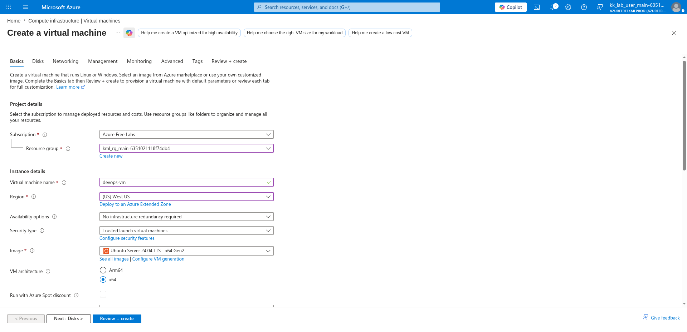

---

### 5. Configure SSH and Others

Scrolled down and configured the administrator account:

- VM architecture: `x64`
- Size: `Standard B1s (1 vcpu, 1 GiB memory)`
- Authentication type: `SSH public key`
- Username: `azureuser`
- SSH public key source: `Use existing public key`
- SSH public key: *(pasted content from `cat .ssh/id_rsa.pub`)*

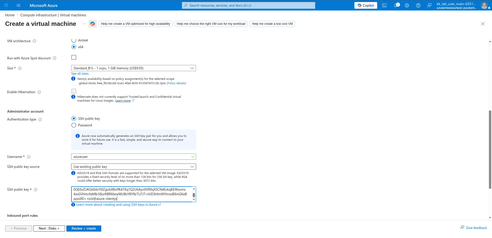

---

### 6. Choose OS Disk Type

On the **Disks** tab, configured:

- OS disk size: `Image default (30 GiB)`
- OS disk type: `Standard HDD (locally-redundant storage)`

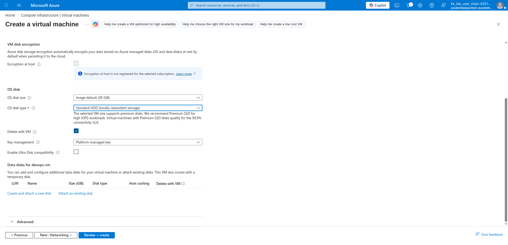

---

### 7. Use Created NSG

On the **Networking** tab, configured:

- Virtual network: `(new) devops-vm-vnet`
- Subnet: `(new) default (10.0.0.0/24)`
- Public IP: `(new) devops-vm-ip`
- Configure network security group: `devops-nsg`

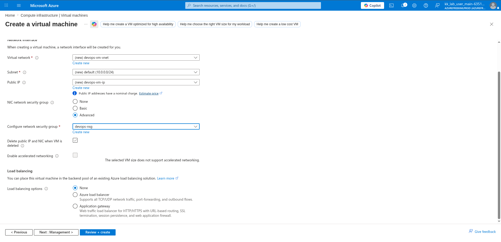

---

### 8. Add Custom Script via Cloud-Init

On the **Advanced** tab, entered the following cloud-init script in the Custom data field to automatically install and enable Nginx on first boot:

```bash
#!/bin/bash
sudo apt update -y
sudo apt install -y nginx
sudo systemctl enable --now nginx
```

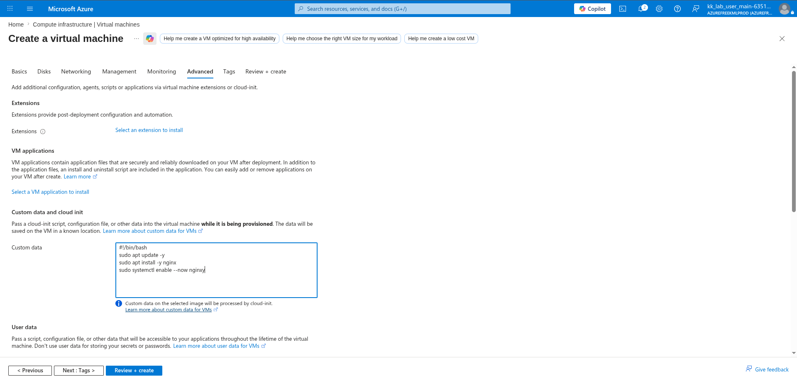

---

### 9. Review and Create VM

Reviewed the full VM configuration and clicked:

```text
Create
```

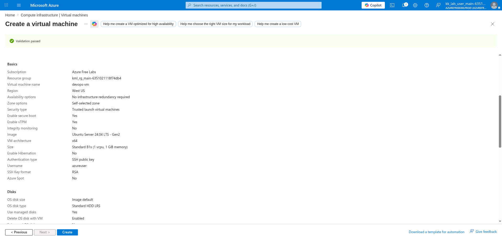

---

### 10. Create Application Gateway

Navigated to:

```text
Load balancing and content delivery → Application gateways → + Create → Application Gateway
```

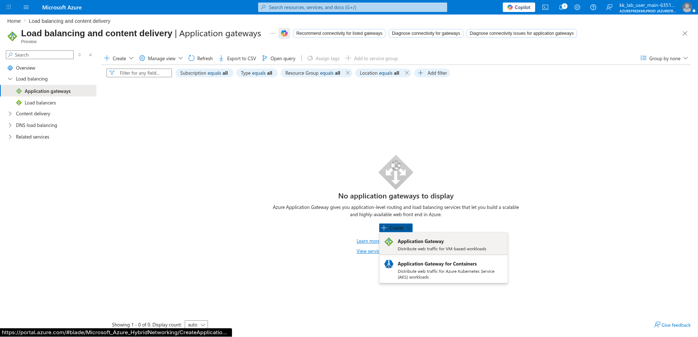

---

### 11. Create a New Subnet in the Existing VNet

Before completing the Application Gateway Basics tab, navigated to:

```text
devops-vm-vnet → Settings → Subnets → + Subnet
```

Added a dedicated subnet for the Application Gateway:

- Subnet purpose: `Default`
- Name: `devops-agw-subnet`

Clicked:

```text
Add
```

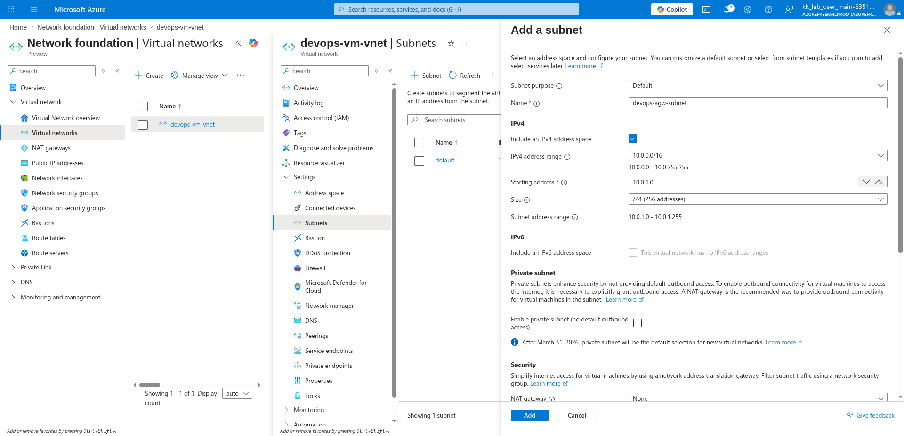

---

### 12. Configure AGW Name, Region and Use Created Subnet

Back on the Application Gateway Basics tab, configured:

- Subscription: `Azure Free Labs`
- Resource group: `kml_rg_main-6351021118f74db4`
- Application gateway name: `devops-agw`
- Region: `West US`
- Tier: `Basic`
- Virtual network: `devops-vm-vnet`
- Subnet: `devops-agw-subnet (10.0.1.0/24)`

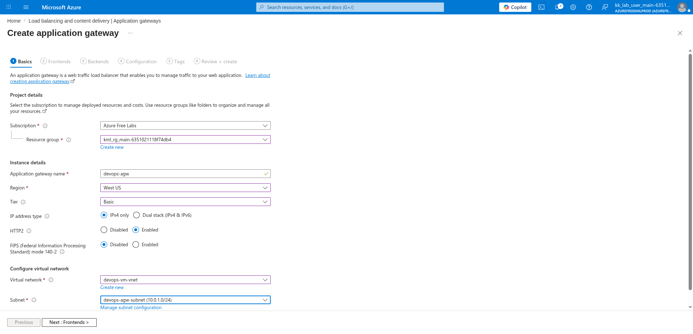

---

### 13. Create New Public IP for Frontend

On the **Frontends** tab, configured:

- Frontend IP address type: `Public`
- Public IPv4 address: `(New) devops-agw-ip`

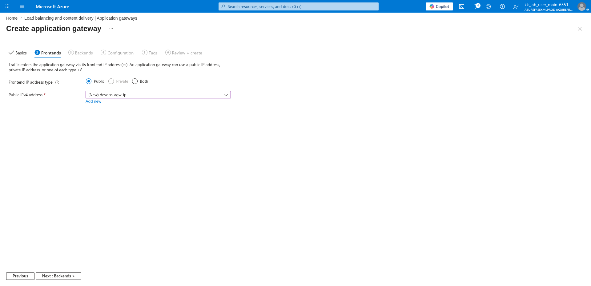

---

### 14. Add Backend Pool

On the **Backends** tab, clicked:

```text
+ Add a backend pool
```

Configured:

- Name: `devops-backendpool`
- Add backend pool without targets: `No`
- Target type: `Virtual machine`
- Target: `devops-vm257 (10.0.0.4)`

Clicked:

```text
Add
```

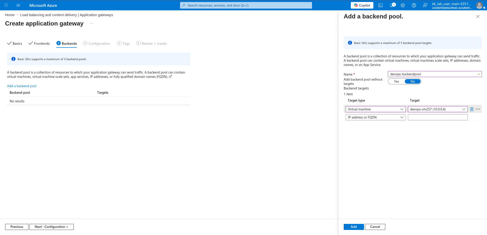

---

### 15. Configure Listener

On the **Configuration** tab, clicked:

```text
+ Add a routing rule
```

On the **Listener** tab of the routing rule panel, configured:

- Rule name: `devops-routing-rule`
- Priority: `1`
- Listener name: `devops-listener`
- Frontend IP: `Public IPv4`
- Protocol: `HTTP`
- Port: `80`
- Listener type: `Basic`

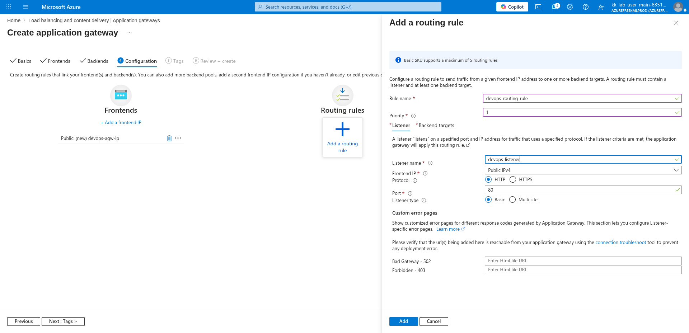

---

### 16. Add Backend Setting

Still in the routing rule panel, clicked the **Backend targets** tab, then clicked:

```text
Add new
```

next to Backend settings. Configured:

- Backend settings name: `devops-http-settings`
- Backend protocol: `HTTP`
- Backend port: `80`
- Cookie-based affinity: `Disable`
- Connection draining: `Disable`
- Dedicated backend connection: `Disable`
- Request time-out (seconds): `20`
- Override hostname: `No`

Clicked:

```text
Add
```

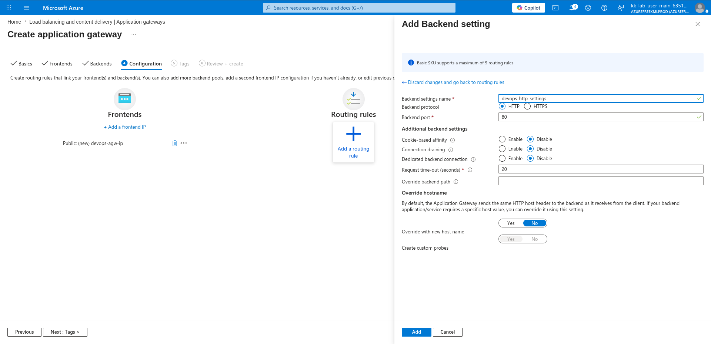

---

### 17. Configure Backend Config (Routing Rule)

Back on the **Backend targets** tab of the routing rule panel, confirmed:

- Target type: `Backend pool`
- Backend target: `devops-backendpool`
- Backend settings: `devops-http-settings`

Clicked:

```text
Add
```

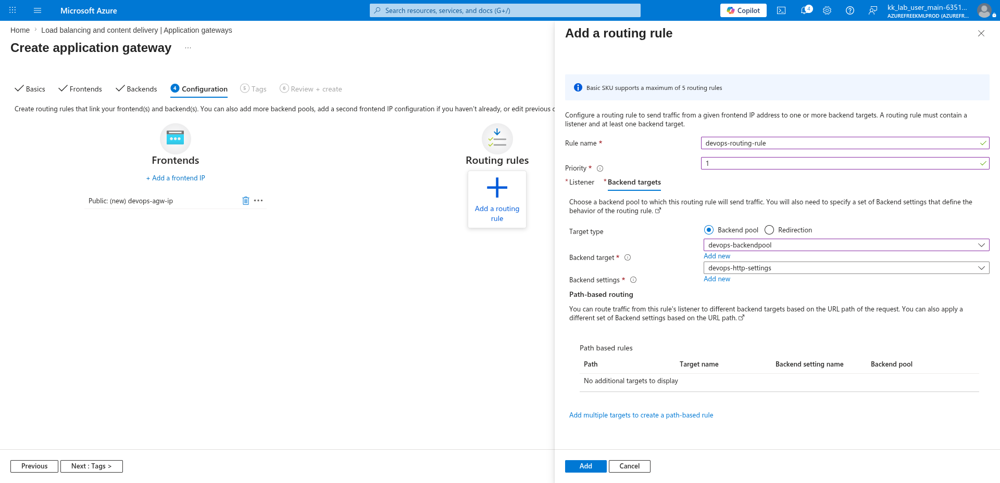

---

### 18. Review and Create Application Gateway

Reviewed the final configuration:

**Basics:**

- Name: `devops-agw`
- Region: `West US`
- Tier: `Basic`
- Virtual network: `devops-vm-vnet`
- Subnet: `devops-agw-subnet (10.0.1.0/24)`

**Frontends:**

- Public IPv4 address name: `devops-agw-ip`

**Inbound rules:**

- Load balancing rule: linked to `devops-backendpool` via `devops-http-settings`
- Listener: `devops-listener` on port 80

Clicked:

```text
Create
```

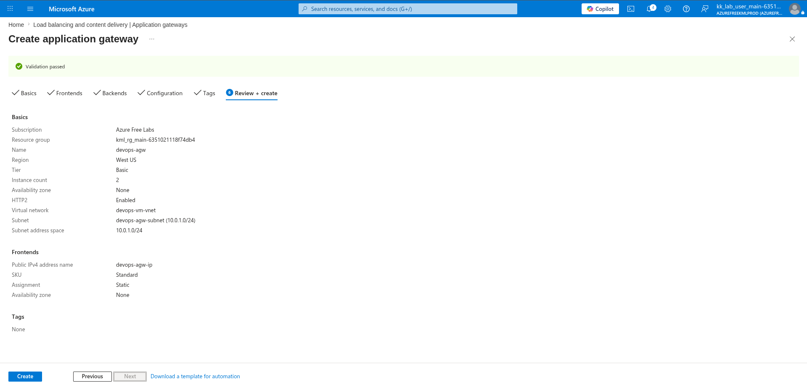

---

## Key Takeaway

Azure Application Gateway is a Layer 7 load balancer that routes HTTP/HTTPS traffic to backend targets based on URL path, host headers, and routing rules. By using cloud-init to auto-install Nginx on the VM and creating a dedicated Application Gateway subnet, the entire setup — from VM provisioning to traffic routing — can be done without any manual SSH configuration after deployment.

---

## Author

Hein Lin Zaw
