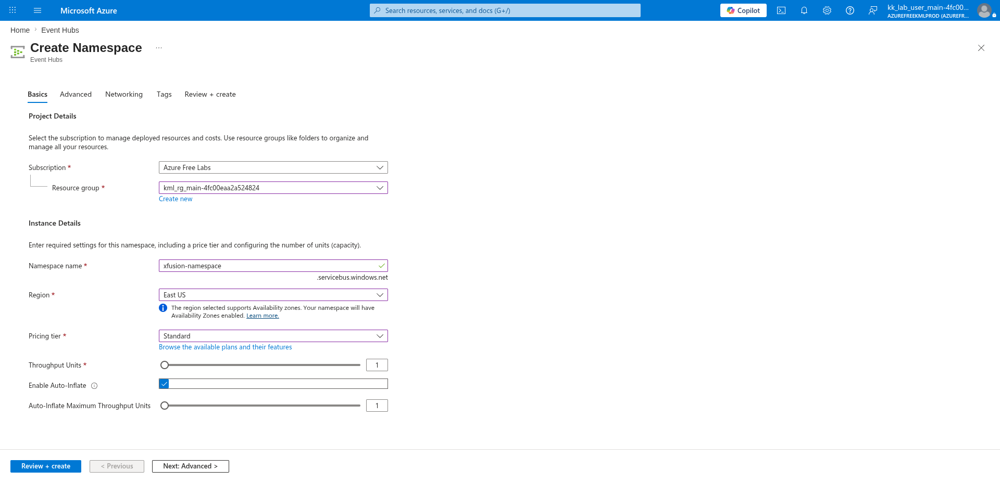
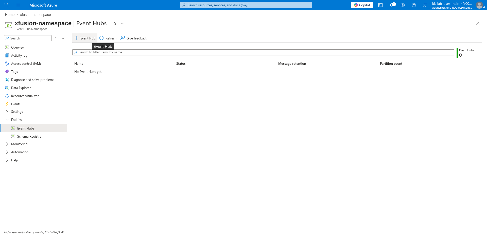
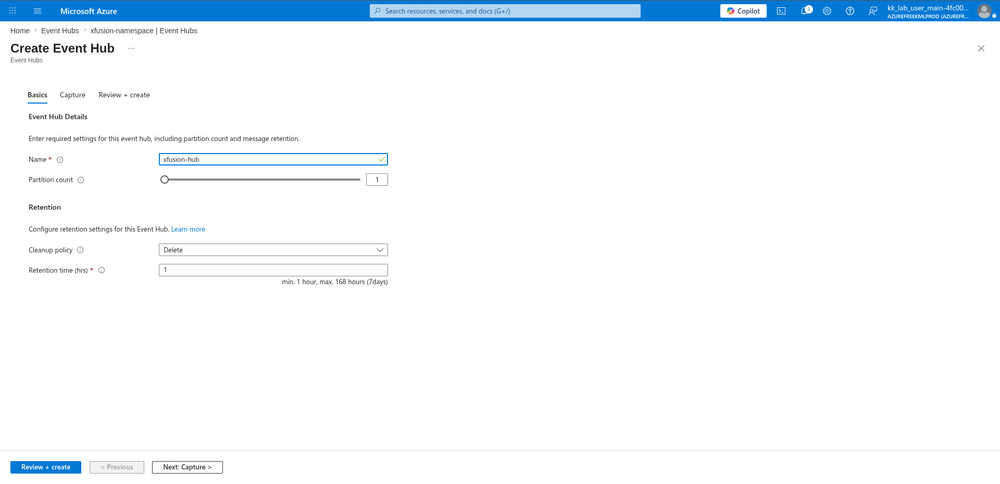
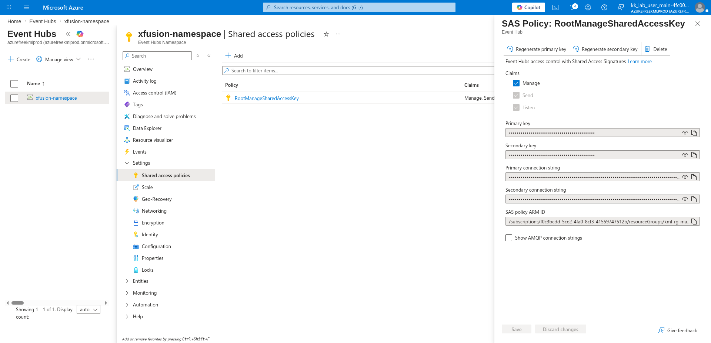
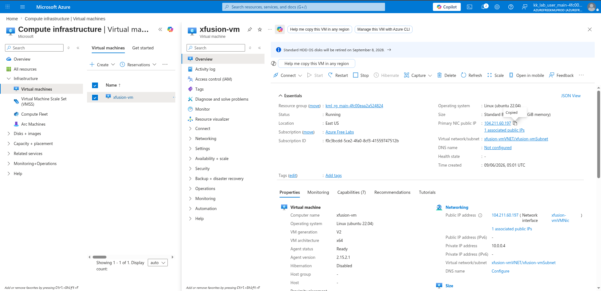

# 100 Days of Azure – Day 44

## Integrating Azure Event Hub with Virtual Machines

## Overview

This lab demonstrates how to create an Azure Event Hub Namespace, create an Event Hub inside it, copy the connection string, and configure a Python script on an existing VM to send logs to the Event Hub.

---

## What I Did

- Created an Azure Event Hub Namespace with Standard tier
- Created an Event Hub inside the namespace
- Copied the primary connection string from the shared access policy
- SSHed into an existing VM using its public IP
- Inspected and edited `send_logs.py` to use the Event Hub connection string
- Ran the Python script multiple times to stream logs to the Event Hub

---

## Steps Performed

### 1. Create Event Hub Namespace

Navigated to:

```text
Event Hubs → + Create
```

Configured:

- Subscription: `Azure Free Labs`
- Resource group: `kml_rg_main-4fc00eaa2a524824`
- Namespace name: `xfusion-namespace`
- Region: `East US`
- Pricing tier: `Standard`
- Throughput Units: `1`
- Enable Auto-Inflate: ✅
- Auto-Inflate Maximum Throughput Units: `1`

Clicked:

```text
Review + create → Create
```



---

### 2. Create an Event Hub Under That Namespace

Navigated to:

```text
xfusion-namespace → Entities → Event Hubs → + Event Hub
```



---

### 3. Configure Event Hub Name and Create

On the **Basics** tab, configured:

- Name: `xfusion-hub`
- Partition count: `1`
- Cleanup policy: `Delete`
- Retention time (hrs): `1`

Clicked:

```text
Review + create → Create
```



---

### 4. Copy Event Hub Connection String

Navigated to:

```text
xfusion-namespace → Settings → Shared access policies → RootManageSharedAccessKey
```

Copied the **Primary connection string** to use in the Python script.



---

### 5. Copy Existing VM Public IP

Navigated to:

```text
Compute infrastructure → Virtual machines → xfusion-vm
```

Copied the **Primary NIC public IP**: `104.211.60.197`



---

### 6. SSH into the VM and Inspect the Script

SSHed into the VM using the copied public IP:

```bash
ssh azureuser@104.211.60.197
```

Inspected the existing Python script:

```bash
cat send_logs.py
```

---

### 7. Update the Connection String and Run the Script

Edited `send_logs.py` to replace the placeholder connection string with the one copied from the Event Hub shared access policy:

```bash
nano send_logs.py
```

Updated the `connection_str` value with the Event Hub primary connection string, saved the file, then ran the script multiple times:

```bash
python3 send_logs.py
python3 send_logs.py
python3 send_logs.py
```

---

## Key Takeaway

Azure Event Hubs is a fully managed, real-time data ingestion service capable of receiving and processing millions of events per second. By pairing an Event Hub with a Python producer script running on a VM, logs and telemetry can be streamed directly from compute workloads into the Event Hub pipeline — without any additional middleware — making it a lightweight and scalable foundation for real-time data processing architectures.

---

## Author

Hein Lin Zaw
