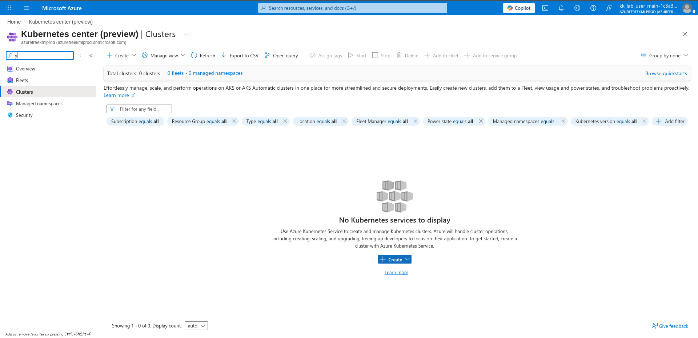
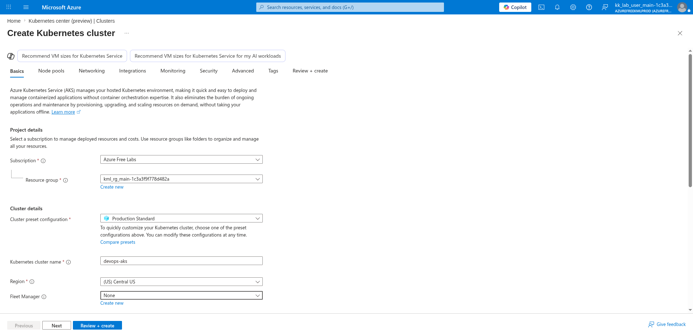
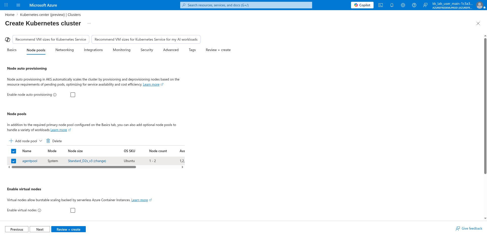
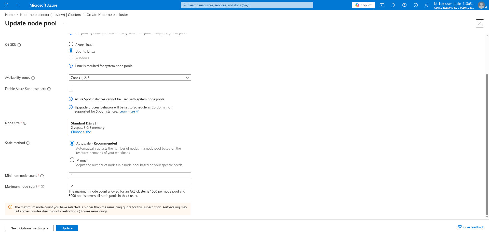
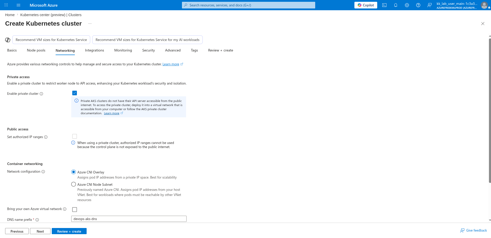
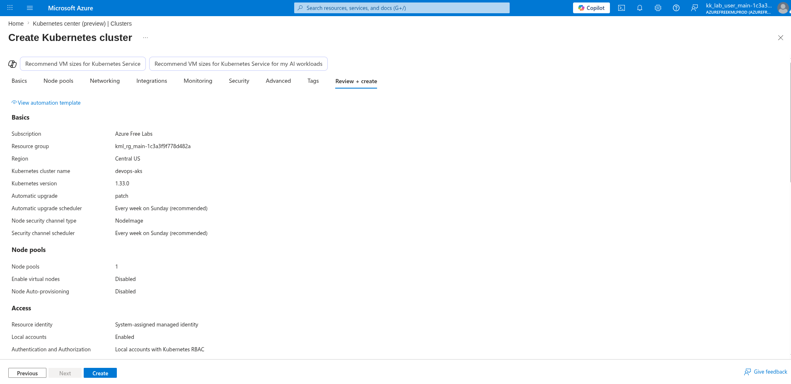

# 100 Days of Azure – Day 45

## Deploying a Private Azure Kubernetes Service (AKS) Cluster

## Overview

This lab demonstrates how to create an Azure Kubernetes Service (AKS) cluster using the Production Standard preset, configure a system node pool with autoscaling, enable a private cluster to restrict API server access from the public internet, disable all monitoring and insights, and deploy the cluster.

---

## What I Did

- Navigated to Kubernetes center and initiated cluster creation
- Configured cluster name, region, and preset as Production Standard
- Updated the default node pool with autoscaling and Ubuntu Linux OS
- Enabled private cluster on the Networking tab
- Disabled all monitoring and insights
- Reviewed and deployed the AKS cluster

---

## Steps Performed

### 1. Create Kubernetes Cluster

Navigated to:

```text
Kubernetes center (preview) → Clusters → + Create → Create a Kubernetes cluster
```



---

### 2. Configure Name and Region

On the **Basics** tab, configured:

- Subscription: `Azure Free Labs`
- Resource group: `kml_rg_main-1c3a3f9f778d482a`
- Cluster preset configuration: `Production Standard`
- Kubernetes cluster name: `devops-aks`
- Region: `(US) Central US`
- Fleet Manager: `None`



---

### 3. Select Configured Node Pool

On the **Node pools** tab, confirmed the default node pool:

- Node auto-provisioning: Disabled
- Enable virtual nodes: Disabled

Clicked the existing `agentpool` entry to edit it:

- Mode: `System`
- Node size: `Standard_D2s_v3`
- OS SKU: `Ubuntu`
- Node count: `1 - 2`



---

### 4. Configure Existing Node Pool

In the **Update node pool** panel, configured:

- OS SKU: `Ubuntu Linux`
- Availability zones: `Zones 1, 2, 3`
- Enable Azure Spot instances: ☐
- Node size: `Standard D2s v3 (2 vcpus, 8 GiB memory)`
- Scale method: `Autoscale - Recommended`
- Minimum node count: `1`
- Maximum node count: `2`

Clicked:

```text
Update
```



---

### 5. Enable Private Cluster

On the **Networking** tab, configured:

- Enable private cluster: ✅
- Set authorized IP ranges: ☐ *(disabled — not available for private clusters)*
- Network configuration: `Azure CNI Overlay`
- Bring your own Azure virtual network: ☐
- DNS name prefix: `devops-aks-dns`



---

### 6. Disable All Monitoring and Insights

On the **Monitoring** tab, disabled all monitoring options:

- Enable Prometheus metrics: ☐
- Enable Grafana: ☐
- Enable Azure Monitor Container Insights: ☐
- Enable recommended alert rules: ☐

Clicked:

```text
Next
```

---

### 7. Review and Create

Reviewed the final configuration:

**Basics:**

- Subscription: `Azure Free Labs`
- Resource group: `kml_rg_main-1c3a3f9f778d482a`
- Region: `Central US`
- Kubernetes cluster name: `devops-aks`
- Kubernetes version: `1.33.0`
- Automatic upgrade: `patch`
- Automatic upgrade scheduler: `Every week on Sunday (recommended)`
- Node security channel type: `NodeImage`
- Security channel scheduler: `Every week on Sunday (recommended)`

**Node pools:**

- Node pools: `1`
- Enable virtual nodes: `Disabled`
- Node Auto-provisioning: `Disabled`

Clicked:

```text
Create
```



---

## Author

Hein Lin Zaw
