# 100 Days of Azure – Day 46

## Streaming VM Logs to Azure Event Hub and Blob Storage with Python

## Overview

This lab demonstrates how to create an Azure Storage Account with anonymous blob access, create a Blob container, create an Event Hub Namespace and Event Hub, provision a VM with an SSH key pair, copy a Python log sender script onto the VM via SCP, configure both connection strings inside the script, set up a Python virtual environment with the required Azure SDK packages, and run the script multiple times to verify that logs are successfully streamed to both Event Hub and Blob Storage.

---

## What I Did

- Created a Storage Account (`nautilusst29362`) with Blob anonymous access enabled
- Created a Blob container (`nautilus-backup-27545`) with anonymous read access
- Copied the Blob Storage connection string from the Access keys panel
- Created an Event Hub Namespace (`nautilus-namespace`) with Standard tier
- Created an Event Hub (`nautilus-hub`) inside the namespace
- Copied the Event Hub primary connection string from the shared access policy
- Generated an SSH key pair via Azure CLI and created a VM (`nautilus-vm`) in East US
- Copied `send_logs.py` onto the VM via SCP and edited it with both connection strings
- Set up a Python virtual environment and installed the required Azure SDK packages
- Ran `send_logs.py` multiple times to verify end-to-end log streaming

---

## Steps Performed

### 1. Create Storage Account

Navigated to:

```text
Storage center | Blob Storage → + Create
```

On the **Basics** tab, configured:

- Subscription: `Azure Free Labs`
- Resource group: `kml_rg_main-036560c433be4e8e`
- Storage account name: `nautilusst29362`
- Region: `(US) East US`
- Preferred storage type: `Azure Blob Storage or Azure Data Lake Storage`
- Performance: `Standard`
- Redundancy: `Locally redundant storage (LRS)`

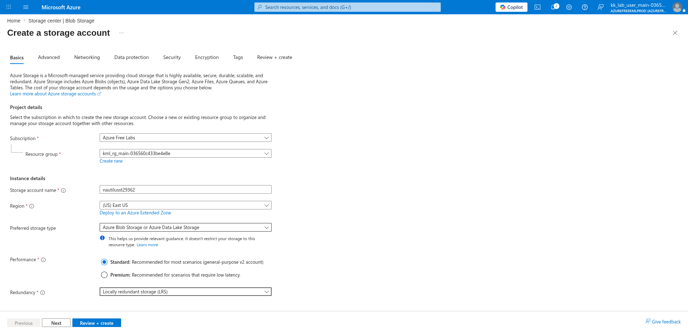

---

### 2. Make Sure Enable Anonymous Access

On the **Security** tab, configured:

- Allow enabling anonymous access on individual containers: ✅

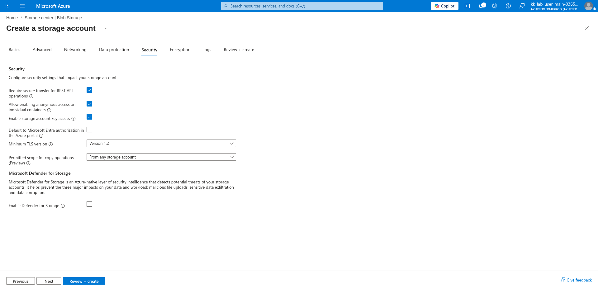

---

### 3. Review and Create Storage Account

Reviewed the final storage account configuration:

**Basics:**

- Location: `East US`
- Storage account name: `nautilusst29362`
- Primary service: `Azure Blob Storage or Azure Data Lake Storage`
- Performance: `Standard`
- Replication: `Locally redundant storage (LRS)`

**Security:**

- Blob anonymous access: `Enabled`
- Allow storage account key access: `Enabled`

Clicked:

```text
Create
```

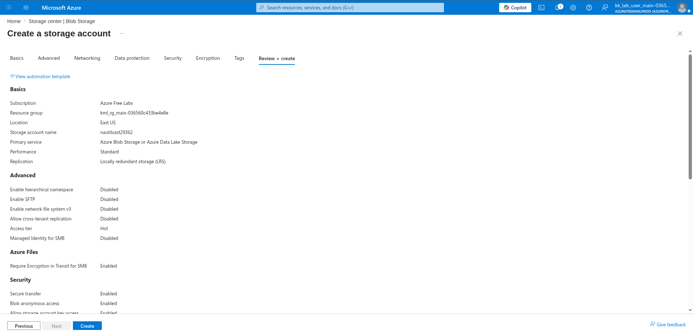

---

### 4. Create a New Container

Navigated to:

```text
nautilusst29362 → Data storage → Containers → + Add container
```

Configured:

- Name: `nautilus-backup-27545`
- Anonymous access level: `Blob (anonymous read access for blobs only)`

Clicked:

```text
Create
```

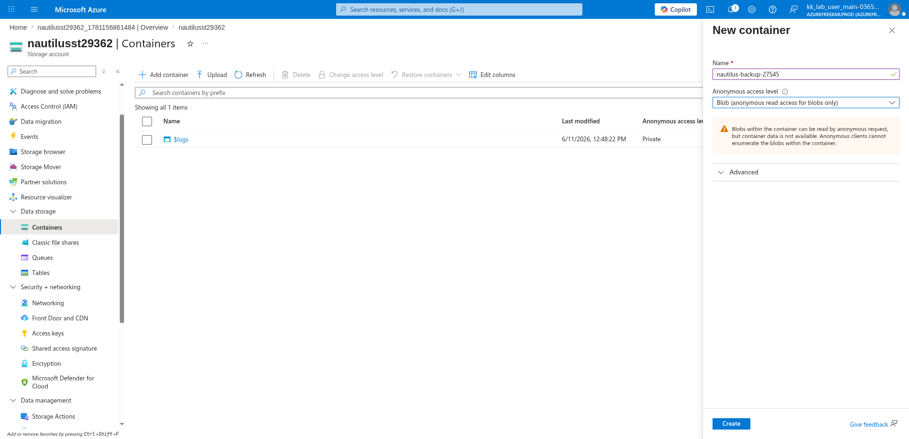

---

### 5. Copy Blob Connection String

Navigated to:

```text
nautilusst29362 → Security + networking → Access keys
```

Copied the **key1 Connection string** to use in the Python script.

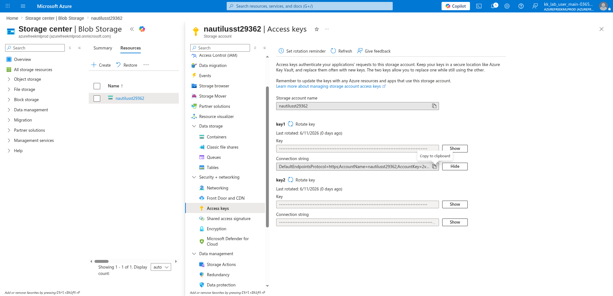

---

### 6. Create Namespace

Navigated to:

```text
Event Hubs → + Create
```

On the **Basics** tab, configured:

- Subscription: `Azure Free Labs`
- Resource group: `kml_rg_main-036560c433be4e8e`
- Namespace name: `nautilus-namespace`
- Region: `East US`
- Pricing tier: `Standard`
- Throughput Units: `1`
- Enable Auto-Inflate: ✅
- Auto-Inflate Maximum Throughput Units: `1`

Reviewed and confirmed:

Clicked:

```text
Create
```

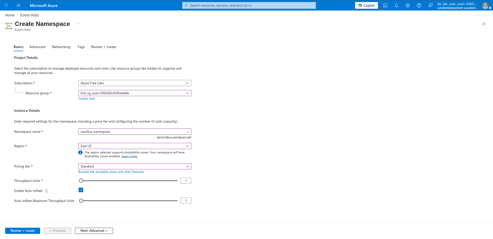

---

### 7. Create Event Hub

Navigated to:

```text
nautilus-namespace → Entities → Event Hubs → + Event Hub
```

On the **Basics** tab, configured:

- Name: `nautilus-hub`
- Partition count: `1`
- Cleanup policy: `Delete`
- Retention time (hrs): `1`

Clicked:

```text
Review + create → Create
```

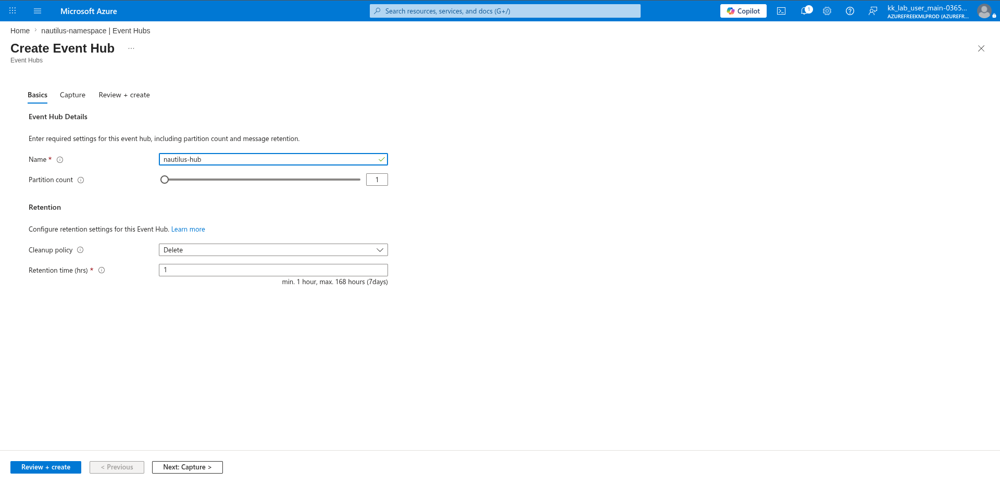

---

### 8. Copy Event Hub Connection String

Navigated to:

```text
nautilus-namespace → Settings → Shared access policies → RootManageSharedAccessKey
```

Copied the **Primary connection string** to use in the Python script.

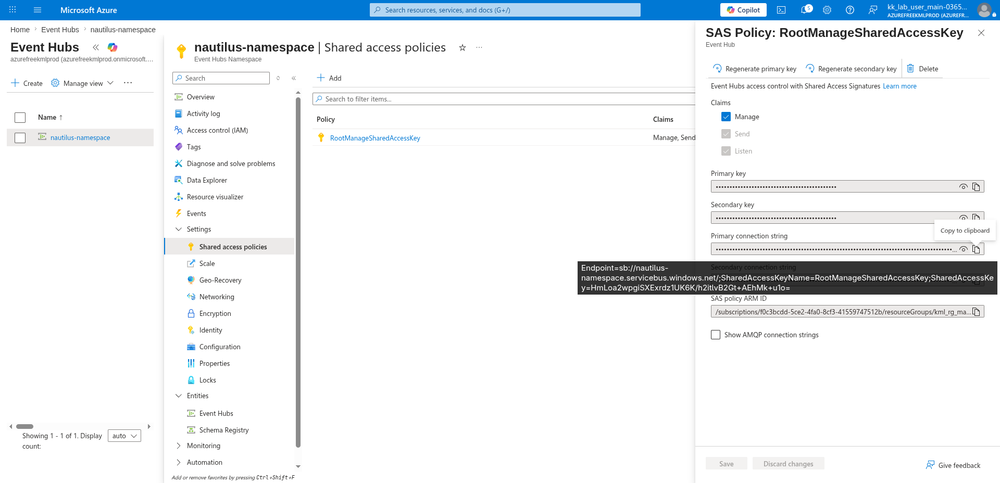

---

### 9. Generate SSH Key Pair via Azure CLI

Generated an SSH key pair on the client machine:

```bash
ssh-keygen
```

Copied the public key content to use during VM creation:

```bash
cat .ssh/id_rsa.pub
```

---

### 10. Configure VM Name and Region

Navigated to:

```text
Compute infrastructure → Virtual machines → + Create → Virtual machine
```

On the **Basics** tab, configured:

- Subscription: `Azure Free Labs`
- Resource group: `kml_rg_main-036560c433be4e8e`
- Virtual machine name: `nautilus-vm`
- Region: `(US) East US`
- Availability options: `Availability zone`
- Zone options: `Self-selected zone`
- Availability zone: `Zone 2`
- Security type: `Trusted launch virtual machines`
- Image: `Ubuntu Server 24.04 LTS - Gen2`
- VM architecture: `x64`

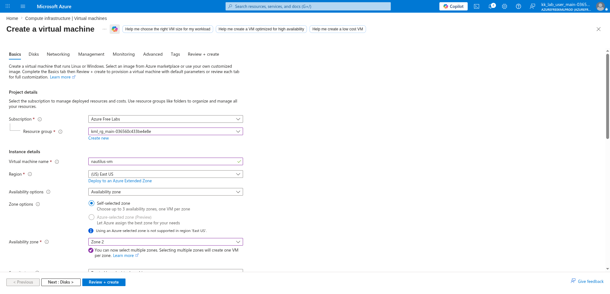

---

### 11. Configure SSH

Scrolled down and configured the administrator account:

- Size: `Standard B1s (1 vcpu, 1 GiB memory)`
- Authentication type: `SSH public key`
- Username: `azureuser`
- SSH public key source: `Use existing public key`
- SSH public key: *(pasted content from `cat .ssh/id_rsa.pub`)*
- Public inbound ports: `SSH`

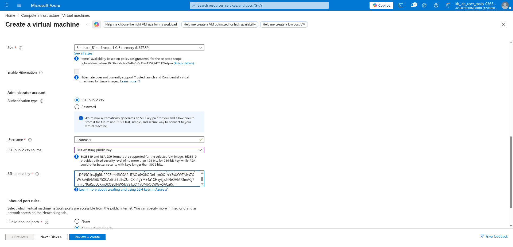

---

### 12. Review and Create VM

Reviewed the full VM configuration and clicked:

```text
Create
```

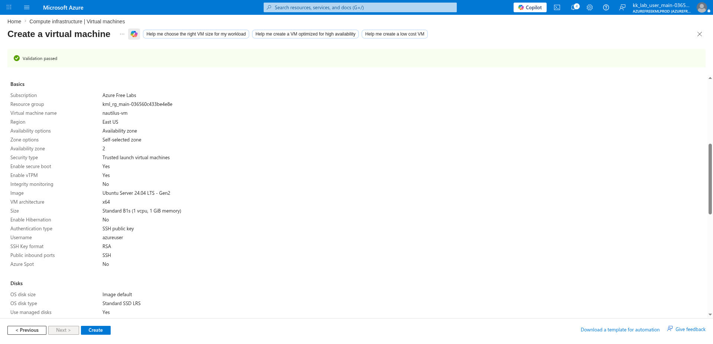

---

### 13. Copy Script to VM and Edit Connection Strings

After the VM deployed, copied `send_logs.py` onto the VM using SCP:

```bash
scp send_logs.py azureuser@<public_ip>:/home/azureuser/
```

SSHed into the VM:

```bash
ssh azureuser@<public_ip>
```

Opened the script with `vi` and updated both connection string values — the Blob Storage connection string and the Event Hub connection string — with the ones copied earlier:

```bash
vi send_logs.py
```

---

### 14. Set Up Python Virtual Environment and Install Dependencies

Ran the script initially and encountered missing Azure module errors. Installed the required packages inside a virtual environment:

```bash
sudo apt update
sudo apt install -y python3-venv
python3 -m venv ~/env
source ~/env/bin/activate
pip install azure-storage-blob azure-eventhub
```

---

### 15. Click Create (Run the Script)

With the virtual environment active, ran the script multiple times to verify that logs were successfully streamed to both Azure Event Hub and Blob Storage:

```bash
python3 send_logs.py
python3 send_logs.py
python3 send_logs.py
```

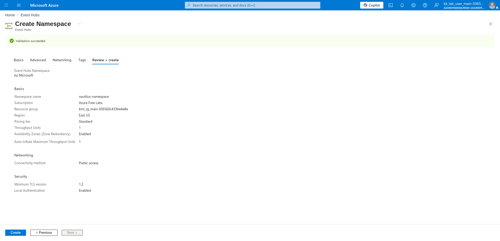

---

## Key Takeaway

Azure Event Hubs and Azure Blob Storage together form a powerful real-time and persistent log ingestion pipeline. Event Hubs handles high-throughput streaming of events as they occur, while Blob Storage provides durable, cost-effective long-term storage for the same data. By using a Python virtual environment with the `azure-eventhub` and `azure-storage-blob` SDK packages on a VM, this entire pipeline — from compute workload to cloud storage — can be set up without any additional managed services or middleware.

---

## Author

Hein Lin Zaw
