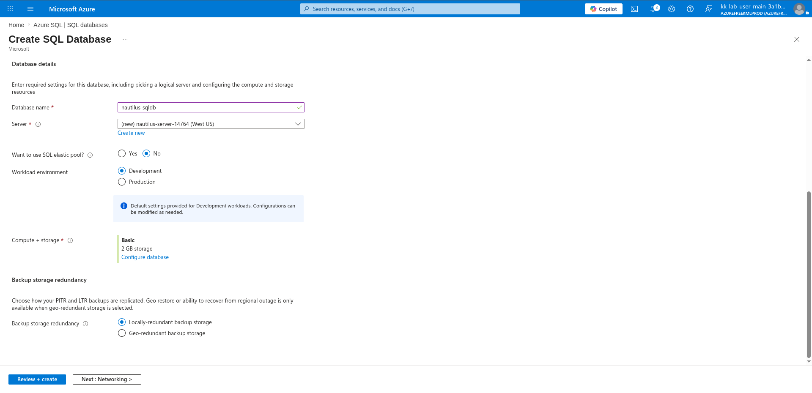
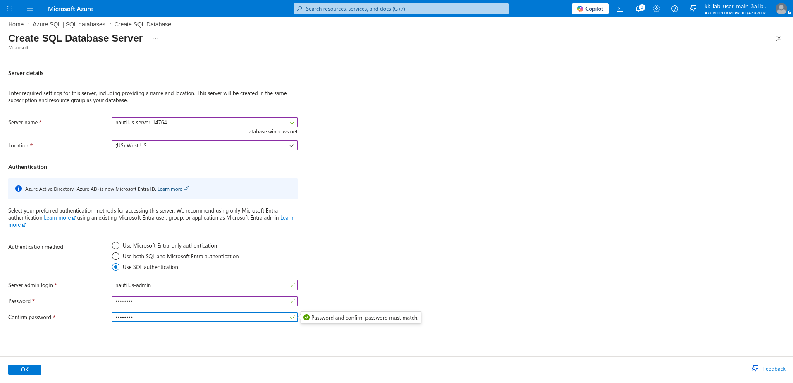
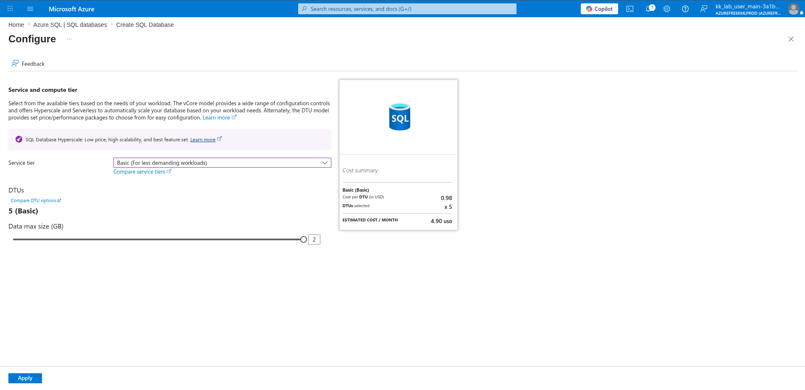
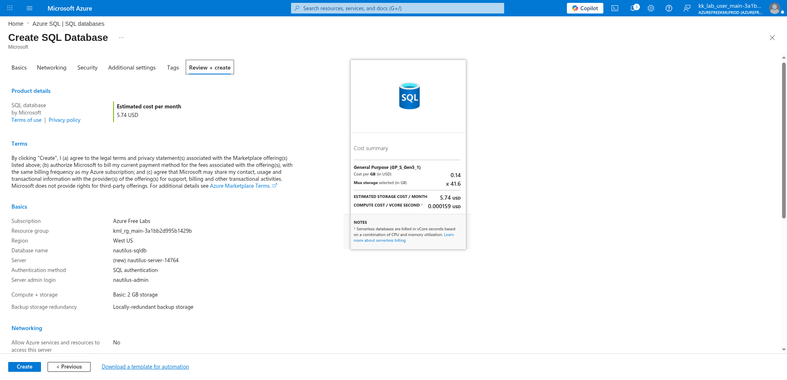
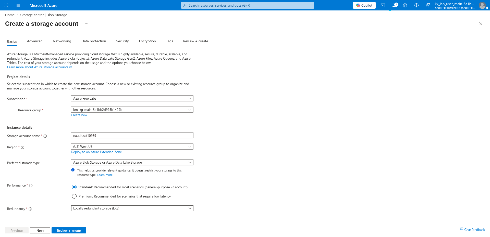
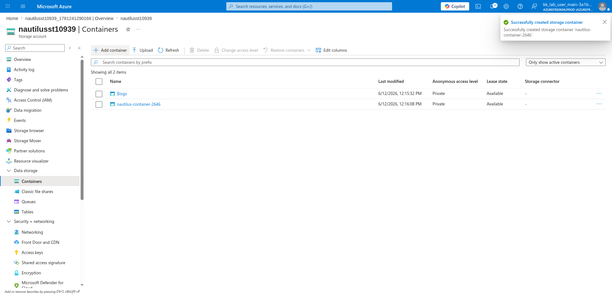
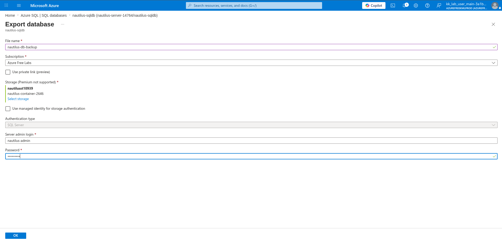
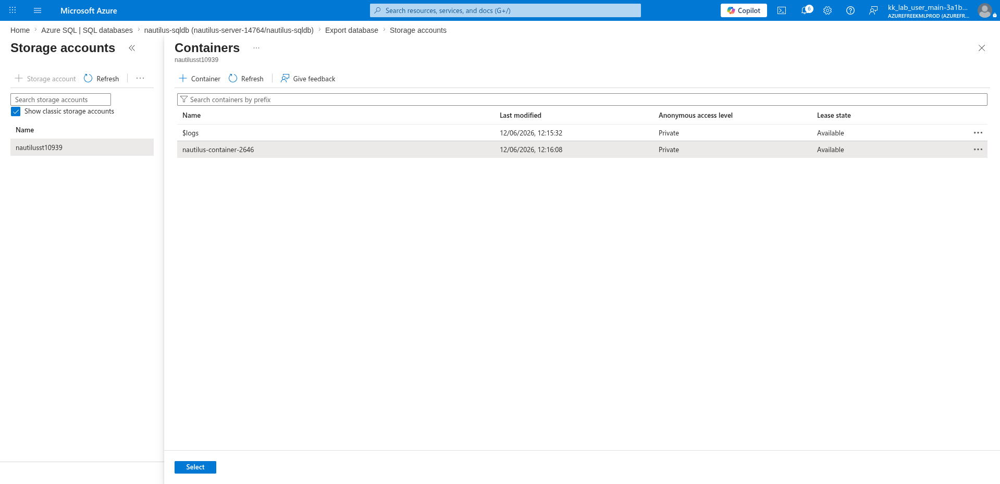

# 100 Days of Azure – Day 47

## Azure SQL Database Migration and Setup

## Overview

This lab demonstrates how to create an Azure SQL Database with a new logical server, configure the Basic service tier, create a Storage Account with a Blob container to serve as the export destination, export the database as a `.bacpac` file to the Blob container, and finally download the exported file to the local machine using the Azure CLI.

---

## What I Did

- Created an Azure SQL Database (`nautilus-sqldb`) with a new logical server (`nautilus-server-14764`)
- Configured the service tier as Basic (DTU model, 2 GB storage)
- Created a Storage Account (`nautilusst10939`) in West US with LRS
- Created a Blob container (`nautilus-container-2646`) inside the storage account
- Exported the SQL database as a `.bacpac` file to the Blob container
- Selected the target container from the storage account picker during export
- Downloaded the exported backup file to the local machine via Azure CLI
- Verified the download with `ls /opt/`

---

## Steps Performed

### 1. Configure Name and Region of DB

Navigated to:

```text
Azure SQL | SQL databases → + Create
```

On the **Basics** tab, configured:

- Subscription: `Azure Free Labs`
- Resource group: `kml_rg_main-3a1bb2d995b1429b`
- Database name: `nautilus-sqldb`
- Server: `(new) nautilus-server-14764 (West US)`
- Want to use SQL elastic pool: `No`
- Workload environment: `Development`
- Compute + storage: `Basic — 2 GB storage`
- Backup storage redundancy: `Locally-redundant backup storage`



---

### 2. Create a New DB Server

Clicked **Create new** next to the Server field. In the **Create SQL Database Server** panel, configured:

- Server name: `nautilus-server-14764`
- Location: `(US) West US`
- Authentication method: `Use SQL authentication`
- Server admin login: `nautilus-admin`
- Password: *(set and confirmed)*

Clicked:

```text
OK
```



---

### 3. Configure Service Tier

Clicked **Configure database** next to the Compute + storage field. In the **Configure** panel, set:

- Service tier: `Basic (For less demanding workloads)`
- DTUs: `5 (Basic)`
- Data max size (GB): `2`
- Estimated cost: `~4.90 USD/month`

Clicked:

```text
Apply
```



---

### 4. Review and Create Database

Reviewed the final SQL Database configuration:

**Basics:**

- Subscription: `Azure Free Labs`
- Resource group: `kml_rg_main-3a1bb2d995b1429b`
- Region: `West US`
- Database name: `nautilus-sqldb`
- Server: `(new) nautilus-server-14764`
- Authentication method: `SQL authentication`
- Server admin login: `nautilus-admin`
- Compute + storage: `Basic: 2 GB storage`
- Backup storage redundancy: `Locally-redundant backup storage`

Clicked:

```text
Create
```



---

### 5. Create a Storage Account

Navigated to:

```text
Storage center | Blob Storage → + Create
```

On the **Basics** tab, configured:

- Subscription: `Azure Free Labs`
- Resource group: `kml_rg_main-3a1bb2d995b1429b`
- Storage account name: `nautilusst10939`
- Region: `(US) West US`
- Preferred storage type: `Azure Blob Storage or Azure Data Lake Storage`
- Performance: `Standard`
- Redundancy: `Locally redundant storage (LRS)`

Clicked:

```text
Review + create → Create
```



---

### 6. Also Create a Blob Container

Navigated to:

```text
nautilusst10939 → Data storage → Containers → + Add container
```

Configured:

- Name: `nautilus-container-2646`
- Anonymous access level: `Private`

Clicked:

```text
Create
```

The portal confirmed: *"Successfully created storage container 'nautilus-container-2646'."*



---

### 7. Go to DB and Export to Blob Container

Navigated to:

```text
Azure SQL | SQL databases → nautilus-sqldb → Export
```

Configured the export:

- File name: `nautilus-db-backup`
- Subscription: `Azure Free Labs`
- Use private link: ☐
- Storage: `nautilusst10939 / nautilus-container-2646`
- Use managed identity for storage authentication: ☐
- Authentication type: `SQL Server`
- Server admin login: `nautilus-admin`
- Password: *(entered)*

Clicked:

```text
OK
```



---

### 8. Choose Blob Container

During the export flow, clicked **Select storage** to pick the destination. In the **Storage accounts** picker, selected:

- Storage account: `nautilusst10939`
- Container: `nautilus-container-2646`

Clicked:

```text
Select
```



---

### 9. Download the Exported Backup via Azure CLI

After the export completed, downloaded the `.bacpac` file from Blob Storage to the local machine using the Azure CLI:

```bash
az storage blob download \
  --account-name nautilusst10939 \
  --container-name nautilus-container-2646 \
  --name nautilus-db-backup.bacpac \
  --file nautilus-db-backup.bacpac
```

Verified the downloaded file:

```bash
ls /opt/
```

---

## Key Takeaway

Azure SQL Database's built-in export feature generates a `.bacpac` file — a portable snapshot of both the schema and data — and writes it directly to an Azure Blob container. Combined with the Azure CLI's `az storage blob download` command, this creates a straightforward, scriptable backup-and-restore workflow that requires no additional tools or agents. Pairing a Basic-tier serverless database with LRS Blob Storage keeps costs minimal while still providing a fully automated offsite backup pipeline.

---

## Author

Hein Lin Zaw
