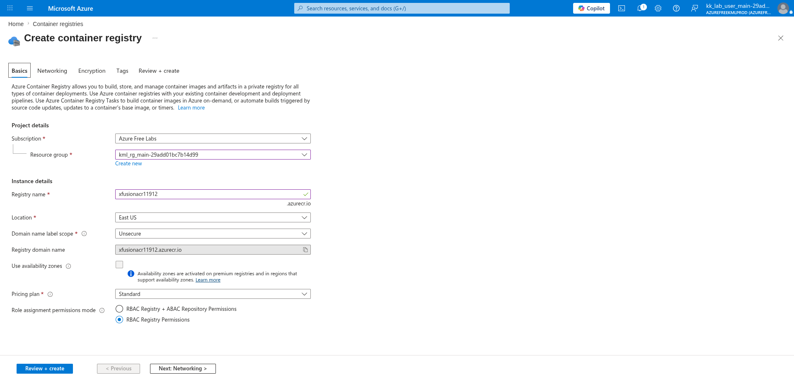
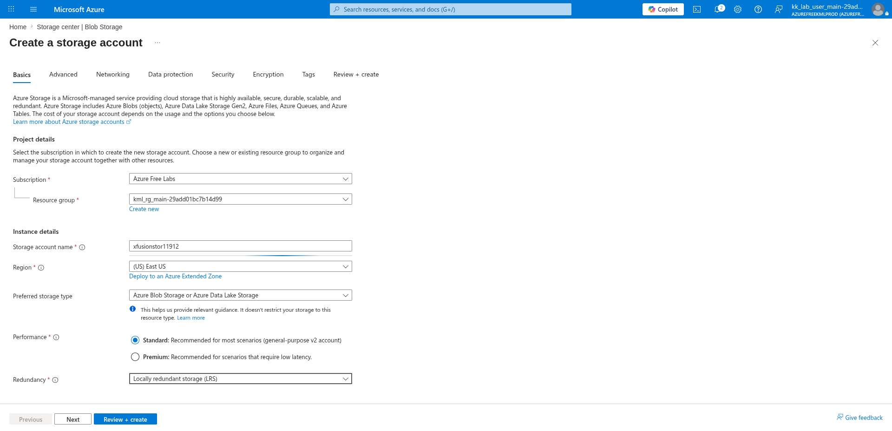
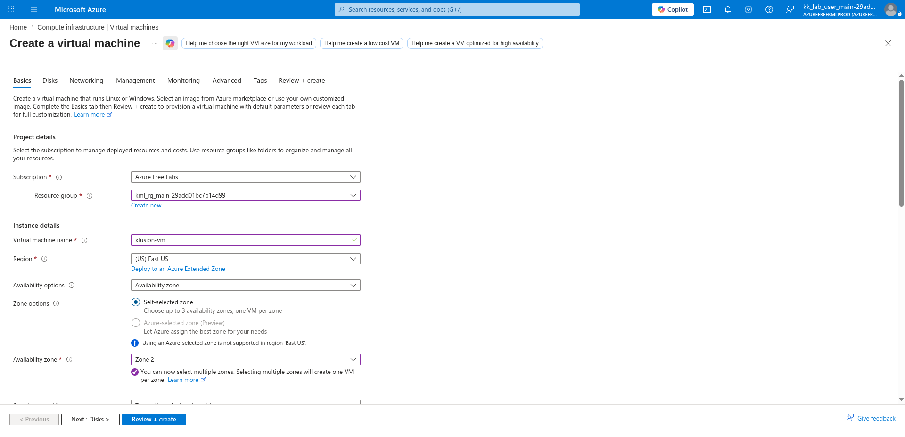
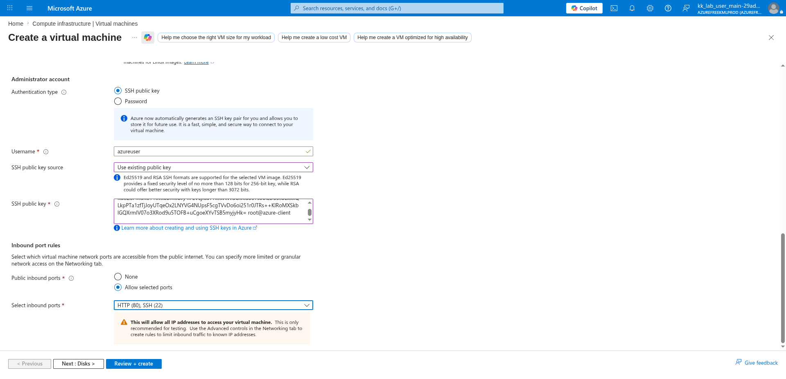
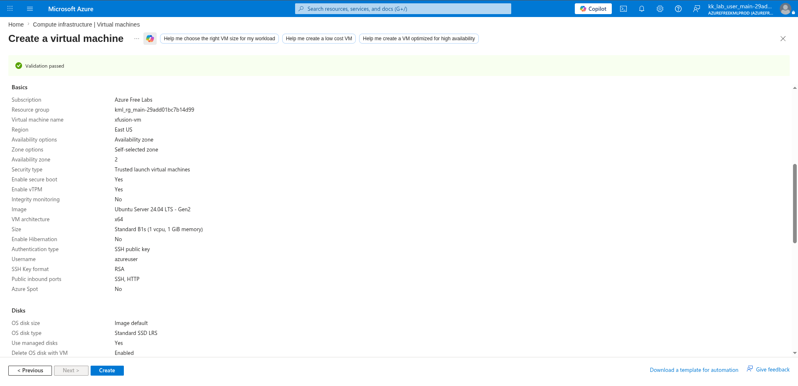
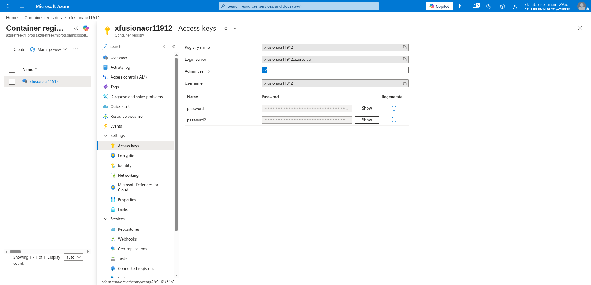

# 100 Days of Azure – Day 48

## Deploying a Containerized Python App to Azure Container Registry and VM

## Overview

This lab demonstrates how to create an Azure Container Registry (ACR), create a Storage Account, provision a VM with HTTP and SSH inbound rules, build and push a Docker image of a Python application to ACR, deploy the container on the VM using Docker, and upload the app's config file to Azure Blob Storage.

---

## What I Did

- Created an Azure Container Registry (`xfusionacr11912`) with Standard pricing plan
- Created a Storage Account (`xfusionstor11912`) in East US with LRS
- Generated an SSH key pair and provisioned a VM (`xfusion-vm`) with HTTP and SSH inbound ports
- Copied ACR credentials (username and password) from the Access keys panel
- Logged into ACR from the client, built the Docker image, and pushed it to ACR
- Copied `config.json` to the VM via SCP
- On the VM, installed Docker and Azure CLI, logged into ACR, and ran the container
- Uploaded `config.json` to Azure Blob Storage via Azure CLI

---

## Steps Performed

### 1. Create ACR

Navigated to:

```text
Container registries → + Create
```

On the **Basics** tab, configured:

- Subscription: `Azure Free Labs`
- Resource group: `kml_rg_main-29add01bc7b14d99`
- Registry name: `xfusionacr11912`
- Location: `East US`
- Domain name label scope: `Unsecure`
- Registry domain name: `xfusionacr11912.azurecr.io`
- Use availability zones: ☐
- Pricing plan: `Standard`
- Role assignment permissions mode: `RBAC Registry Permissions`

Clicked:

```text
Review + create → Create
```



---

### 2. Create a Storage Account

Navigated to:

```text
Storage center | Blob Storage → + Create
```

On the **Basics** tab, configured:

- Subscription: `Azure Free Labs`
- Resource group: `kml_rg_main-29add01bc7b14d99`
- Storage account name: `xfusionstor11912`
- Region: `(US) East US`
- Preferred storage type: `Azure Blob Storage or Azure Data Lake Storage`
- Performance: `Standard`
- Redundancy: `Locally redundant storage (LRS)`

Clicked:

```text
Review + create → Create
```



---

### 3. Generate SSH Key Pair via Azure CLI

Generated an SSH key pair on the client machine:

```bash
ssh-keygen
```

Copied the public key content to use during VM creation:

```bash
cat .ssh/id_rsa.pub
```

---

### 4. Create VM

Navigated to:

```text
Compute infrastructure → Virtual machines → + Create → Virtual machine
```

On the **Basics** tab, configured:

- Subscription: `Azure Free Labs`
- Resource group: `kml_rg_main-29add01bc7b14d99`
- Virtual machine name: `xfusion-vm`
- Region: `(US) East US`
- Availability options: `Availability zone`
- Zone options: `Self-selected zone`
- Availability zone: `Zone 2`
- Security type: `Trusted launch virtual machines`
- Image: `Ubuntu Server 24.04 LTS - Gen2`
- VM architecture: `x64`
- Size: `Standard B1s (1 vcpu, 1 GiB memory)`



---

### 5. Use Existing Public Key and Allow Inbound Rules

Scrolled down and configured the administrator account and inbound ports:

- Authentication type: `SSH public key`
- Username: `azureuser`
- SSH public key source: `Use existing public key`
- SSH public key: *(pasted content from `cat .ssh/id_rsa.pub`)*
- Public inbound ports: `Allow selected ports`
- Select inbound ports: `HTTP (80), SSH (22)`



---

### 6. Review and Create

Reviewed the full VM configuration:

**Basics:**

- Virtual machine name: `xfusion-vm`
- Region: `East US`
- Availability zone: `2`
- Security type: `Trusted launch virtual machines`
- Image: `Ubuntu Server 24.04 LTS - Gen2`
- Size: `Standard B1s (1 vcpu, 1 GiB memory)`
- Authentication type: `SSH public key`
- Username: `azureuser`
- SSH Key format: `RSA`
- Public inbound ports: `SSH, HTTP`

**Disks:**

- OS disk size: `Image default`
- OS disk type: `Standard SSD LRS`
- Use managed disks: `Yes`
- Delete OS disk with VM: `Enabled`

Clicked:

```text
Create
```



---

### 7. Copy Username and Password for Docker Login

Navigated to:

```text
xfusionacr11912 → Settings → Access keys
```

Enabled **Admin user** and noted the credentials:

- Registry name: `xfusionacr11912`
- Login server: `xfusionacr11912.azurecr.io`
- Username: `xfusionacr11912`
- Password: *(copied from the password field)*



---

### 8. Build and Push Docker Image to ACR

From the client machine, logged into ACR, built the Docker image from the Python app source, and pushed it:

```bash
az acr login --name xfusionacr11912
cd pyapp/
docker build -t xfusionacr11912.azurecr.io/<repo_name>:latest .
docker push xfusionacr11912.azurecr.io/<repo_name>:latest
```

---

### 9. Copy Config to VM

Copied the application config file to the VM via SCP:

```bash
scp config.json azureuser@<vm_pip>:/home/azureuser/
```

---

### 10. Set Up Docker and Azure CLI on VM, Then Run Container

SSHed into the VM and performed the full Docker setup:

```bash
ssh azureuser@<vm_pip>

# Install and enable Docker
sudo apt update
sudo apt install docker.io
sudo systemctl enable --now docker
sudo usermod -aG docker azureuser
docker ps

# Install Azure CLI
curl -fsSL 'https://azurecliprod.blob.core.windows.net/$root/deb_install.sh' | sudo bash

# Log into ACR using credentials copied from Access keys
docker login xfusionacr11912.azurecr.io

# Pull and run the container
docker run -d -p 80:80 \
  -v /home/azureuser/config.json:/app/config.json \
  --name <app_name> \
  xfusionacr11912.azurecr.io/<repo_name>:latest
```

---

### 11. Upload Config to Blob Storage

After exiting the VM, uploaded `config.json` to Azure Blob Storage for durable storage:

```bash
az storage blob upload \
  --account-name xfusionstor11912 \
  --container-name <container_name> \
  --name config.json \
  --file config.json
```

---

## Key Takeaway

Azure Container Registry provides a private, managed Docker registry that integrates natively with Azure services. By combining ACR with a VM running Docker and the Azure CLI, a full container build-push-pull-run pipeline can be established entirely within Azure — without relying on Docker Hub or any external registry. Uploading the app's config to Blob Storage alongside the running container ensures configuration is version-controlled, centrally stored, and decoupled from the container image itself.

---

## Author

Hein Lin Zaw
