# 100 Days of Azure – Day 49

## Hosting a Static Website on Nginx VM with Azure Blob Storage

## Overview

This lab demonstrates how to create a Virtual Network with a custom subnet, provision a Storage Account with a Blob container, create a VM with HTTP and SSH inbound rules, upload a static HTML file to Blob Storage, install Nginx on the VM, install the Azure CLI on the VM, and download the HTML file from Blob Storage directly into the Nginx web root — serving it as a live static website.

---

## What I Did

- Created a Virtual Network (`xfusion-vnet`) with a custom subnet (`xfusion-subnet`, `10.0.1.0/24`)
- Created a Storage Account (`xfusionstor10438`) in East US with LRS
- Created a Blob container (`xfusion-container`) inside the storage account
- Copied the storage account access key from the Access keys panel
- Generated an SSH key pair and provisioned a VM (`xfusion-vm`) using the existing public key
- Configured HTTP (80) and SSH (22) inbound ports on both the Basics and Networking tabs
- Uploaded `index.html` to Blob Storage via Azure CLI
- SSHed into the VM, installed Nginx and Azure CLI, then downloaded `index.html` from Blob Storage into the Nginx web root

---

## Steps Performed

### 1. Create a Virtual Network

Navigated to:

```text
Network foundation | Virtual networks → + Create
```

On the **Basics** tab, configured:

- Subscription: `Azure Free Labs`
- Resource group: `kml_rg_main-8c6d42fb0034438e`
- Virtual network name: `xfusion-vnet`
- Region: `(US) East US`

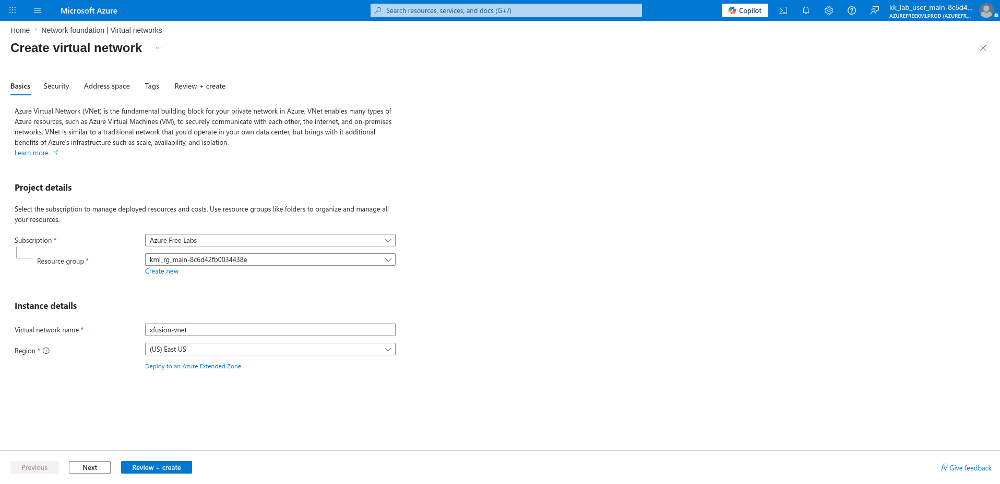

---

### 2. Add a New Subnet

On the **Address space** tab, clicked **+ Add a subnet** and configured:

- Subnet purpose: `Default`
- Name: `xfusion-subnet`
- IPv4 address range: `10.0.0.0/16`
- Starting address: `10.0.1.0`
- Size: `/24 (256 addresses)`
- Subnet address range: `10.0.1.0 - 10.0.1.255`
- Enable private subnet (no default outbound access): ✅

Clicked:

```text
Add
```

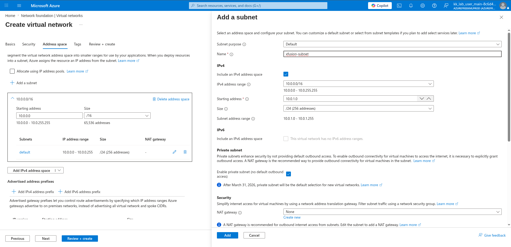

---

### 3. Hit Create (Virtual Network)

Reviewed the final VNet configuration:

**Basics:**

- Name: `xfusion-vnet`
- Region: `East US`

**Security:**

- Azure Bastion: `Disabled`
- Azure Firewall: `Disabled`
- Azure DDoS Network Protection: `Disabled`

**Address space:**

- Address space: `10.0.0.0/16 (65,536 addresses)`
- Subnet: `default (10.0.0.0/24) (256 addresses)`
- Subnet: `xfusion-subnet (10.0.1.0/24) (256 addresses)`

Clicked:

```text
Create
```

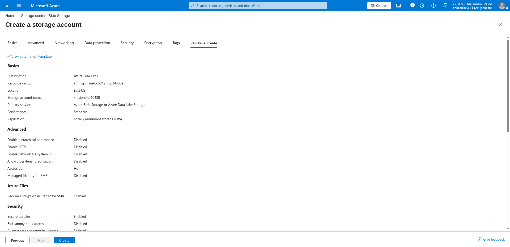

---

### 4. Create a Storage Account

Navigated to:

```text
Storage center | Blob Storage → + Create
```

On the **Basics** tab, configured:

- Subscription: `Azure Free Labs`
- Resource group: `kml_rg_main-8c6d42fb0034438e`
- Storage account name: `xfusionstor10438`
- Region: `(US) East US`
- Preferred storage type: `Azure Blob Storage or Azure Data Lake Storage`
- Performance: `Standard`
- Redundancy: `Locally redundant storage (LRS)`

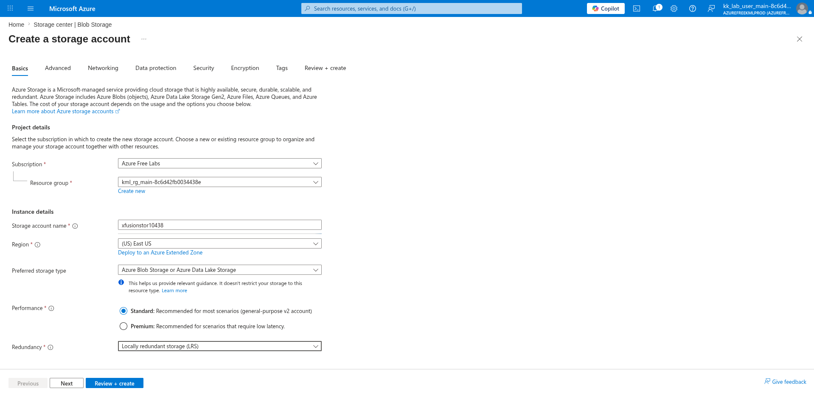

---

### 5. Click Create (Storage Account)

Reviewed the final storage account configuration:

**Basics:**

- Location: `East US`
- Storage account name: `xfusionstor10438`
- Primary service: `Azure Blob Storage or Azure Data Lake Storage`
- Performance: `Standard`
- Replication: `Locally redundant storage (LRS)`

**Security:**

- Blob anonymous access: `Disabled`
- Allow storage account key access: `Enabled`

Clicked:

```text
Create
```

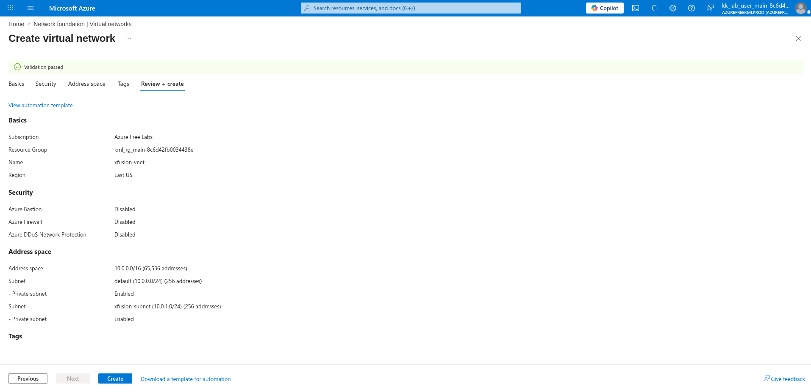

---

### 6. Create a New Blob Container

Navigated to:

```text
xfusionstor10438 → Data storage → Containers → + Add container
```

Configured:

- Name: `xfusion-container`
- Anonymous access level: `Private (no anonymous access)`

Clicked:

```text
Create
```

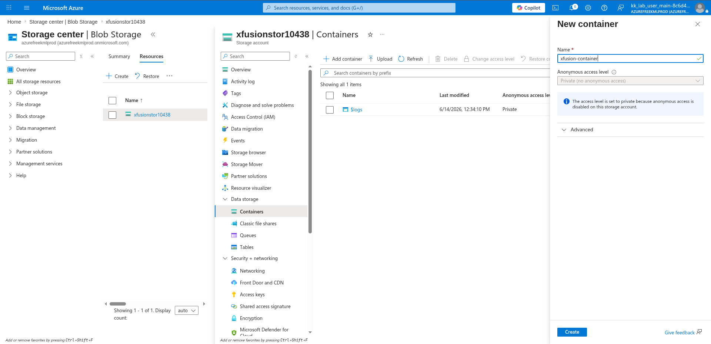

---

### 7. Copy Key to Use with az download

Navigated to:

```text
xfusionstor10438 → Security + networking → Access keys
```

Clicked **Show** on the **key1** field and copied the key value to use with the `az storage blob download` command on the VM.

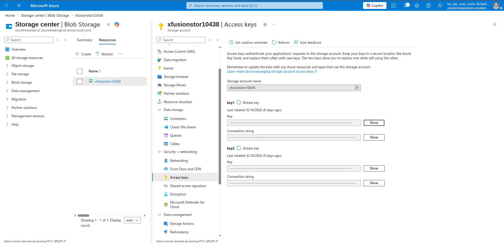

---

### 8. Generate SSH Key Pair via Azure CLI

Generated an SSH key pair on the client machine:

```bash
ssh-keygen
```

Copied the public key content to use during VM creation:

```bash
cat .ssh/id_rsa.pub
```

---

### 9. Configure Name and Region (VM)

Navigated to:

```text
Compute infrastructure → Virtual machines → + Create → Virtual machine
```

On the **Basics** tab, configured:

- Subscription: `Azure Free Labs`
- Resource group: `kml_rg_main-8c6d42fb0034438e`
- Virtual machine name: `xfusion-vm`
- Region: `(US) East US`
- Availability options: `No infrastructure redundancy required`
- Security type: `Trusted launch virtual machines`
- Image: `Ubuntu Server 24.04 LTS - x64 Gen2`
- VM architecture: `x64`

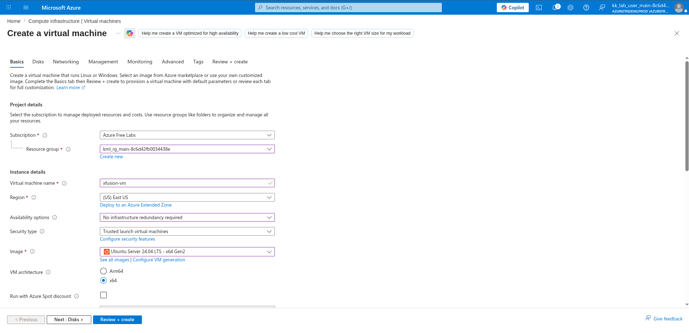

---

### 10. Use Existing Public Key

Scrolled down and configured the administrator account:

- Authentication type: `SSH public key`
- Username: `azureuser`
- SSH public key source: `Use existing public key`
- SSH public key: *(pasted content from `cat .ssh/id_rsa.pub`)*
- Public inbound ports: `Allow selected ports`
- Select inbound ports: `HTTP (80), SSH (22)`

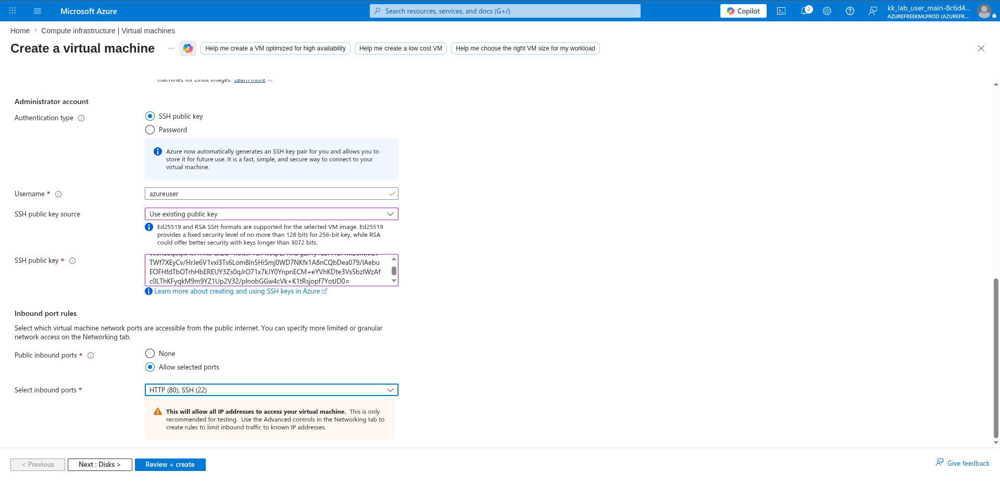

---

### 11. Allow Both HTTP and SSH (Networking Tab)

On the **Networking** tab, confirmed and configured:

- Virtual network: `xfusion-vnet`
- Subnet: `xfusion-subnet (10.0.1.0/24)`
- Public IP: `(new) xfusion-vm-ip`
- NIC network security group: `Basic`
- Public inbound ports: `Allow selected ports`
- Select inbound ports: `HTTP (80), SSH (22)`
- Delete public IP and NIC when VM is deleted: ☐

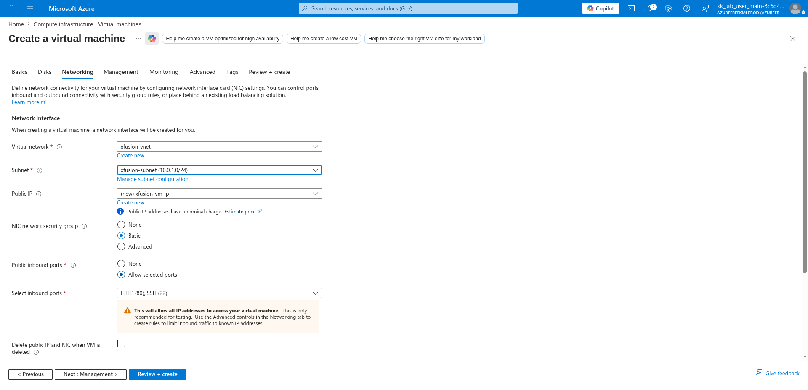

---

### 12. Create (VM)

Reviewed the final VM configuration and clicked:

```text
Create
```

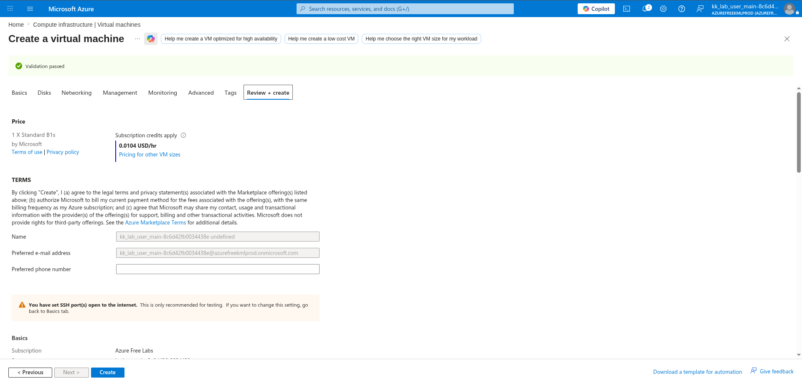

---

### 13. Upload index.html to Blob Storage

From the client machine, uploaded the static HTML file to the Blob container:

```bash
az storage blob upload \
  --account-name xfusionstor10438 \
  --container-name xfusion-container \
  --name index.html \
  --file index.html
```

---

### 14. Set Up Nginx on VM and Serve the HTML File

SSHed into the VM and performed the full setup:

```bash
ssh azureuser@<vm_pip>

# Install and enable Nginx
sudo apt update
sudo apt install -y nginx

# Install Azure CLI
curl -fsSL 'https://azurecliprod.blob.core.windows.net/$root/deb_install.sh' | sudo bash

# Download index.html from Blob Storage directly into the Nginx web root
sudo az storage blob download \
  --account-name xfusionstor10438 \
  --account-key <key1_value> \
  --container-name xfusion-container \
  --name index.html \
  --file /var/www/html/index.html
```

---

## Key Takeaway

Azure Blob Storage and Nginx together form a simple but powerful static content delivery pattern. By uploading HTML assets to a private Blob container and downloading them directly into the Nginx web root using the Azure CLI with an account key, the VM serves the latest content without needing public blob access or a CDN. This pattern is easily scriptable and can be integrated into a CI/CD pipeline to push updated content to any number of VMs by re-running the `az storage blob download` step.

---

## Author

Hein Lin Zaw
