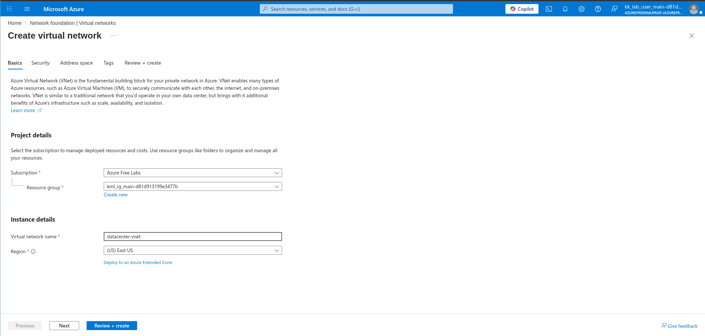
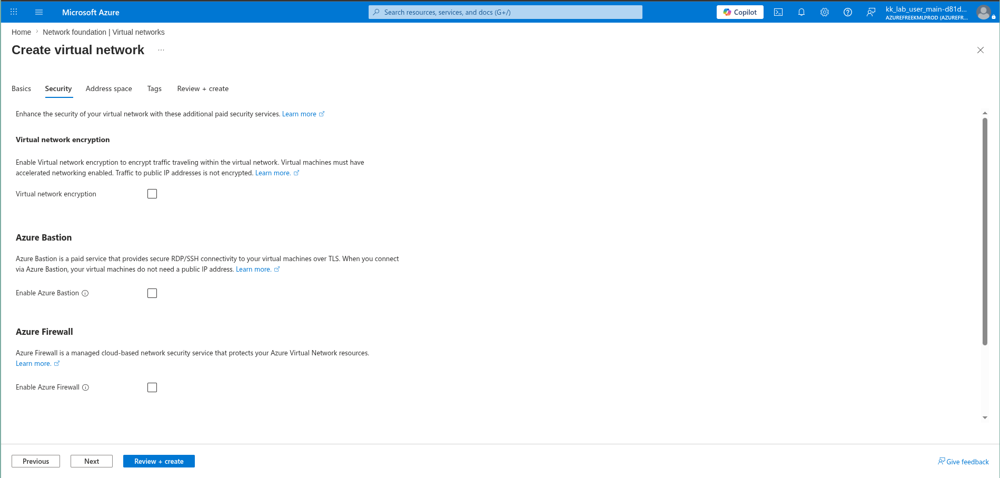
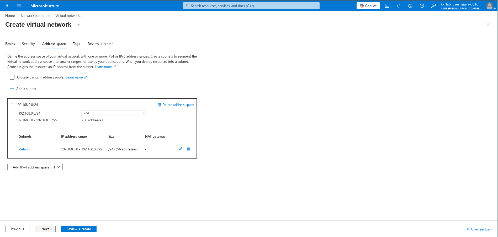
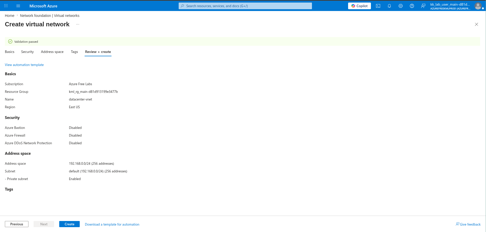

# 100 Days of Azure – Day 05  

## Azure Virtual Network with Custom Address Space

## Overview  

This task focuses on creating a Virtual Network with a custom IP address range and subnet configuration.

---

## What I Did  

- Created a Virtual Network (VNet)  
- Name: datacenter-vnet  
- Region: East US  
- Configured custom address space: 192.168.0.0/24  
- Used default subnet within the range  
- Kept security settings as default  

---

## Screenshots  

### Name and Region  

### Security (Default)  

### Address Space  

### Review and Create  

---

## Result  

Successfully created a Virtual Network with a custom IP range.

---

## Author  

Hein Lin Zaw
