# 100 Days of Azure – Day 50

## Deploying an Azure Application Gateway with Two Nginx VM Backends

## Overview

This lab demonstrates how to create a Virtual Network with two custom subnets — one for the VMs and one dedicated to the Application Gateway — provision two Ubuntu VMs with Nginx auto-configured via cloud-init, deploy an Azure Application Gateway with a backend pool targeting both VMs, and verify that HTTP traffic is load-balanced across the two backend instances.

---

## What I Did

- Created a Virtual Network (`xfusion-vnet`) with three subnets: `default`, `xfusion-subnet` (for VMs), and `xfusion-apgw-subnet` (for the Application Gateway)
- Generated an SSH key pair via Azure CLI and provisioned `xfusion-vm1` with Nginx auto-installed via cloud-init
- Repeated the exact same steps to create `xfusion-vm2` as a second backend
- Created an Application Gateway (`xfusion-apgw`) with a public frontend IP, a backend pool targeting both VMs, an HTTP listener, backend settings, and a routing rule
- Reviewed and deployed the Application Gateway

---

## Steps Performed

### 1. Create a Virtual Network

Navigated to:

```text
Network foundation | Virtual networks → + Create
```

On the **Basics** tab, configured:

- Subscription: `Azure Free Labs`
- Resource group: `kml_rg_main-22e55ecb9de44ed5`
- Virtual network name: `xfusion-vnet`
- Region: `(US) East US`

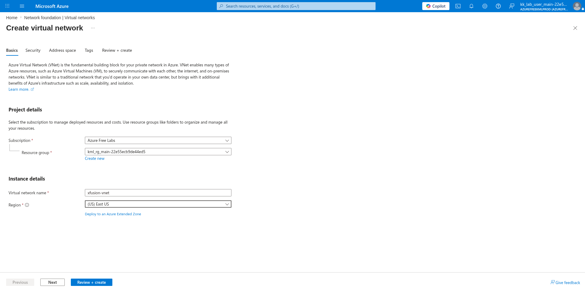

---

### 2. Add Two New Subnets

On the **Address space** tab, added two custom subnets alongside the default subnet:

**xfusion-subnet** (for VMs):

- Starting address: `10.0.1.0`
- Size: `/24 (256 addresses)`
- Subnet address range: `10.0.1.0 - 10.0.1.255`

**xfusion-apgw-subnet** (for Application Gateway):

- Starting address: `10.0.2.0`
- Size: `/24 (256 addresses)`
- Subnet address range: `10.0.2.0 - 10.0.2.255`

Final address space:

| Subnet | IP Range | Size |
|---|---|---|
| default | 10.0.0.0 - 10.0.0.255 | /24 (256 addresses) |
| xfusion-subnet | 10.0.1.0 - 10.0.1.255 | /24 (256 addresses) |
| xfusion-apgw-subnet | 10.0.2.0 - 10.0.2.255 | /24 (256 addresses) |

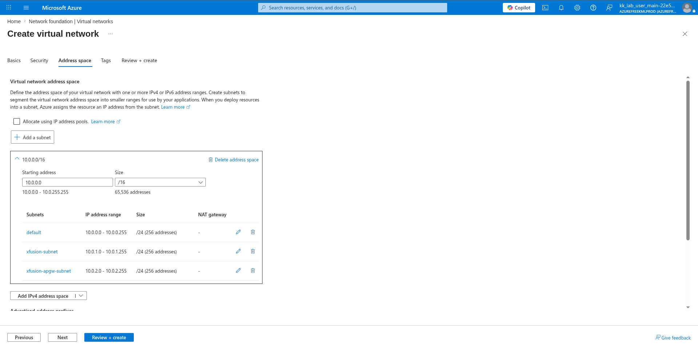

---

### 3. Review and Create (VNet)

Reviewed the final VNet configuration:

**Basics:**

- Name: `xfusion-vnet`
- Region: `East US`

**Address space:** `10.0.0.0/16 (65,536 addresses)` with all three subnets confirmed.

Clicked:

```text
Create
```

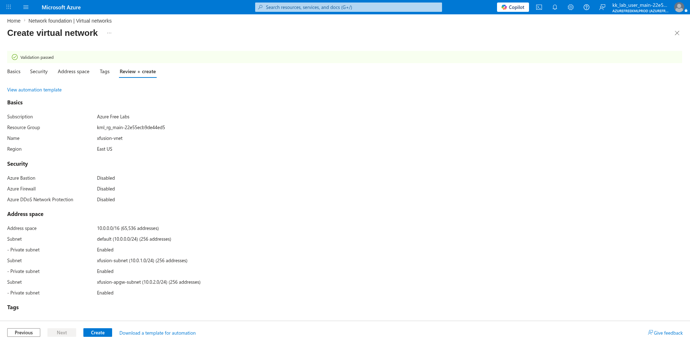

---

### 4. Generate SSH Key Pair via Azure CLI

Generated an SSH key pair on the client machine:

```bash
ssh-keygen
```

Copied the public key content to use during VM creation:

```bash
cat .ssh/id_rsa.pub
```

---

### 5. Create a VM (xfusion-vm1 Basics)

Navigated to:

```text
Compute infrastructure → Virtual machines → + Create → Virtual machine
```

On the **Basics** tab, configured:

- Subscription: `Azure Free Labs`
- Resource group: `kml_rg_main-22e55ecb9de44ed5`
- Virtual machine name: `xfusion-vm1`
- Region: `(US) East US`
- Availability options: `No infrastructure redundancy required`
- Security type: `Trusted launch virtual machines`
- Image: `Ubuntu Server 24.04 LTS - x64 Gen2`
- VM architecture: `x64`
- Size: `Standard B1s (1 vcpu, 1 GiB memory)`

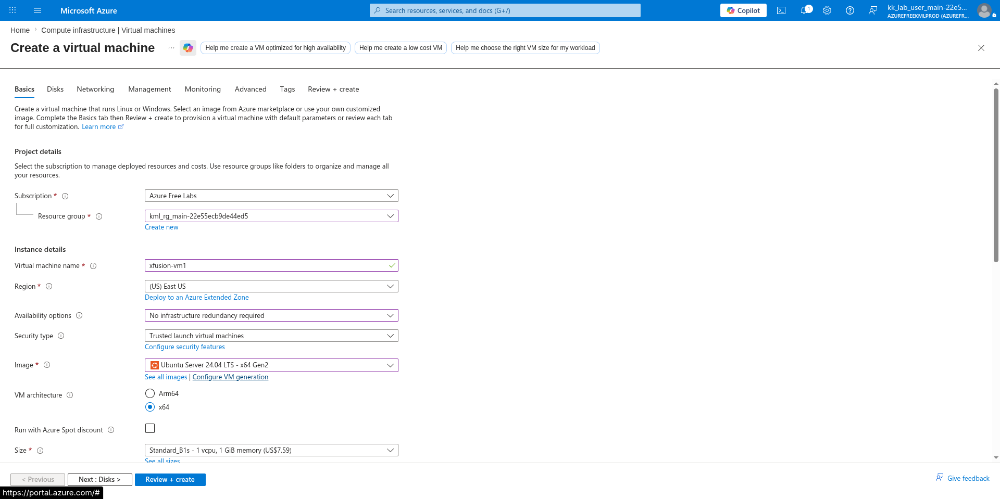

---

### 6. Use Existing Public Key

Scrolled down and configured the administrator account:

- Authentication type: `SSH public key`
- Username: `azureuser`
- SSH public key source: `Use existing public key`
- SSH public key: *(pasted content from `cat .ssh/id_rsa.pub`)*
- Public inbound ports: `Allow selected ports`
- Select inbound ports: `HTTP (80), SSH (22)`

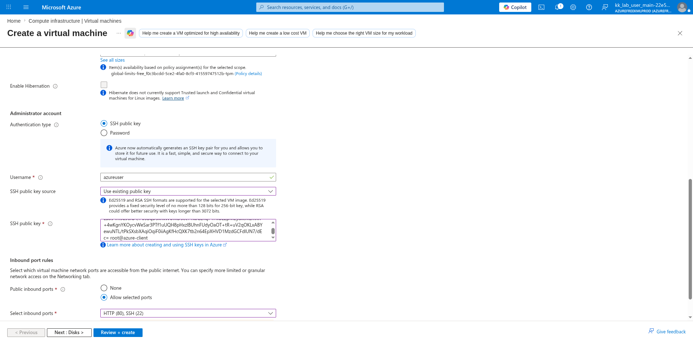

---

### 7. Use Created Subnet for VM

On the **Networking** tab, configured:

- Virtual network: `xfusion-vnet`
- Subnet: `xfusion-subnet (10.0.1.0/24)`
- Public IP: `(new) xfusion-vm1-ip`
- NIC network security group: `Basic`
- Public inbound ports: `Allow selected ports`
- Select inbound ports: `HTTP (80), SSH (22)`

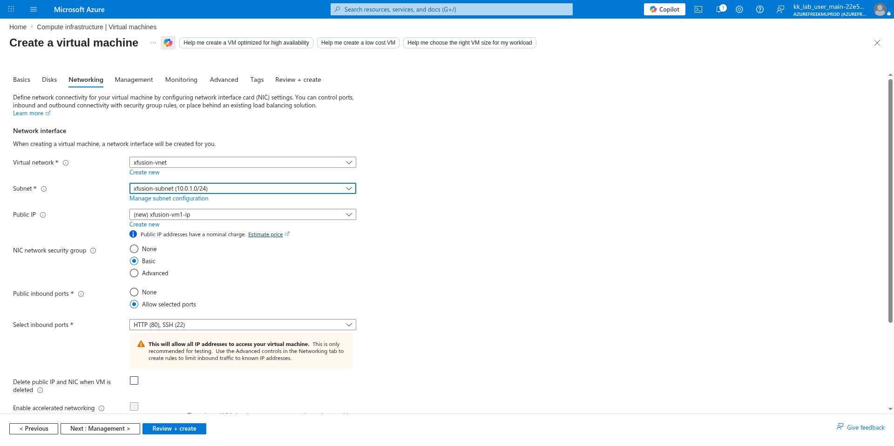

---

### 8. Install and Config Nginx (cloud-init)

On the **Advanced** tab, entered the following cloud-init script in the **Custom data** field to automatically install Nginx and write a version-specific index page on first boot:

```bash
#!/bin/bash
sudo apt update -y
sudo apt install -y nginx
echo "Welcome to KKE Labs:Version 1" | sudo tee /var/www/html/index.html
sudo systemctl enable --now nginx
sudo systemctl restart nginx
```

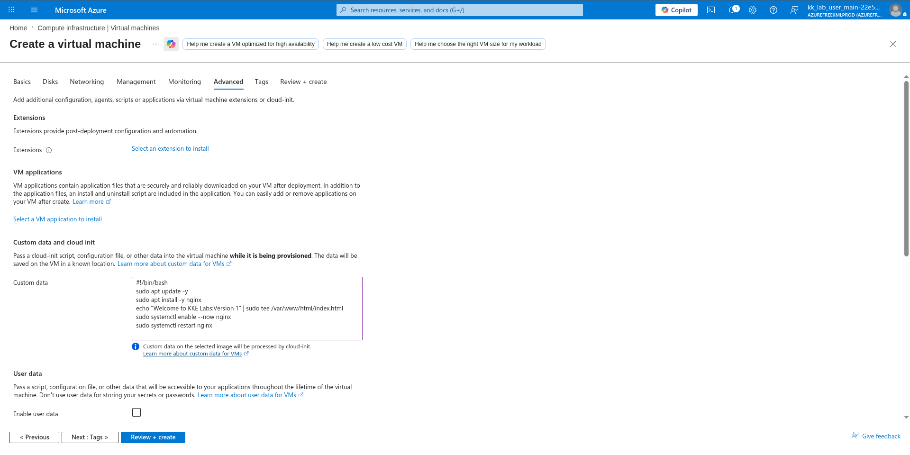

---

### 9. Review and Create VM (xfusion-vm1)

Reviewed the full VM1 configuration and clicked:

```text
Create
```

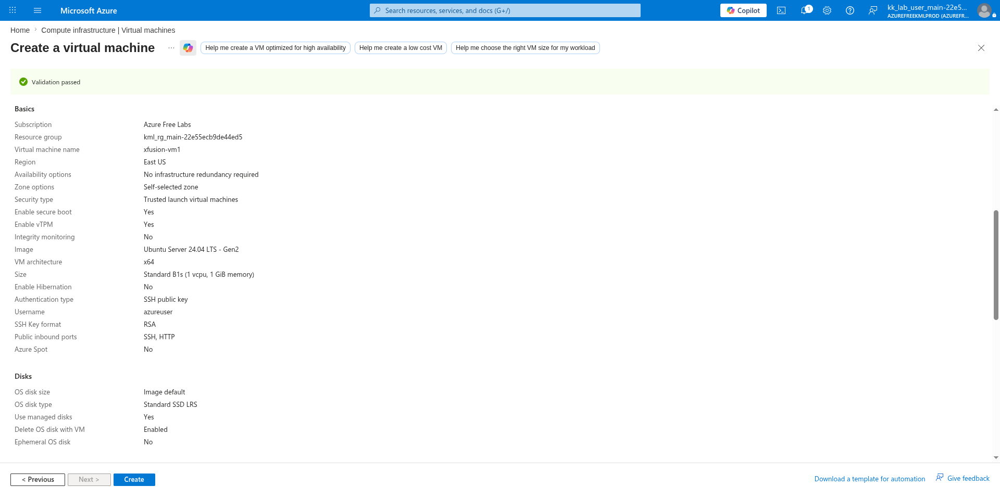

---

### 10. Do the Exact Steps for VM2 and Create

Repeated all the same steps (Basics → SSH → Networking → cloud-init) to create `xfusion-vm2` with identical configuration. The only differences were the VM name and a new public IP assigned automatically.

After both VMs were deployed, confirmed both were running in East US:

- `xfusion-vm1` — Public IP: `20.119.67.154`
- `xfusion-vm2` — Public IP: `168.62.169.56`

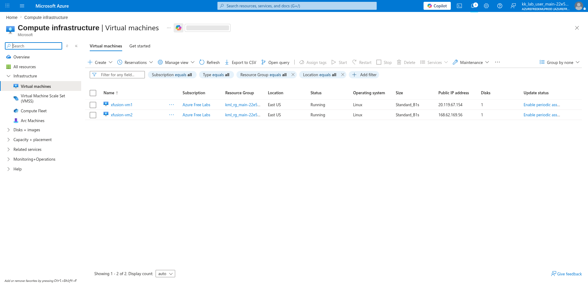

---

### 11. Config AGW Name

Navigated to:

```text
Load balancing and content delivery | Application gateways → + Create
```

On the **Basics** tab, configured:

- Subscription: `Azure Free Labs`
- Resource group: `kml_rg_main-22e55ecb9de44ed5`
- Application gateway name: `xfusion-apgw`
- Region: `East US`
- Tier: `Basic`
- IP address type: `IPv4 only`
- Virtual network: `xfusion-vnet`
- Subnet: `xfusion-apgw-subnet (10.0.2.0/24)`

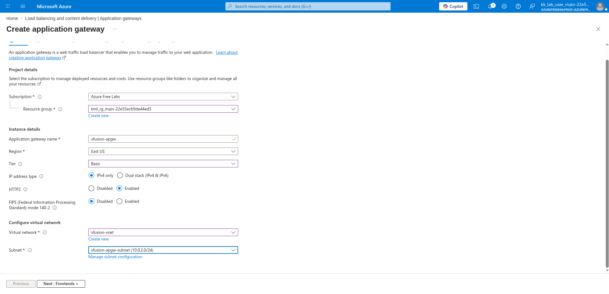

---

### 12. Add New Frontend IP

On the **Frontends** tab, configured:

- Frontend IP address type: `Public`
- Public IPv4 address: `(New) xfusion-apgw-ip`

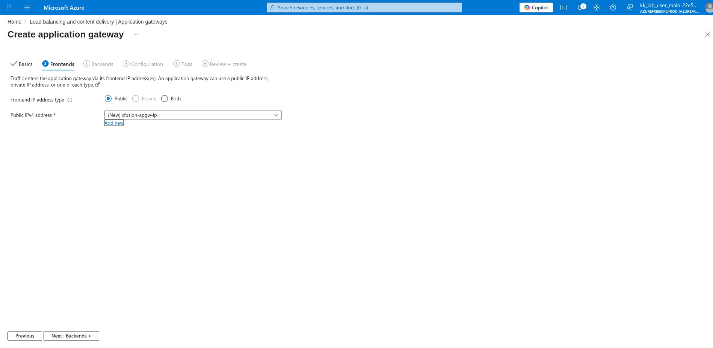

---

### 13. Create a Backend Pool and Target to Two VMs

On the **Backends** tab, clicked **+ Add a backend pool** and configured:

- Name: `xfusion-apgw-backendpool`
- Add backend pool without targets: `No`
- Target type: `Virtual machine` → `xfusion-vm1476`
- Target type: `Virtual machine` → `xfusion-vm2397 (10.0.1.5)`

Clicked:

```text
Add
```

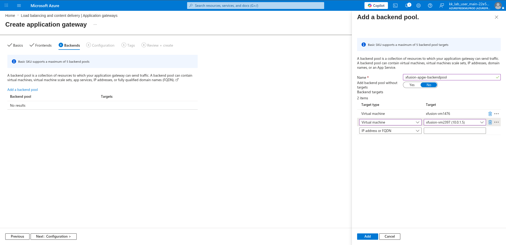

---

### 14. Configure Routing Rule Listener

On the **Configuration** tab, clicked **+ Add a routing rule**. On the **Listener** tab of the routing rule panel, configured:

- Rule name: `xfusion-apgw-routing-rule`
- Priority: `1`
- Listener name: `xfusion-apgw-listener`
- Frontend IP: `Public IPv4`
- Protocol: `HTTP`
- Port: `80`
- Listener type: `Basic`

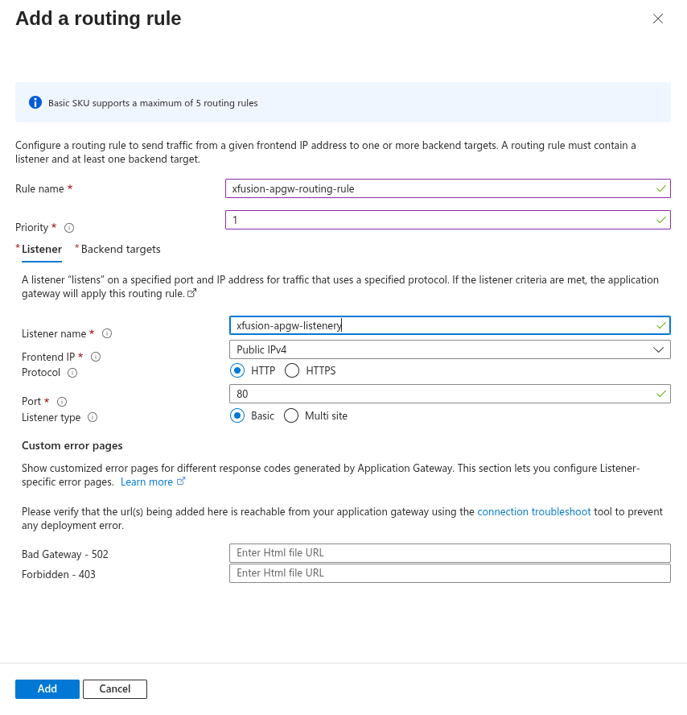

---

### 15. Add Backend Setting

Still in the routing rule panel, clicked the **Backend targets** tab, then clicked **Add new** next to Backend settings. Configured:

- Backend settings name: `xfusion-apgw-backend-setting`
- Backend protocol: `HTTP`
- Backend port: `80`
- Cookie-based affinity: `Disable`
- Connection draining: `Disable`
- Dedicated backend connection: `Disable`
- Request time-out (seconds): `20`
- Override hostname: `No`

Clicked:

```text
Add
```

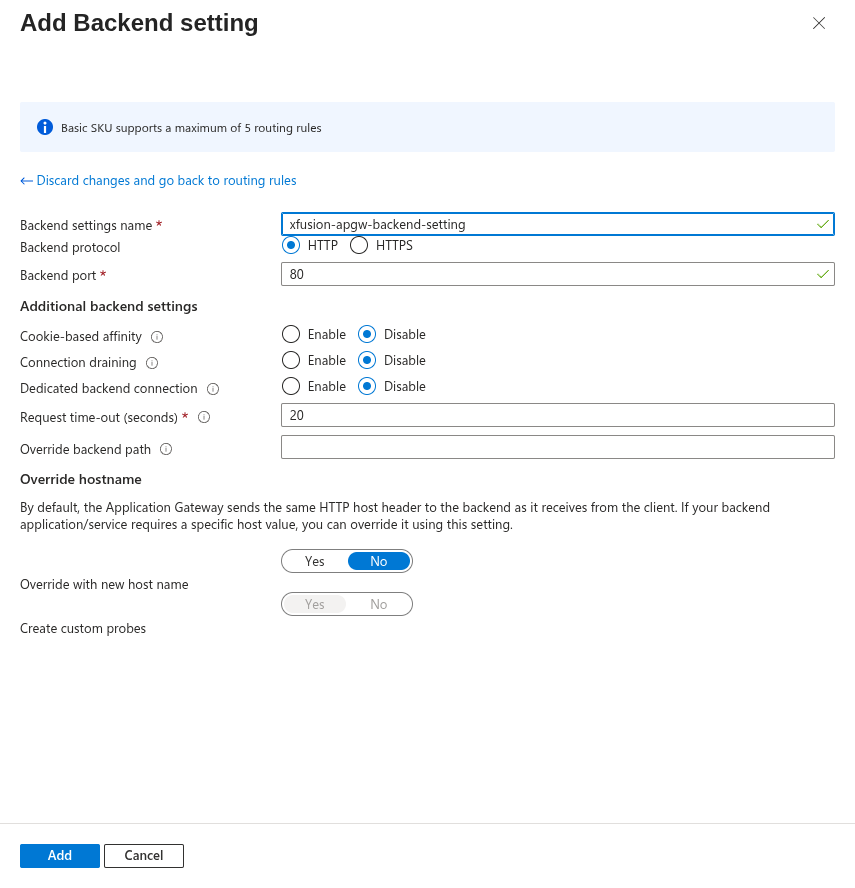

---

### 16. Add Routing Rule Backend

Back on the **Backend targets** tab, confirmed:

- Target type: `Backend pool`
- Backend target: `xfusion-apgw-backendpool`
- Backend settings: `xfusion-apgw-backend-setting`

Clicked:

```text
Add
```

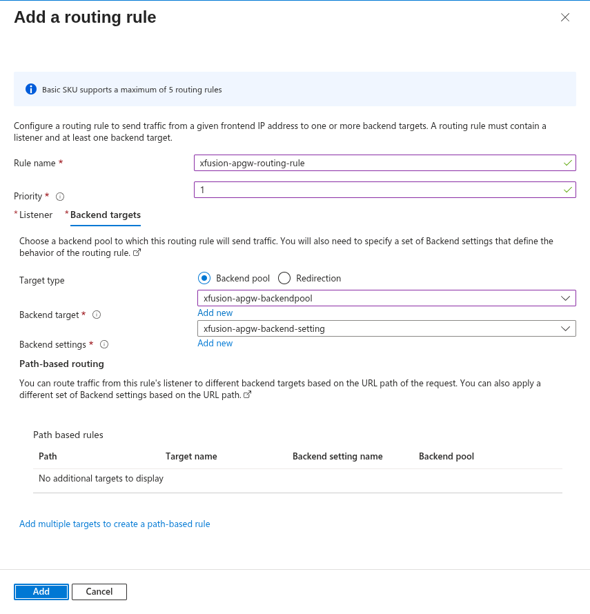

---

### 17. Review and Create AGW

Reviewed the final Application Gateway configuration:

**Basics:**

- Name: `xfusion-apgw`
- Region: `East US`
- Tier: `Basic`
- Instance count: `2`
- Availability zone: `Zones 1, 2, 3`
- HTTP2: `Enabled`
- Virtual network: `xfusion-vnet`
- Subnet: `xfusion-apgw-subnet (10.0.2.0/24)`

**Frontends:**

- Public IPv4 address name: `xfusion-apgw-ip`
- SKU: `Standard`
- Assignment: `Static`
- Availability zone: `ZoneRedundant`

Clicked:

```text
Create
```

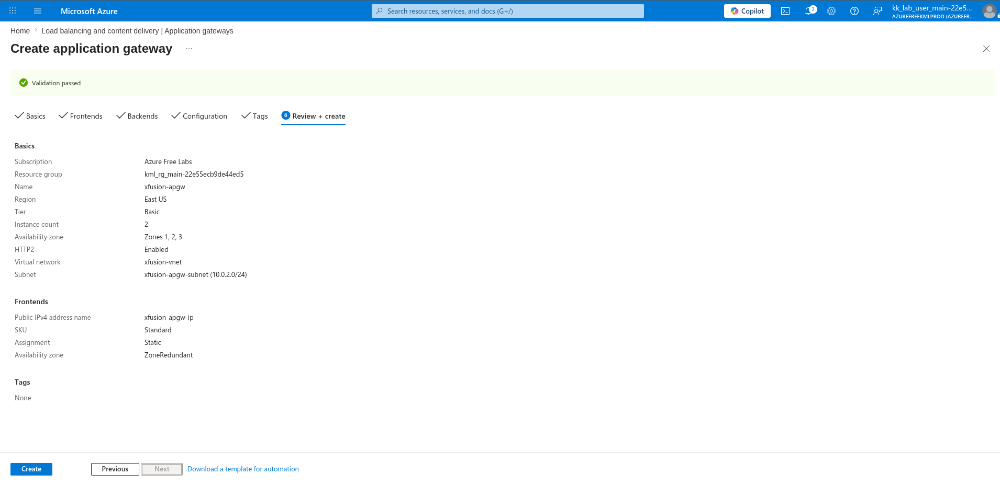

---

## Key Takeaway

Azure Application Gateway is a Layer 7 load balancer that distributes HTTP traffic across backend targets based on configurable routing rules. By using cloud-init to auto-install and configure Nginx on both VMs at provisioning time — without any post-deployment SSH — and placing the Application Gateway in its own dedicated subnet, the entire multi-VM web serving architecture is fully automated from day one. Requests to the Application Gateway's public frontend IP are distributed across both backend VMs, providing both load distribution and high availability.

---

## Author

Hein Lin Zaw
