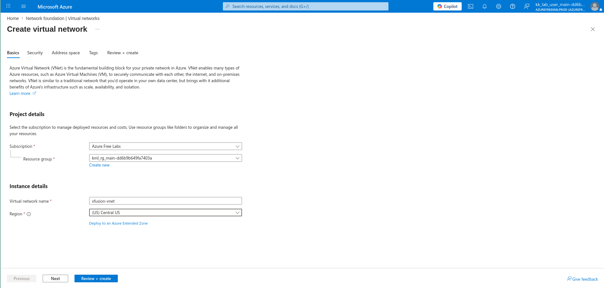
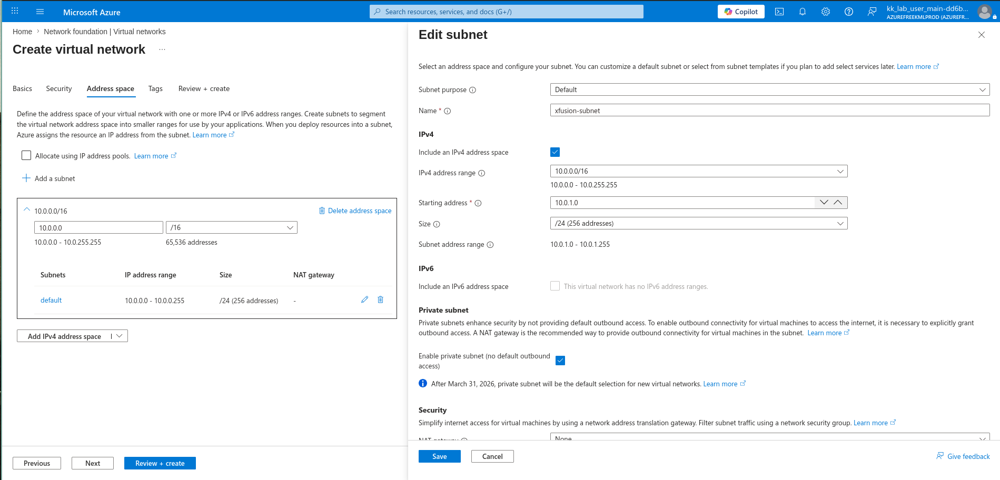
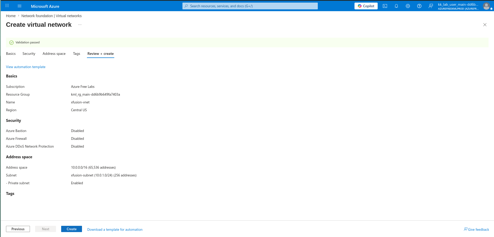

# 100 Days of Azure – Day 06  
## Azure Virtual Network with Custom Subnet

## Overview  
This task focuses on creating a Virtual Network and configuring a custom subnet.

---

## What I Did  
- Created a Virtual Network (VNet)  
- Name: xfusion-vnet  
- Region: Central US  
- Configured address space: 10.0.0.0/16  
- Created custom subnet: xfusion-subnet  
- Subnet range: 10.0.1.0/24  
- Enabled private subnet  

---

## Screenshots  

### Name and Region  

### Edit Subnet  

### Review and Create  

---

## Result  
Successfully created a Virtual Network with a custom subnet configuration.

---

## Author  
Hein Lin Zaw
