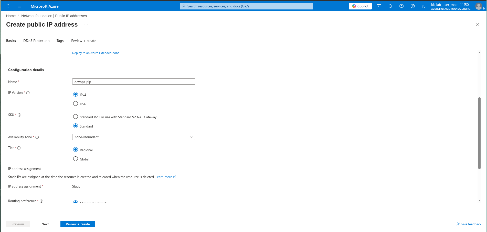
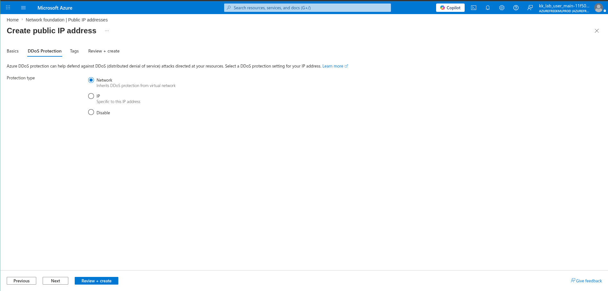
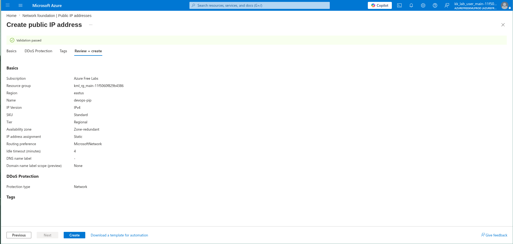

# 100 Days of Azure – Day 07  

## Azure Public IP Address Creation

## Overview  

This task focuses on creating a Public IP address in Azure for external connectivity.

---

## What I Did  

- Created a Public IP resource  
- Name: devops-pip  
- Region: East US  
- IP Version: IPv4  
- SKU: Standard  
- Assignment: Static  
- Tier: Regional  
- DDoS Protection: Network  

---

## Screenshots  

### Name and Configuration  

### DDoS Protection (Choose the type as you need)

### Review and Create  

---

## Result  

Successfully created a Public IP address with static allocation.

---

## Author  

Hein Lin Zaw
