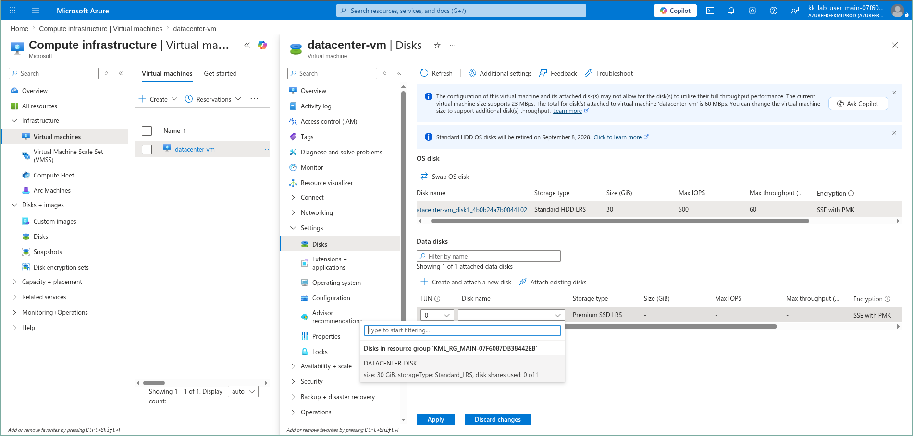
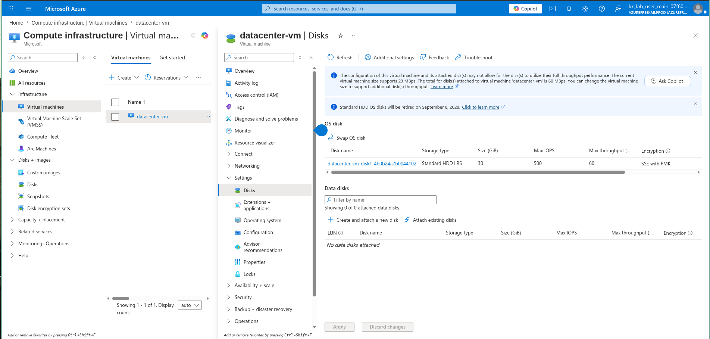
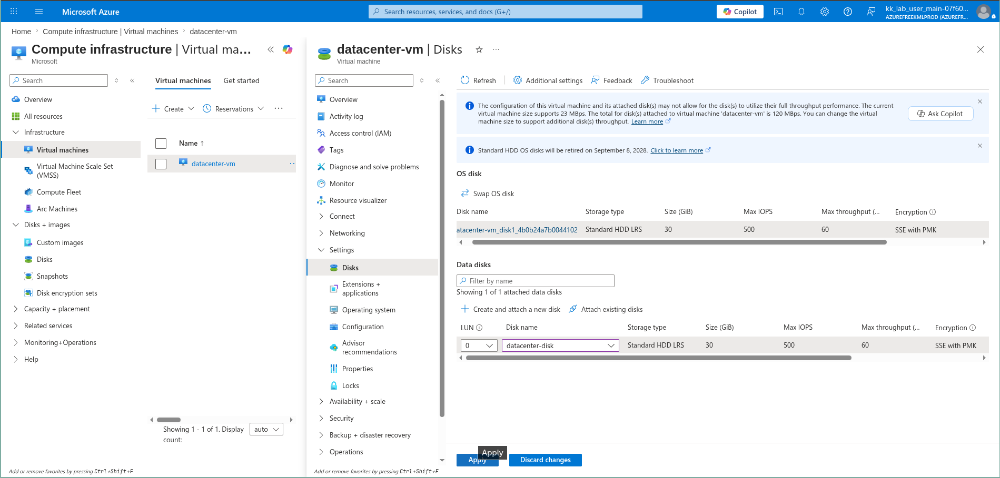
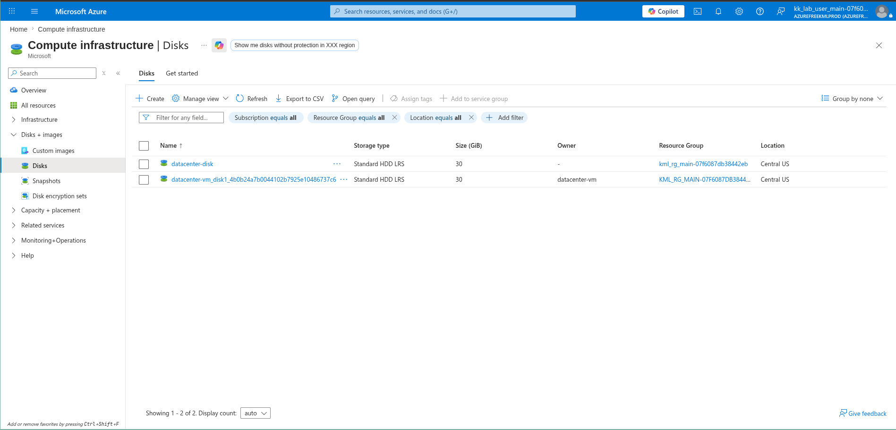

# 100 Days of Azure – Day 08  
## Attach Existing Disk to Virtual Machine

## Overview  
This task focuses on attaching an existing managed disk to a Virtual Machine in Azure.

---

## What I Did  
- Navigated to Virtual Machine: datacenter-vm  
- Opened disk settings  
- Selected an existing disk: datacenter-disk  
- Attached the disk to the VM  
- Applied the changes  

---

## Screenshots  

### Select Existing Disk  

### Attach Disk  

### Apply Changes  

### Disk Dashboard  

---

## Result  
Successfully attached an existing disk to the Virtual Machine.

---

## Author  
Hein Lin Zaw
