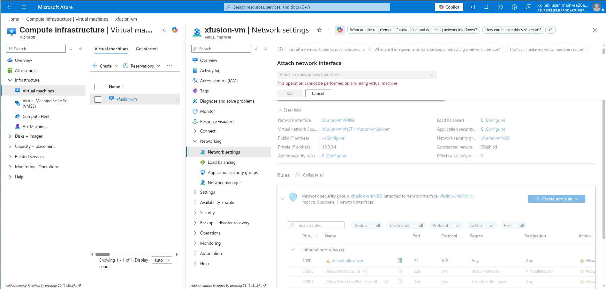
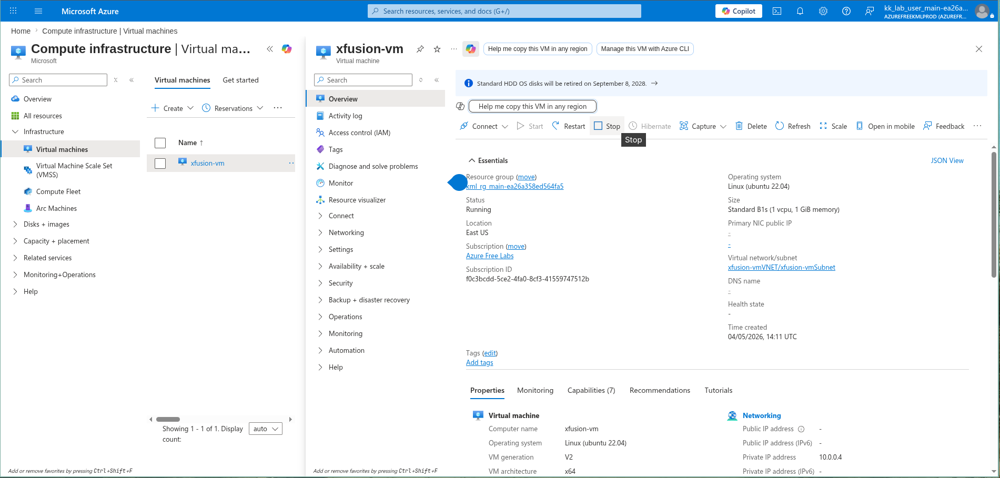
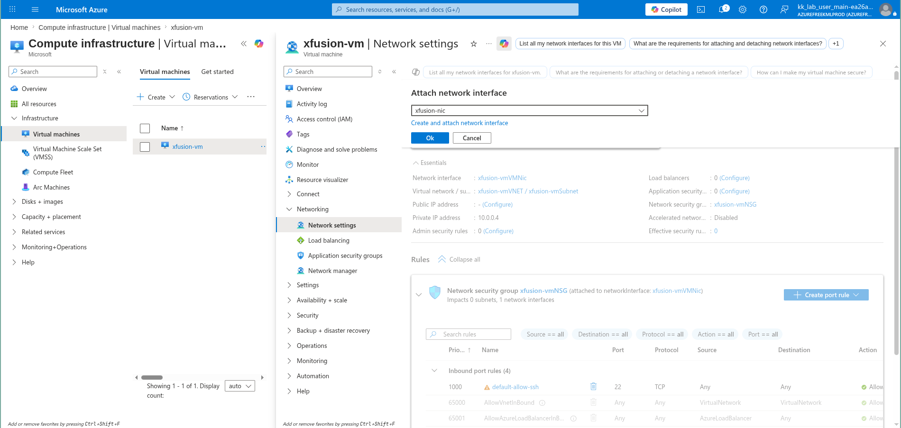
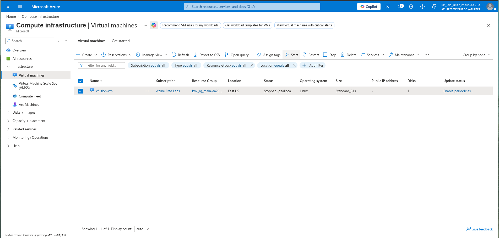

# 100 Days of Azure – Day 09  

## Attach Network Interface to Virtual Machine

## Overview  

This task demonstrates attaching a network interface (NIC) to a Virtual Machine in Azure.

---

## What I Did  

- Navigated to Virtual Machine: xfusion-vm  
- Opened Network settings  
- Attempted to attach a network interface  
- Stopped the VM (required before attaching NIC)  
- Attached the network interface: xfusion-nic  
- Restarted the Virtual Machine  

---

## Screenshots  

### Cannot Attach While Running

### Stop Virtual Machine  

### Attach Network Interface  

### Restart Virtual Machine  

---

## Result  

Successfully attached a network interface to the Virtual Machine after stopping it.

---

## Author  

Hein Lin Zaw
